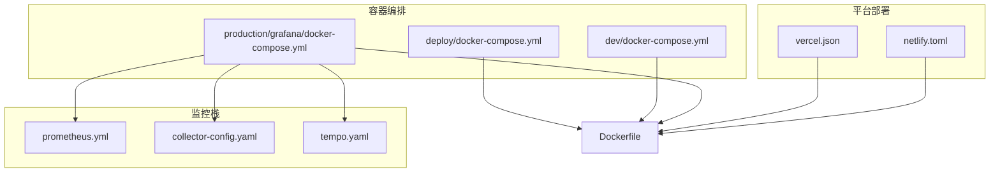
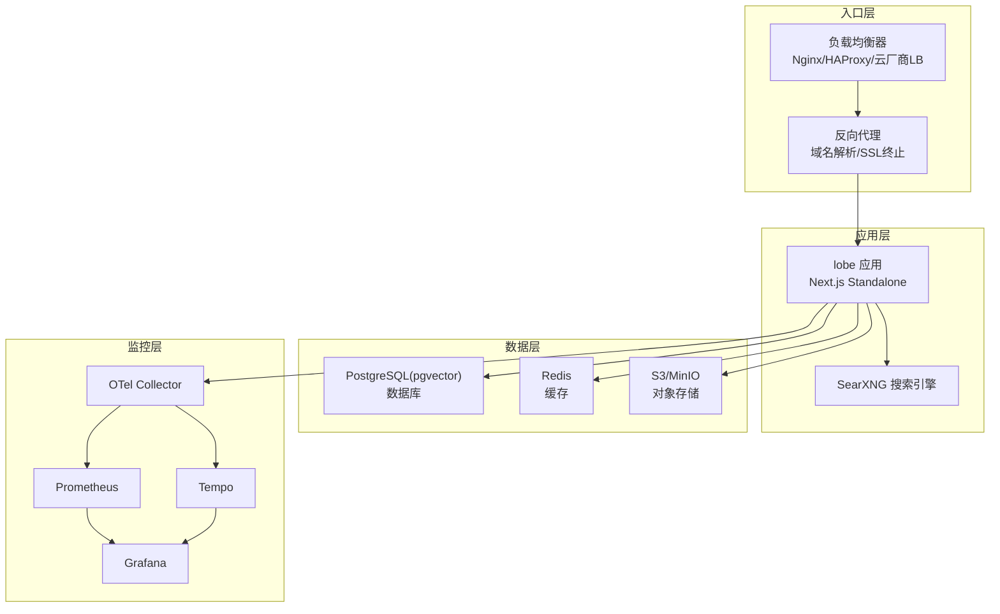
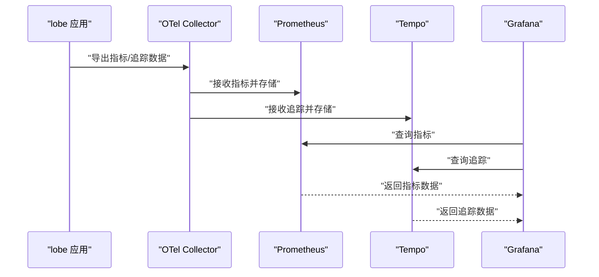
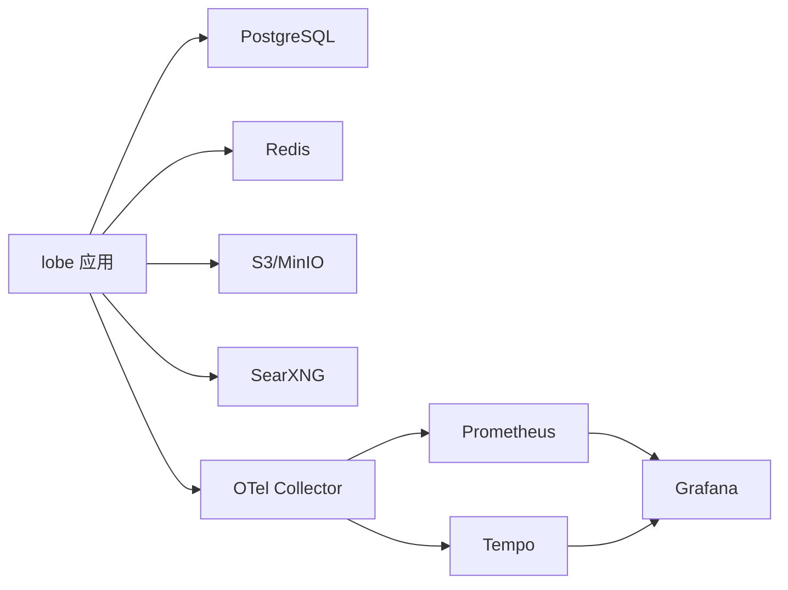

# 基础设施配置

<cite>
**本文引用的文件**
- [docker-compose/deploy/docker-compose.yml](file://docker-compose/deploy/docker-compose.yml)
- [docker-compose/dev/docker-compose.yml](file://docker-compose/dev/docker-compose.yml)
- [docker-compose/production/grafana/docker-compose.yml](file://docker-compose/production/grafana/docker-compose.yml)
- [docker-compose/production/grafana/prometheus/prometheus.yml](file://docker-compose/production/grafana/prometheus/prometheus.yml)
- [docker-compose/production/grafana/otel-collector/collector-config.yaml](file://docker-compose/production/grafana/otel-collector/collector-config.yaml)
- [docker-compose/production/grafana/tempo/tempo.yaml](file://docker-compose/production/grafana/tempo/tempo.yaml)
- [docker-compose/deploy/bucket.config.json](file://docker-compose/deploy/bucket.config.json)
- [docker-compose/dev/bucket.config.json](file://docker-compose/dev/bucket.config.json)
- [Dockerfile](file://Dockerfile)
- [vercel.json](file://vercel.json)
- [netlify.toml](file://netlify.toml)
</cite>

## 目录
1. [简介](#简介)
2. [项目结构](#项目结构)
3. [核心组件](#核心组件)
4. [架构总览](#架构总览)
5. [详细组件分析](#详细组件分析)
6. [依赖关系分析](#依赖关系分析)
7. [性能考量](#性能考量)
8. [故障排查指南](#故障排查指南)
9. [结论](#结论)
10. [附录](#附录)

## 简介
本文件面向 LobeHub 自托管与生产环境的基础设施配置，围绕以下主题展开：
- 反向代理与负载均衡：Nginx、HAProxy、云厂商负载均衡器的选型与配置要点
- 反向代理设置：域名解析、SSL 证书、HTTP/HTTPS 转发、缓存策略
- 数据库集群：主从复制、读写分离、备份恢复、高可用
- 缓存系统：Redis 集群、内存缓存、分布式缓存
- 监控与日志：Prometheus、Grafana、OpenTelemetry Collector、Tempo
- 安全基础设施：防火墙、WAF、SSL/TLS 证书管理
- 部署脚本与配置文件示例路径

说明：仓库中提供了多套 docker-compose 配置（开发、部署、生产 Grafana/OTel），并包含构建镜像的 Dockerfile 与平台部署配置（Vercel、Netlify）。本文在不展示具体代码内容的前提下，基于现有配置文件进行系统化梳理与最佳实践建议。

## 项目结构
本项目基础设施相关的关键目录与文件如下：
- docker-compose
  - deploy：生产级部署编排（含数据库、缓存、对象存储、搜索引擎）
  - dev：本地开发编排（简化版）
  - production/grafana：生产监控栈（Prometheus、Grafana、Tempo、OTel Collector）
- 根目录
  - Dockerfile：应用镜像构建与运行时环境
  - vercel.json、netlify.toml：平台部署配置

**图表来源**
- [docker-compose/deploy/docker-compose.yml](file://docker-compose/deploy/docker-compose.yml#L1-L144)
- [docker-compose/dev/docker-compose.yml](file://docker-compose/dev/docker-compose.yml#L1-L123)
- [docker-compose/production/grafana/docker-compose.yml](file://docker-compose/production/grafana/docker-compose.yml#L1-L251)
- [docker-compose/production/grafana/prometheus/prometheus.yml](file://docker-compose/production/grafana/prometheus/prometheus.yml)
- [docker-compose/production/grafana/otel-collector/collector-config.yaml](file://docker-compose/production/grafana/otel-collector/collector-config.yaml)
- [docker-compose/production/grafana/tempo/tempo.yaml](file://docker-compose/production/grafana/tempo/tempo.yaml)
- [Dockerfile](file://Dockerfile#L1-L344)
- [vercel.json](file://vercel.json#L1-L15)
- [netlify.toml](file://netlify.toml#L1-L10)

**章节来源**
- [docker-compose/deploy/docker-compose.yml](file://docker-compose/deploy/docker-compose.yml#L1-L144)
- [docker-compose/dev/docker-compose.yml](file://docker-compose/dev/docker-compose.yml#L1-L123)
- [docker-compose/production/grafana/docker-compose.yml](file://docker-compose/production/grafana/docker-compose.yml#L1-L251)
- [Dockerfile](file://Dockerfile#L1-L344)
- [vercel.json](file://vercel.json#L1-L15)
- [netlify.toml](file://netlify.toml#L1-L10)

## 核心组件
- 应用服务（lobe）：基于 Next.js Standalone 构建，容器内监听 3210 端口；通过环境变量注入数据库、缓存、S3/MinIO、搜索引擎等外部依赖。
- 数据库（PostgreSQL）：使用 pgvector 扩展版本，支持向量检索；提供健康检查与持久化卷。
- 缓存（Redis）：单实例 Redis，启用 AOF 持久化；提供健康检查。
- 对象存储（RustFS/MinIO）：RustFS 或 MinIO 提供 S3 兼容接口；初始化脚本自动创建桶并设置匿名访问策略。
- 搜索引擎（SearXNG）：独立容器，挂载自定义 settings.yml。
- 监控栈（Grafana/Prometheus/Tempo/OTel Collector）：集中采集指标与追踪数据，提供可视化面板。

**章节来源**
- [docker-compose/deploy/docker-compose.yml](file://docker-compose/deploy/docker-compose.yml#L3-L35)
- [docker-compose/production/grafana/docker-compose.yml](file://docker-compose/production/grafana/docker-compose.yml#L160-L193)
- [docker-compose/production/grafana/docker-compose.yml](file://docker-compose/production/grafana/docker-compose.yml#L19-L36)
- [docker-compose/production/grafana/docker-compose.yml](file://docker-compose/production/grafana/docker-compose.yml#L38-L48)
- [docker-compose/production/grafana/docker-compose.yml](file://docker-compose/production/grafana/docker-compose.yml#L85-L96)
- [docker-compose/production/grafana/docker-compose.yml](file://docker-compose/production/grafana/docker-compose.yml#L98-L113)

## 架构总览
下图展示了生产环境的基础设施拓扑与交互关系：

**图表来源**
- [docker-compose/production/grafana/docker-compose.yml](file://docker-compose/production/grafana/docker-compose.yml#L1-L251)
- [docker-compose/deploy/docker-compose.yml](file://docker-compose/deploy/docker-compose.yml#L1-L144)

## 详细组件分析

### 负载均衡器配置与部署
- 选择与对比
  - Nginx：适合中小型流量，配置灵活，社区生态完善；可实现健康检查、会话保持、压缩与缓存。
  - HAProxy：高并发、低延迟，适合高可用与复杂调度场景；支持动态配置与丰富的健康检查。
  - 云厂商负载均衡器（AWS ALB/NLB、GCP Cloud Load Balancing、Azure Load Balancer）：具备弹性伸缩、WAF、DDoS 防护与全球加速能力，运维成本较低。
- 部署要点
  - 多实例部署：至少 2-3 个应用实例，结合健康检查与自动故障转移。
  - 会话粘性：若应用未做无状态设计，需开启会话亲和或使用共享缓存/数据库。
  - 健康检查：探测路径与超时重试参数需与应用实际响应一致。
  - 端口映射：确保 80/443 与应用端口（3210）正确映射。
- 与仓库配置的对应
  - 生产编排中，网络模式采用共享网络服务，便于统一暴露端口；可参考该模式在外部 LB 上进行端口映射与健康检查配置。

**章节来源**
- [docker-compose/production/grafana/docker-compose.yml](file://docker-compose/production/grafana/docker-compose.yml#L3-L17)
- [docker-compose/production/grafana/docker-compose.yml](file://docker-compose/production/grafana/docker-compose.yml#L160-L193)

### 反向代理设置（域名解析、SSL、HTTP/HTTPS、缓存）
- 域名解析
  - 将域名指向负载均衡器或直接指向应用节点（按部署架构而定）。
- SSL 证书
  - 使用 ACME 自动签发（Let’s Encrypt）或自有证书；在 LB/反代层终止 TLS，降低应用加密开销。
- HTTP/HTTPS 转发
  - 80 端口重定向至 443；443 端口转发到应用 3210 端口。
- 缓存策略
  - 静态资源：浏览器缓存与 CDN 缓存结合；合理设置 Cache-Control 与 ETag。
  - 动态内容：对热点查询结果进行短期缓存，避免压垮数据库与搜索引擎。
- 与仓库配置的对应
  - 应用容器默认监听 3210 端口；可在 LB 层统一暴露 80/443 并转发至该端口。

**章节来源**
- [docker-compose/production/grafana/docker-compose.yml](file://docker-compose/production/grafana/docker-compose.yml#L160-L193)
- [Dockerfile](file://Dockerfile#L339-L344)

### 数据库集群部署架构
- 主从复制与读写分离
  - 使用 PostgreSQL 主从复制，将只读查询路由至从库，写操作路由至主库；应用侧实现连接池与读写分离。
- 备份与恢复
  - 定期逻辑备份（pg_dump）与物理备份（pg_basebackup）结合；验证恢复流程与 RTO/RPO 指标。
- 高可用
  - 使用仲裁节点与自动故障转移（如 Patroni/Repmgr）；确保 WAL 同步与脑裂防护。
- 与仓库配置的对应
  - 当前编排使用单实例 PostgreSQL；生产建议升级为主从或托管高可用方案。

**章节来源**
- [docker-compose/production/grafana/docker-compose.yml](file://docker-compose/production/grafana/docker-compose.yml#L19-L36)
- [docker-compose/deploy/docker-compose.yml](file://docker-compose/deploy/docker-compose.yml#L39-L59)

### 缓存系统配置
- 单机/集群选择
  - 开发：单实例 Redis（已启用 AOF 持久化）。
  - 生产：Redis 集群或 Redis Sentinel 实现高可用与分片；配合客户端路由与故障转移。
- 缓存键策略
  - 统一前缀与命名空间；设置过期时间与淘汰策略；热点数据预热。
- 分布式缓存
  - 使用 Redis 集群或云托管缓存服务（如 AWS ElastiCache、阿里云 Redis）。
- 与仓库配置的对应
  - 应用通过环境变量注入 Redis 连接信息；当前编排为单实例。

**章节来源**
- [docker-compose/production/grafana/docker-compose.yml](file://docker-compose/production/grafana/docker-compose.yml#L160-L193)
- [docker-compose/deploy/docker-compose.yml](file://docker-compose/deploy/docker-compose.yml#L61-L79)

### 监控与日志系统
- 指标与追踪
  - Prometheus：采集应用与基础设施指标；OTel Collector 接收 OTLP 指标与追踪。
  - Tempo：接收追踪数据并提供查询界面。
  - Grafana：可视化面板，连接 Prometheus 与 Tempo。
- 配置要点
  - 在应用中启用 OTLP 导出器，配置协议与端点；Prometheus 抓取目标与标签。
  - Grafana 数据源与仪表板按需配置；确保跨域与鉴权设置。
- 与仓库配置的对应
  - 生产编排已内置 Prometheus、Grafana、Tempo、OTel Collector，并提供配置文件示例。

**图表来源**
- [docker-compose/production/grafana/docker-compose.yml](file://docker-compose/production/grafana/docker-compose.yml#L138-L148)
- [docker-compose/production/grafana/prometheus/prometheus.yml](file://docker-compose/production/grafana/prometheus/prometheus.yml)
- [docker-compose/production/grafana/otel-collector/collector-config.yaml](file://docker-compose/production/grafana/otel-collector/collector-config.yaml)
- [docker-compose/production/grafana/tempo/tempo.yaml](file://docker-compose/production/grafana/tempo/tempo.yaml)

**章节来源**
- [docker-compose/production/grafana/docker-compose.yml](file://docker-compose/production/grafana/docker-compose.yml#L98-L148)

### 安全基础设施
- 防火墙与网络隔离
  - 仅开放必要端口（LB 80/443、数据库 5432、缓存 6379、对象存储 9000/9001 等）；使用安全组/防火墙限制来源 IP。
- WAF 与 DDOS 防护
  - 云厂商 WAF（AWS Shield、GCP Cloud Armor、Azure DDoS Protection）与 Web 应用防火墙联动。
- SSL/TLS 证书管理
  - 自动续期与证书轮换；在 LB/反代层统一管理证书与密钥。
- 与仓库配置的对应
  - 生产编排中，应用通过环境变量注入 S3/MinIO 凭据与 OIDC Issuer；需确保凭据安全与最小权限原则。

**章节来源**
- [docker-compose/production/grafana/docker-compose.yml](file://docker-compose/production/grafana/docker-compose.yml#L174-L192)

### 部署脚本与配置文件示例
- 部署脚本
  - 仓库提供 docker-compose 目录下的启动脚本与初始化配置，可作为部署模板。
- 配置文件示例路径
  - 对象存储桶策略：deploy 与 dev 目录下的 bucket.config.json
  - Prometheus 配置：production/grafana/prometheus/prometheus.yml
  - OTel Collector 配置：production/grafana/otel-collector/collector-config.yaml
  - Tempo 配置：production/grafana/tempo/tempo.yaml
- 平台部署
  - Vercel：构建命令、重写规则
  - Netlify：构建命令、环境变量

**章节来源**
- [docker-compose/deploy/bucket.config.json](file://docker-compose/deploy/bucket.config.json)
- [docker-compose/dev/bucket.config.json](file://docker-compose/dev/bucket.config.json)
- [docker-compose/production/grafana/prometheus/prometheus.yml](file://docker-compose/production/grafana/prometheus/prometheus.yml)
- [docker-compose/production/grafana/otel-collector/collector-config.yaml](file://docker-compose/production/grafana/otel-collector/collector-config.yaml)
- [docker-compose/production/grafana/tempo/tempo.yaml](file://docker-compose/production/grafana/tempo/tempo.yaml)
- [vercel.json](file://vercel.json#L1-L15)
- [netlify.toml](file://netlify.toml#L1-L10)

## 依赖关系分析
- 应用服务依赖数据库、缓存、对象存储与搜索引擎；生产编排通过共享网络服务统一暴露端口。
- 监控栈通过 OTel Collector 接收指标与追踪，再分别写入 Prometheus 与 Tempo，最终由 Grafana 可视化。

**图表来源**
- [docker-compose/production/grafana/docker-compose.yml](file://docker-compose/production/grafana/docker-compose.yml#L160-L193)
- [docker-compose/production/grafana/docker-compose.yml](file://docker-compose/production/grafana/docker-compose.yml#L138-L148)

**章节来源**
- [docker-compose/production/grafana/docker-compose.yml](file://docker-compose/production/grafana/docker-compose.yml#L160-L193)

## 性能考量
- 反向代理层
  - 启用 gzip/br 压缩；合理设置 keep-alive 与超时；CDN 加速静态资源。
- 数据库
  - 读写分离与连接池优化；慢查询分析与索引调优；定期统计信息更新。
- 缓存
  - 热点数据预热与多级缓存（本地缓存+分布式缓存）；淘汰策略与过期时间。
- 监控
  - 指标采样率与告警阈值；追踪采样率与存储周期；资源配额与成本控制。

## 故障排查指南
- 健康检查失败
  - 检查数据库、缓存、对象存储的健康端点与凭证；确认容器间网络连通性。
- OIDC/Casdoor 配置冲突
  - 编排中包含 OIDC 配置校验逻辑；若校验失败，请核对 Issuer 地址与配置文件一致性。
- MinIO 健康状态不可达
  - 检查端口映射与健康检查路径；确认初始化脚本执行成功。
- S3/桶策略问题
  - 对照 bucket.config.json 中的策略设置，确保匿名访问与 ACL 配置符合预期。

**章节来源**
- [docker-compose/production/grafana/docker-compose.yml](file://docker-compose/production/grafana/docker-compose.yml#L194-L233)
- [docker-compose/production/grafana/docker-compose.yml](file://docker-compose/production/grafana/docker-compose.yml#L222-L231)
- [docker-compose/deploy/bucket.config.json](file://docker-compose/deploy/bucket.config.json)
- [docker-compose/dev/bucket.config.json](file://docker-compose/dev/bucket.config.json)

## 结论
本项目提供了从开发到生产的完整基础设施编排模板，覆盖应用、数据库、缓存、对象存储、搜索引擎与监控栈。建议在生产环境中：
- 引入负载均衡与 WAF/DDOS 防护；
- 升级数据库为主从或托管高可用；
- 部署 Redis 集群并实施严格的凭据与网络策略；
- 完善 SSL/TLS 与证书轮换流程；
- 建立完善的备份与灾难恢复机制。

## 附录
- 关键配置文件路径清单
  - 应用镜像与运行时：Dockerfile
  - 开发编排：docker-compose/dev/docker-compose.yml
  - 生产编排：docker-compose/production/grafana/docker-compose.yml
  - 部署编排：docker-compose/deploy/docker-compose.yml
  - Prometheus 配置：docker-compose/production/grafana/prometheus/prometheus.yml
  - OTel Collector 配置：docker-compose/production/grafana/otel-collector/collector-config.yaml
  - Tempo 配置：docker-compose/production/grafana/tempo/tempo.yaml
  - 对象存储桶策略：docker-compose/deploy/bucket.config.json、docker-compose/dev/bucket.config.json
  - 平台部署：vercel.json、netlify.toml