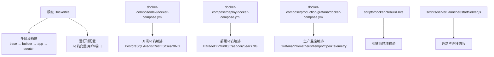
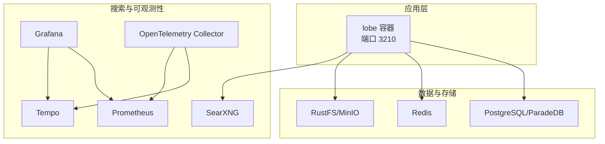
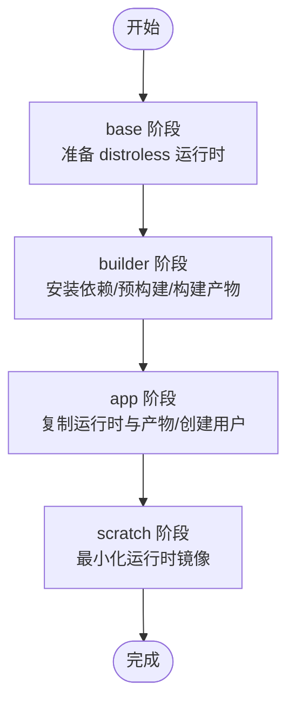
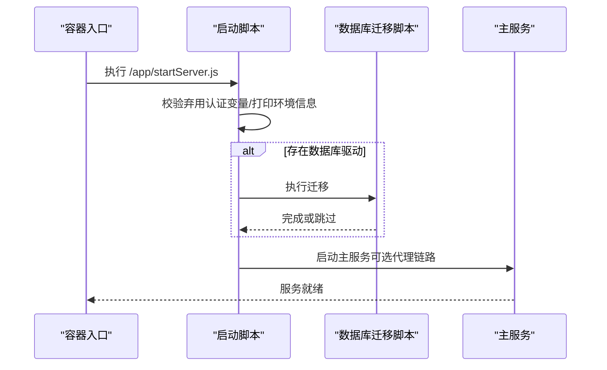
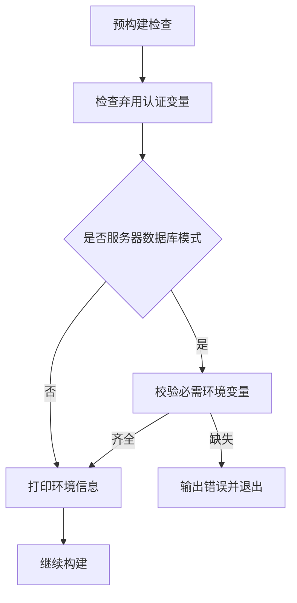
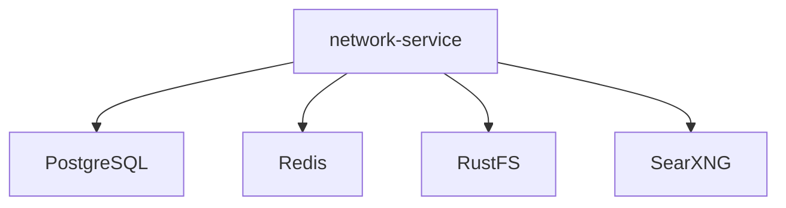
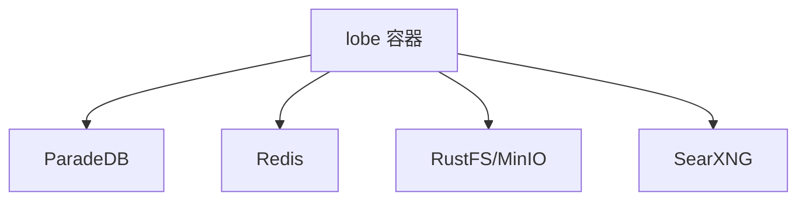
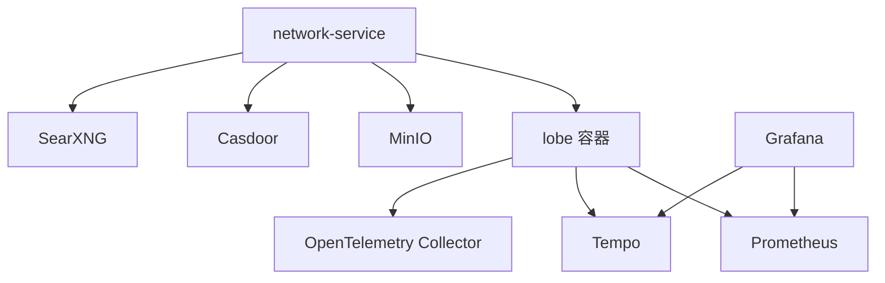
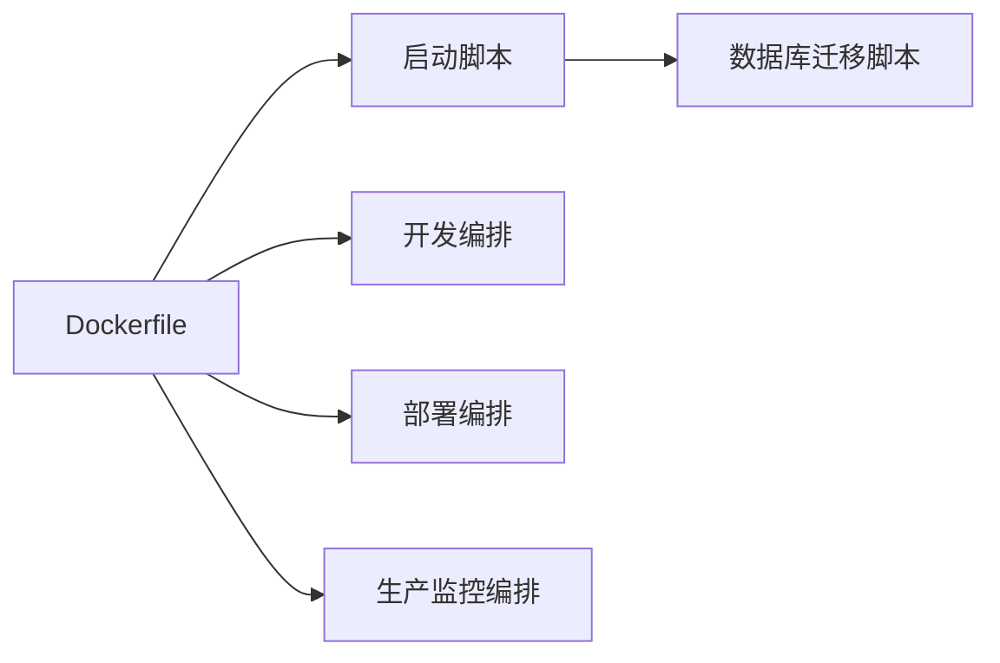

# 容器化部署架构

<cite>
**本文档引用的文件**
- [Dockerfile](file://Dockerfile)
- [docker-compose/dev/docker-compose.yml](file://docker-compose/dev/docker-compose.yml)
- [docker-compose/deploy/docker-compose.yml](file://docker-compose/deploy/docker-compose.yml)
- [docker-compose/production/grafana/docker-compose.yml](file://docker-compose/production/grafana/docker-compose.yml)
- [scripts/dockerPrebuild.mts](file://scripts/dockerPrebuild.mts)
- [scripts/serverLauncher/startServer.js](file://scripts/serverLauncher/startServer.js)
- [package.json](file://package.json)
- [docker-compose/dev/bucket.config.json](file://docker-compose/dev/bucket.config.json)
- [docker-compose/deploy/bucket.config.json](file://docker-compose/deploy/bucket.config.json)
- [docker-compose/dev/searxng-settings.yml](file://docker-compose/dev/searxng-settings.yml)
- [docker-compose/deploy/searxng-settings.yml](file://docker-compose/deploy/searxng-settings.yml)
- [docker-compose/production/grafana/searxng-settings.yml](file://docker-compose/production/grafana/searxng-settings.yml)
</cite>

## 目录
1. [简介](#简介)
2. [项目结构](#项目结构)
3. [核心组件](#核心组件)
4. [架构总览](#架构总览)
5. [详细组件分析](#详细组件分析)
6. [依赖关系分析](#依赖关系分析)
7. [性能考虑](#性能考虑)
8. [故障排除指南](#故障排除指南)
9. [结论](#结论)
10. [附录](#附录)

## 简介
本文件系统性梳理 LobeHub 项目的容器化部署架构，重点覆盖以下方面：
- Docker 多阶段构建流程与镜像分层策略（base → builder → app → scratch）
- 生产镜像精简与运行时配置（环境变量、用户权限、端口暴露）
- 容器编排方案（docker-compose 服务定义、网络与卷配置）
- 部署最佳实践（镜像优化、安全加固、健康检查）
- 具体 Dockerfile 解析与部署示例路径

## 项目结构
围绕容器化部署，仓库中与之直接相关的文件与目录如下：
- 根级 Dockerfile：定义多阶段构建与最终运行时
- docker-compose 目录：包含开发、部署与生产监控三套编排
- scripts 目录：构建前检查与启动脚本
- 各环境的 searxng 配置与 S3 桶策略配置

图表来源
- [Dockerfile](file://Dockerfile#L1-L344)
- [docker-compose/dev/docker-compose.yml](file://docker-compose/dev/docker-compose.yml#L1-L123)
- [docker-compose/deploy/docker-compose.yml](file://docker-compose/deploy/docker-compose.yml#L1-L144)
- [docker-compose/production/grafana/docker-compose.yml](file://docker-compose/production/grafana/docker-compose.yml#L1-L251)
- [scripts/dockerPrebuild.mts](file://scripts/dockerPrebuild.mts#L1-L125)
- [scripts/serverLauncher/startServer.js](file://scripts/serverLauncher/startServer.js#L1-L210)

章节来源
- [Dockerfile](file://Dockerfile#L1-L344)
- [docker-compose/dev/docker-compose.yml](file://docker-compose/dev/docker-compose.yml#L1-L123)
- [docker-compose/deploy/docker-compose.yml](file://docker-compose/deploy/docker-compose.yml#L1-L144)
- [docker-compose/production/grafana/docker-compose.yml](file://docker-compose/production/grafana/docker-compose.yml#L1-L251)

## 核心组件
- 多阶段 Docker 构建
  - base 阶段：基于 node slim，准备 distroless 运行时所需二进制与证书
  - builder 阶段：安装依赖、执行预构建检查与 Next.js 构建
  - app 阶段：基于 busybox，复制 standalone 产物与静态资源
  - scratch 阶段：最小化运行时，仅包含运行所需的二进制与配置
- 运行时与启动
  - 使用非 root 用户运行，设置端口与环境变量
  - 启动脚本负责数据库迁移、代理链路生成与主服务启动
- 编排与依赖
  - 开发：PostgreSQL、Redis、RustFS、SearXNG
  - 部署：ParadeDB、MinIO、Casdoor、SearXNG
  - 生产：Grafana、Prometheus、Tempo、OpenTelemetry Collector

章节来源
- [Dockerfile](file://Dockerfile#L1-L344)
- [scripts/serverLauncher/startServer.js](file://scripts/serverLauncher/startServer.js#L1-L210)

## 架构总览
下图展示容器化部署的整体交互：应用容器与数据库、缓存、对象存储、搜索服务之间的连接关系。

图表来源
- [docker-compose/dev/docker-compose.yml](file://docker-compose/dev/docker-compose.yml#L1-L123)
- [docker-compose/deploy/docker-compose.yml](file://docker-compose/deploy/docker-compose.yml#L1-L144)
- [docker-compose/production/grafana/docker-compose.yml](file://docker-compose/production/grafana/docker-compose.yml#L1-L251)

## 详细组件分析

### 多阶段构建与镜像分层
- base 阶段
  - 基于 node slim，启用非交互式安装，准备 distroless 运行时所需的动态库、可执行文件与证书
  - 将 proxychains 与必要依赖复制到 distroless 路径，便于后续在运行时使用代理链路
- builder 阶段
  - 设置 Next.js 构建相关环境变量（如 base path、分析平台 DSN、特性开关等）
  - 安装 pnpm 并拉取依赖，执行预构建检查脚本，移除桌面专属代码后进行 Docker 专用构建
- app 阶段
  - 基于 busybox，复制 base 阶段准备的 distroless 运行时、Next.js standalone 产物、静态资源、数据库迁移脚本与共享脚本
  - 创建非 root 用户组与用户，设置目录权限
- scratch 阶段
  - 从 app 阶段复制全部内容，设置运行时环境变量（如 DNS 优先级、CA 证书路径等）
  - 暴露端口 3210，以非 root 用户运行，入口为 Node 可执行文件，命令为启动脚本

图表来源
- [Dockerfile](file://Dockerfile#L5-L344)

章节来源
- [Dockerfile](file://Dockerfile#L1-L344)

### 运行时配置与启动流程
- 环境变量
  - 运行时设置 NODE_OPTIONS、SSL_CERT_FILE 等，确保 DNS 与 TLS 正常
  - 提供大量第三方模型与服务的环境变量占位，便于按需启用
- 用户与权限
  - 在 app 阶段创建非 root 用户与用户组，并设置目录所有权
- 端口暴露与入口
  - 暴露 3210 端口，ENTRYPOINT 指向 Node，CMD 执行启动脚本
- 启动脚本职责
  - 校验弃用的认证变量，打印环境信息
  - 可选生成代理链路配置，支持通过代理访问外部服务
  - 执行数据库迁移脚本（若存在），随后启动主服务
  - 支持通过网关密钥启动代理网关

图表来源
- [scripts/serverLauncher/startServer.js](file://scripts/serverLauncher/startServer.js#L1-L210)
- [Dockerfile](file://Dockerfile#L134-L344)

章节来源
- [Dockerfile](file://Dockerfile#L134-L344)
- [scripts/serverLauncher/startServer.js](file://scripts/serverLauncher/startServer.js#L1-L210)

### 构建前检查与环境校验
- 校验逻辑
  - 检查弃用的认证变量并提示迁移
  - 在服务器数据库模式下强制要求关键环境变量（如 AUTH_SECRET、KEY_VAULTS_SECRET）
  - 打印 Node/npm/pnpm/bun 版本与认证相关环境变量概要
- 触发时机
  - 在 builder 阶段执行预构建脚本，失败则终止构建

图表来源
- [scripts/dockerPrebuild.mts](file://scripts/dockerPrebuild.mts#L1-L125)

章节来源
- [scripts/dockerPrebuild.mts](file://scripts/dockerPrebuild.mts#L1-L125)

### 开发环境编排
- 服务组成
  - network-service：提供桥接网络与端口映射
  - PostgreSQL（pgvector）：持久化数据
  - Redis：缓存与会话
  - RustFS：对象存储服务（含初始化客户端）
  - SearXNG：搜索聚合服务
- 关键点
  - 使用本地卷持久化数据
  - 通过健康检查保障服务可用性
  - 通过 env_file 注入环境变量

图表来源
- [docker-compose/dev/docker-compose.yml](file://docker-compose/dev/docker-compose.yml#L1-L123)

章节来源
- [docker-compose/dev/docker-compose.yml](file://docker-compose/dev/docker-compose.yml#L1-L123)

### 部署环境编排
- 服务组成
  - lobe：应用容器，依赖数据库、缓存、对象存储与搜索服务
  - PostgreSQL（ParadeDB）：生产数据库
  - Redis：缓存
  - RustFS/MinIO：对象存储
  - SearXNG：搜索
- 关键点
  - 应用容器通过环境变量连接各依赖
  - 对象存储桶策略通过 mc 初始化脚本配置

图表来源
- [docker-compose/deploy/docker-compose.yml](file://docker-compose/deploy/docker-compose.yml#L1-L144)

章节来源
- [docker-compose/deploy/docker-compose.yml](file://docker-compose/deploy/docker-compose.yml#L1-L144)

### 生产监控编排
- 服务组成
  - Grafana、Prometheus、Tempo、OpenTelemetry Collector
  - MinIO、Casdoor、SearXNG、网络服务
- 关键点
  - 通过网络模式共享网络，简化服务间通信
  - 启动脚本增加对 OIDC 与对象存储健康检查的验证

图表来源
- [docker-compose/production/grafana/docker-compose.yml](file://docker-compose/production/grafana/docker-compose.yml#L1-L251)

章节来源
- [docker-compose/production/grafana/docker-compose.yml](file://docker-compose/production/grafana/docker-compose.yml#L1-L251)

### SearXNG 配置与对象存储策略
- SearXNG 配置
  - 各环境提供独立 settings.yml，包含通用、搜索、服务端、UI、插件等配置项
- 对象存储桶策略
  - 通过 bucket.config.json 定义匿名读取策略，配合初始化脚本自动创建桶并设置策略

章节来源
- [docker-compose/dev/searxng-settings.yml](file://docker-compose/dev/searxng-settings.yml#L1-L800)
- [docker-compose/deploy/searxng-settings.yml](file://docker-compose/deploy/searxng-settings.yml#L1-L800)
- [docker-compose/production/grafana/searxng-settings.yml](file://docker-compose/production/grafana/searxng-settings.yml#L1-L800)
- [docker-compose/dev/bucket.config.json](file://docker-compose/dev/bucket.config.json#L1-L19)
- [docker-compose/deploy/bucket.config.json](file://docker-compose/deploy/bucket.config.json#L1-L19)

## 依赖关系分析
- 组件耦合
  - 应用容器依赖数据库、缓存、对象存储与搜索服务
  - 启动脚本与数据库迁移脚本存在条件执行关系
- 外部依赖
  - Next.js 构建产物（standalone 与静态资源）
  - Node 运行时与 CA 证书
- 可能的循环依赖
  - 编排层面通过服务名称与网络隔离避免循环依赖

图表来源
- [Dockerfile](file://Dockerfile#L1-L344)
- [scripts/serverLauncher/startServer.js](file://scripts/serverLauncher/startServer.js#L1-L210)
- [docker-compose/dev/docker-compose.yml](file://docker-compose/dev/docker-compose.yml#L1-L123)
- [docker-compose/deploy/docker-compose.yml](file://docker-compose/deploy/docker-compose.yml#L1-L144)
- [docker-compose/production/grafana/docker-compose.yml](file://docker-compose/production/grafana/docker-compose.yml#L1-L251)

章节来源
- [Dockerfile](file://Dockerfile#L1-L344)
- [scripts/serverLauncher/startServer.js](file://scripts/serverLauncher/startServer.js#L1-L210)
- [docker-compose/dev/docker-compose.yml](file://docker-compose/dev/docker-compose.yml#L1-L123)
- [docker-compose/deploy/docker-compose.yml](file://docker-compose/deploy/docker-compose.yml#L1-L144)
- [docker-compose/production/grafana/docker-compose.yml](file://docker-compose/production/grafana/docker-compose.yml#L1-L251)

## 性能考虑
- 构建阶段优化
  - 使用 pnpm 与工作区减少重复安装
  - 预构建阶段移除桌面专属代码，缩小产物体积
- 运行时优化
  - 多阶段构建将运行时与构建时依赖分离，显著减小最终镜像
  - 使用 busybox 作为中间层，进一步压缩镜像大小
  - 在 scratch 镜像中仅保留必要二进制与配置，降低攻击面
- 网络与 I/O
  - 通过健康检查与重试机制提升服务可用性
  - 对象存储与数据库使用本地卷持久化，避免频繁网络 IO

## 故障排除指南
- 构建失败
  - 检查预构建脚本输出，确认必需环境变量是否齐全
  - 若出现弃用变量，请按提示迁移到新变量名
- 启动异常
  - 查看启动脚本日志，确认数据库迁移是否成功
  - 如启用代理链路，检查代理 URL 格式与端口合法性
- 服务不可达
  - 检查 docker-compose 中的端口映射与网络配置
  - 对象存储初始化脚本需等待目标服务健康后再执行

章节来源
- [scripts/dockerPrebuild.mts](file://scripts/dockerPrebuild.mts#L1-L125)
- [scripts/serverLauncher/startServer.js](file://scripts/serverLauncher/startServer.js#L1-L210)
- [docker-compose/dev/docker-compose.yml](file://docker-compose/dev/docker-compose.yml#L1-L123)
- [docker-compose/deploy/docker-compose.yml](file://docker-compose/deploy/docker-compose.yml#L1-L144)
- [docker-compose/production/grafana/docker-compose.yml](file://docker-compose/production/grafana/docker-compose.yml#L1-L251)

## 结论
该容器化部署架构通过多阶段构建实现“构建期完整、运行期极简”的目标，结合 docker-compose 实现开发、部署与生产监控的全链路编排。配合严格的环境变量校验与启动脚本流程，能够在保证功能完整性的同时，最大化镜像安全性与运行效率。

## 附录
- 构建与运行常用命令
  - 开发环境一键启动：参考脚本中的 docker compose 命令
  - 自定义镜像构建：使用 package.json 中的构建脚本
- 参考路径
  - 多阶段构建定义：[Dockerfile](file://Dockerfile#L1-L344)
  - 启动脚本入口：[scripts/serverLauncher/startServer.js](file://scripts/serverLauncher/startServer.js#L1-L210)
  - 预构建检查：[scripts/dockerPrebuild.mts](file://scripts/dockerPrebuild.mts#L1-L125)
  - 开发编排：[docker-compose/dev/docker-compose.yml](file://docker-compose/dev/docker-compose.yml#L1-L123)
  - 部署编排：[docker-compose/deploy/docker-compose.yml](file://docker-compose/deploy/docker-compose.yml#L1-L144)
  - 生产监控编排：[docker-compose/production/grafana/docker-compose.yml](file://docker-compose/production/grafana/docker-compose.yml#L1-L251)
  - SearXNG 配置（开发）：[docker-compose/dev/searxng-settings.yml](file://docker-compose/dev/searxng-settings.yml#L1-L800)
  - SearXNG 配置（部署）：[docker-compose/deploy/searxng-settings.yml](file://docker-compose/deploy/searxng-settings.yml#L1-L800)
  - SearXNG 配置（生产）：[docker-compose/production/grafana/searxng-settings.yml](file://docker-compose/production/grafana/searxng-settings.yml#L1-L800)
  - 对象存储桶策略（开发）：[docker-compose/dev/bucket.config.json](file://docker-compose/dev/bucket.config.json#L1-L19)
  - 对象存储桶策略（部署）：[docker-compose/deploy/bucket.config.json](file://docker-compose/deploy/bucket.config.json#L1-L19)
  - 构建脚本入口：[package.json](file://package.json#L36-L122)