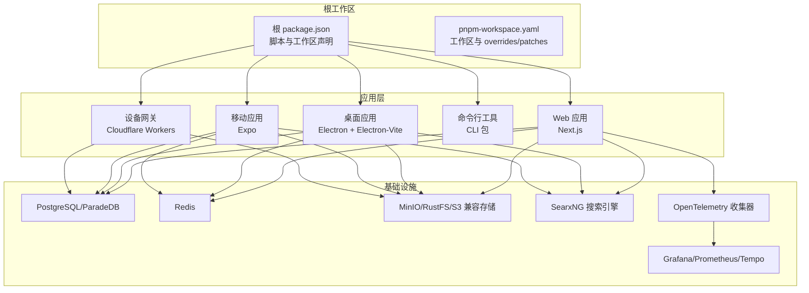
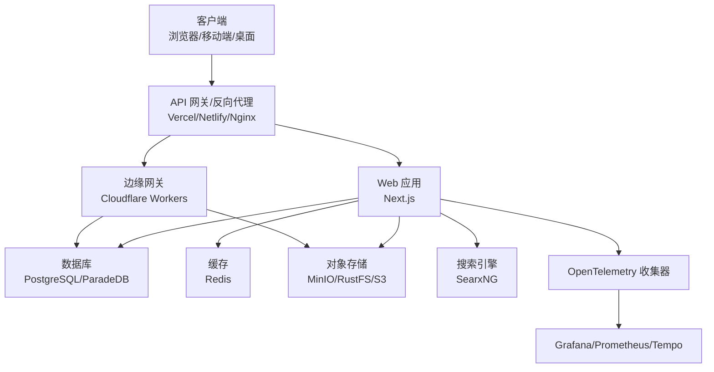
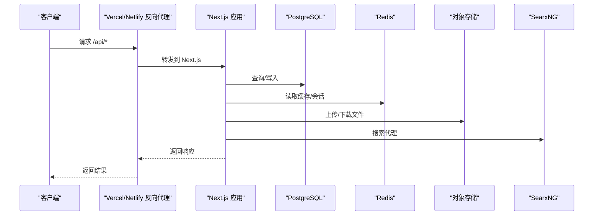
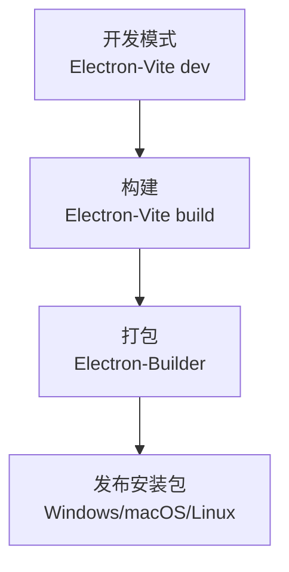
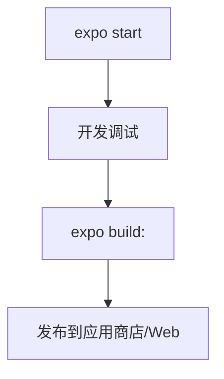
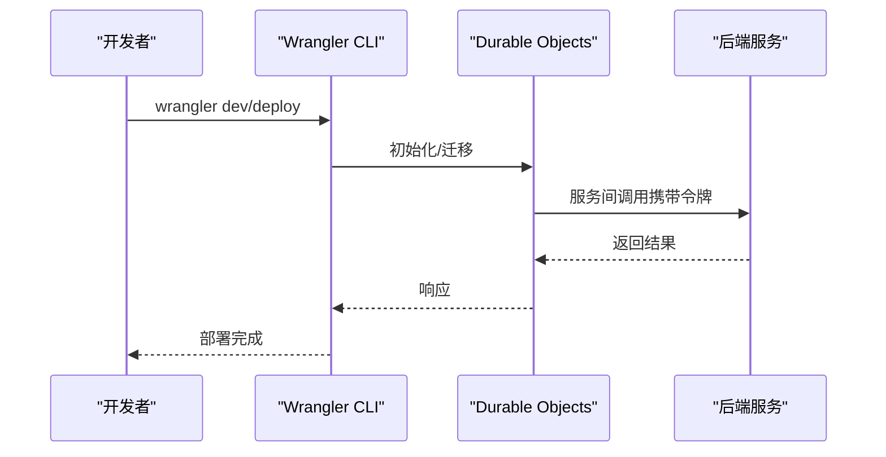
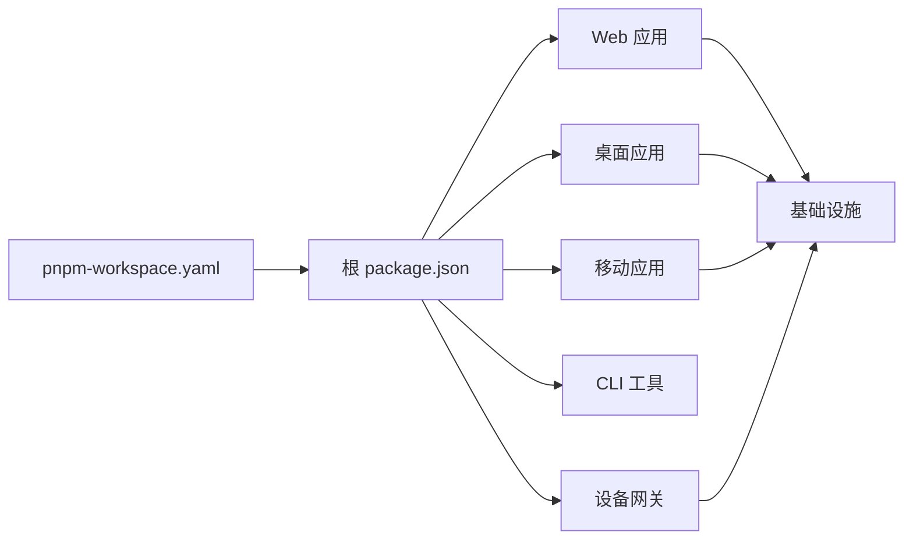

# 微服务架构部署

<cite>
**本文引用的文件**
- [pnpm-workspace.yaml](file://pnpm-workspace.yaml)
- [package.json](file://package.json)
- [docker-compose/deploy/docker-compose.yml](file://docker-compose/deploy/docker-compose.yml)
- [docker-compose/production/grafana/docker-compose.yml](file://docker-compose/production/grafana/docker-compose.yml)
- [apps/desktop/package.json](file://apps/desktop/package.json)
- [apps/desktop/electron.vite.config.ts](file://apps/desktop/electron.vite.config.ts)
- [apps/mobile/package.json](file://apps/mobile/package.json)
- [apps/mobile/app.json](file://apps/mobile/app.json)
- [apps/cli/package.json](file://apps/cli/package.json)
- [apps/device-gateway/package.json](file://apps/device-gateway/package.json)
- [apps/device-gateway/wrangler.toml](file://apps/device-gateway/wrangler.toml)
- [vercel.json](file://vercel.json)
- [netlify.toml](file://netlify.toml)
</cite>

## 目录
1. [引言](#引言)
2. [项目结构](#项目结构)
3. [核心组件](#核心组件)
4. [架构总览](#架构总览)
5. [详细组件分析](#详细组件分析)
6. [依赖关系分析](#依赖关系分析)
7. [性能考量](#性能考量)
8. [故障排查指南](#故障排查指南)
9. [结论](#结论)
10. [附录](#附录)

## 引言
本文件面向 LobeHub 项目的微服务化与多端部署场景，系统性梳理基于 pnpm workspace 的多包管理架构、各应用模块（Web、桌面、移动、边缘网关）的部署策略、服务发现与注册、API 网关与路由、分布式配置与动态配置、以及可观测性（链路追踪、指标采集、告警）方案，并提供拓扑图与部署流程示例，帮助读者在自托管或生产环境中稳定落地。

## 项目结构
LobeHub 采用 monorepo + pnpm workspace 的组织方式，根目录通过工作区声明统一管理多个子包与应用。核心特征如下：
- 根工作区定义了 packages/**、根项目自身、e2e、以及桌面应用主进程入口等路径，确保跨包依赖解析与构建的一致性。
- 各应用模块独立 package.json 与构建配置，分别面向 Web、桌面、移动、CLI 与边缘网关。
- Docker Compose 提供开发与生产环境的容器编排，覆盖数据库、缓存、对象存储、搜索引擎与可观测性组件。

图表来源
- [pnpm-workspace.yaml](file://pnpm-workspace.yaml#L1-L23)
- [package.json](file://package.json#L30-L35)
- [docker-compose/deploy/docker-compose.yml](file://docker-compose/deploy/docker-compose.yml#L1-L144)
- [docker-compose/production/grafana/docker-compose.yml](file://docker-compose/production/grafana/docker-compose.yml#L1-L251)

章节来源
- [pnpm-workspace.yaml](file://pnpm-workspace.yaml#L1-L23)
- [package.json](file://package.json#L30-L35)

## 核心组件
- 多包管理与版本治理
  - 工作区统一声明与 overrides/patches，保证 React、类型库、第三方依赖版本一致性与补丁修复。
  - 通过 onlyBuiltDependencies 控制原生/二进制依赖的构建范围，减少安装与打包成本。
- 应用模块
  - Web：Next.js 应用，支持 SPA 构建与复制模板，配合数据库迁移与 Sitemap 生成。
  - 桌面：Electron 应用，使用 Electron-Vite 开发与打包，区分主进程、预加载与渲染进程配置。
  - 移动：Expo 应用，配置导航、图像与文件系统等依赖。
  - CLI：可执行命令行工具，便于本地开发与自动化任务。
  - 设备网关：Cloudflare Workers，提供 Durable Objects 与密钥绑定，适合作为边缘服务与设备通信桥接。
- 基础设施
  - 数据库：PostgreSQL/ParadeDB（开发/生产可选），提供向量检索能力。
  - 缓存：Redis，支持会话、限流与临时数据。
  - 存储：MinIO/RustFS 或 S3 兼容接口，用于文件上传与对象存储。
  - 搜索：SearxNG，提供隐私友好的搜索代理。
  - 可观测性：OpenTelemetry Collector、Prometheus、Grafana、Tempo，实现指标与链路追踪采集与可视化。

章节来源
- [pnpm-workspace.yaml](file://pnpm-workspace.yaml#L7-L23)
- [package.json](file://package.json#L36-L122)
- [apps/desktop/package.json](file://apps/desktop/package.json#L13-L42)
- [apps/desktop/electron.vite.config.ts](file://apps/desktop/electron.vite.config.ts#L45-L115)
- [apps/mobile/package.json](file://apps/mobile/package.json#L5-L10)
- [apps/cli/package.json](file://apps/cli/package.json#L11-L20)
- [apps/device-gateway/package.json](file://apps/device-gateway/package.json#L5-L11)

## 架构总览
下图展示生产级部署拓扑，强调服务发现与注册、API 网关与路由、分布式配置与动态配置、以及可观测性闭环。

图表来源
- [docker-compose/production/grafana/docker-compose.yml](file://docker-compose/production/grafana/docker-compose.yml#L138-L193)
- [apps/device-gateway/wrangler.toml](file://apps/device-gateway/wrangler.toml#L1-L17)
- [vercel.json](file://vercel.json#L1-L15)
- [netlify.toml](file://netlify.toml#L1-L10)

## 详细组件分析

### Web 应用（Next.js）
- 构建与运行
  - 支持 SPA 构建、复制模板与 Next.js 构建；提供数据库迁移与 Sitemap 生成脚本。
  - 生产镜像暴露 3210 端口，通过环境变量注入数据库、缓存、对象存储与搜索引擎地址。
- 部署策略
  - Vercel：通过 vercel.json 定义构建命令与重写规则，适合静态资源与边缘计算场景。
  - Netlify：通过 netlify.toml 定义构建命令与 Node 环境参数，适合静态站点托管。
- 服务发现与注册
  - 在容器编排中通过服务名进行内网访问（如 postgresql、redis、searxng），无需外部 DNS 注册。
- API 网关与路由
  - 反向代理负责静态资源与 API 路由转发；可结合平台的重写规则实现 SPA 路由回退。
- 分布式配置
  - 使用环境变量注入配置；生产环境建议结合平台的密钥管理与环境变量分组。
- 可观测性
  - 通过 OpenTelemetry 导出指标与链路追踪至 OTLP 接收端，结合 Grafana 展示。

图表来源
- [docker-compose/deploy/docker-compose.yml](file://docker-compose/deploy/docker-compose.yml#L17-L34)
- [docker-compose/production/grafana/docker-compose.yml](file://docker-compose/production/grafana/docker-compose.yml#L174-L193)
- [vercel.json](file://vercel.json#L4-L13)
- [netlify.toml](file://netlify.toml#L1-L9)

章节来源
- [package.json](file://package.json#L36-L51)
- [docker-compose/deploy/docker-compose.yml](file://docker-compose/deploy/docker-compose.yml#L3-L35)
- [docker-compose/production/grafana/docker-compose.yml](file://docker-compose/production/grafana/docker-compose.yml#L160-L193)
- [vercel.json](file://vercel.json#L1-L15)
- [netlify.toml](file://netlify.toml#L1-L10)

### 桌面应用（Electron）
- 构建与打包
  - 使用 Electron-Vite 进行开发与构建，区分主进程、预加载与渲染进程；通过 onlyBuiltDependencies 控制原生依赖。
  - 支持多平台打包（Windows/macOS/Linux），并提供本地打包与更新通道配置。
- 部署策略
  - 通过 Electron Builder 生成安装包；开发时可直接启动预览。
- 服务发现与注册
  - 与 Web 应用一致，通过服务名在容器网络内访问后端服务。
- API 网关与路由
  - 主进程可作为轻量网关，处理本地 IPC 与网络请求转发。
- 分布式配置
  - 通过环境变量与配置文件注入；可结合平台密钥管理。

图表来源
- [apps/desktop/electron.vite.config.ts](file://apps/desktop/electron.vite.config.ts#L45-L115)
- [apps/desktop/package.json](file://apps/desktop/package.json#L13-L42)

章节来源
- [apps/desktop/package.json](file://apps/desktop/package.json#L13-L42)
- [apps/desktop/electron.vite.config.ts](file://apps/desktop/electron.vite.config.ts#L45-L115)

### 移动应用（Expo）
- 构建与运行
  - 使用 Expo CLI 启动开发服务器，支持 Android、iOS 与 Web 平台。
  - 依赖包括导航、图像、文件系统与 TailwindCSS 等。
- 部署策略
  - 通过 Expo 进行应用商店构建与发布；Web 端可作为 PWA 托管。
- 服务发现与注册
  - 通过平台提供的网络与 API 访问后端服务。
- API 网关与路由
  - 移动端直连后端 API，必要时可通过平台的边缘函数或 CDN 进行路由与缓存优化。

图表来源
- [apps/mobile/package.json](file://apps/mobile/package.json#L5-L10)
- [apps/mobile/app.json](file://apps/mobile/app.json#L1-L36)

章节来源
- [apps/mobile/package.json](file://apps/mobile/package.json#L1-L47)
- [apps/mobile/app.json](file://apps/mobile/app.json#L1-L36)

### CLI 工具
- 功能与用途
  - 提供命令行工具，便于本地开发、测试与自动化任务。
- 版本与发布
  - 通过 publishConfig 配置公开发布与 registry，便于全局安装与使用。

章节来源
- [apps/cli/package.json](file://apps/cli/package.json#L11-L42)

### 设备网关（Cloudflare Workers）
- 构建与部署
  - 使用 Wrangler 进行本地开发与部署；定义 Durable Objects 与迁移。
  - 通过 secrets 注入公钥与服务令牌，实现服务间认证。
- 服务发现与注册
  - 作为边缘服务，通过 Worker 绑定与环境变量访问后端资源。
- API 网关与路由
  - 可作为边缘路由与鉴权前置，实现请求预处理与转发。

图表来源
- [apps/device-gateway/wrangler.toml](file://apps/device-gateway/wrangler.toml#L1-L17)
- [apps/device-gateway/package.json](file://apps/device-gateway/package.json#L5-L11)

章节来源
- [apps/device-gateway/package.json](file://apps/device-gateway/package.json#L1-L24)
- [apps/device-gateway/wrangler.toml](file://apps/device-gateway/wrangler.toml#L1-L17)

## 依赖关系分析
- 工作区与包管理
  - pnpm workspace 声明统一管理 packages/**、根项目、e2e 与桌面主进程入口，避免重复安装与版本漂移。
  - overrides/patches 与 onlyBuiltDependencies 确保关键依赖版本一致与原生模块可控。
- 应用间依赖
  - Web 应用通过 workspace:* 依赖业务与工具包，形成清晰的领域边界与复用。
- 基础设施耦合
  - Web、桌面、移动均依赖数据库、缓存、对象存储与搜索引擎；通过容器编排实现服务发现与健康检查。

图表来源
- [pnpm-workspace.yaml](file://pnpm-workspace.yaml#L1-L23)
- [package.json](file://package.json#L30-L35)

章节来源
- [pnpm-workspace.yaml](file://pnpm-workspace.yaml#L1-L23)
- [package.json](file://package.json#L30-L35)

## 性能考量
- 构建与缓存
  - 使用 onlyBuiltDependencies 与精简的依赖树，降低安装与打包时间。
  - SPA 构建与复制模板分离，缩短 Next.js 构建路径。
- 运行时优化
  - Redis 缓存热点数据，PostgreSQL/ParadeDB 提供向量检索能力。
  - 对象存储与搜索引擎分离，避免单点瓶颈。
- 观测性
  - OpenTelemetry 收集指标与链路追踪，结合 Grafana/Prometheus/Tempo 实现性能监控与告警。

## 故障排查指南
- 健康检查失败
  - PostgreSQL/Redis/RustFS/MinIO 均配置了健康检查；若容器未就绪，需检查环境变量与卷挂载。
- OIDC 与存储连通性
  - 启动脚本对 Casdoor OIDC 配置与 S3 健康状态进行校验，失败时输出提示信息，便于定位配置冲突与网络问题。
- 日志与追踪
  - 通过 OpenTelemetry 导出至 OTLP 接收端，结合 Grafana 查看指标与链路；Tempo 提供分布式追踪查询。

章节来源
- [docker-compose/deploy/docker-compose.yml](file://docker-compose/deploy/docker-compose.yml#L52-L102)
- [docker-compose/production/grafana/docker-compose.yml](file://docker-compose/production/grafana/docker-compose.yml#L194-L233)

## 结论
LobeHub 通过 pnpm workspace 实现多包统一治理，结合容器编排与平台托管（Vercel/Netlify），实现了 Web、桌面、移动与边缘网关的多端协同部署。以 OpenTelemetry 为核心的可观测性体系，保障了生产环境的稳定性与可维护性。建议在生产部署中进一步完善服务网格、API 网关的细粒度路由与安全策略，并持续优化缓存与存储的性能与可靠性。

## 附录
- 部署流程示例（生产）
  - 准备环境变量与密钥（数据库、缓存、对象存储、搜索引擎、SSO 等）。
  - 启动基础设施：PostgreSQL/Redis/MinIO/SearxNG/OTel/Grafana。
  - 部署 Web 应用与设备网关，配置反向代理与重写规则。
  - 验证健康检查与 OIDC 配置，观察 Grafana 面板与链路追踪。
- 发布策略
  - 使用语义化版本与脚本触发发布；CLI 工具可辅助自动化任务与验证。