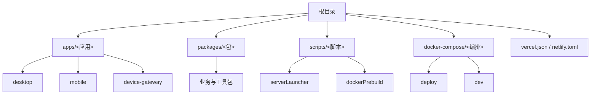
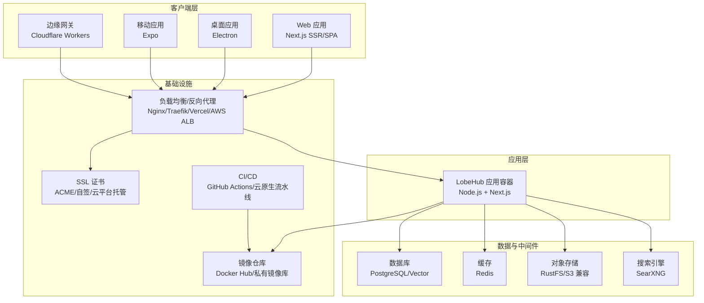
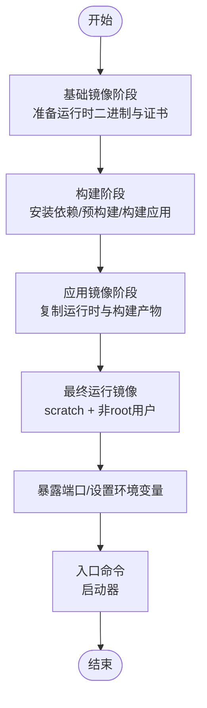
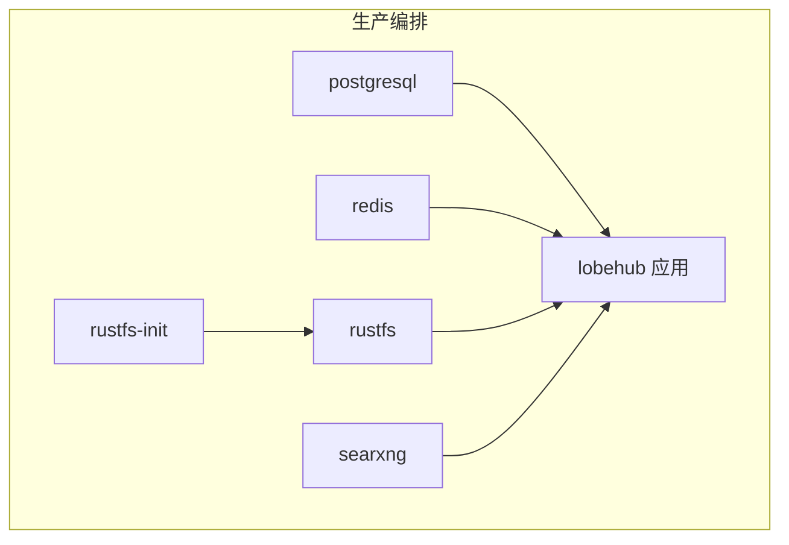
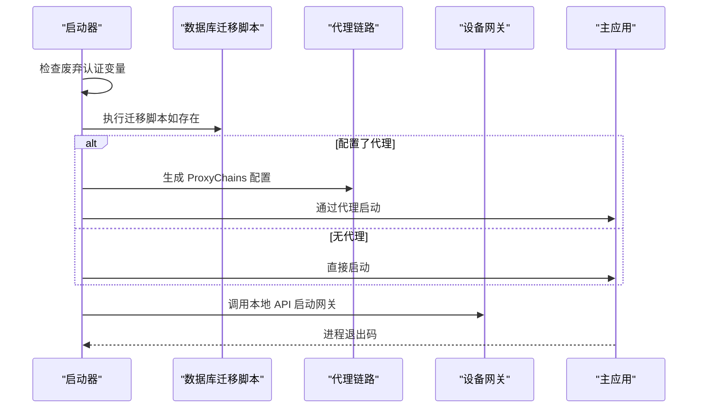
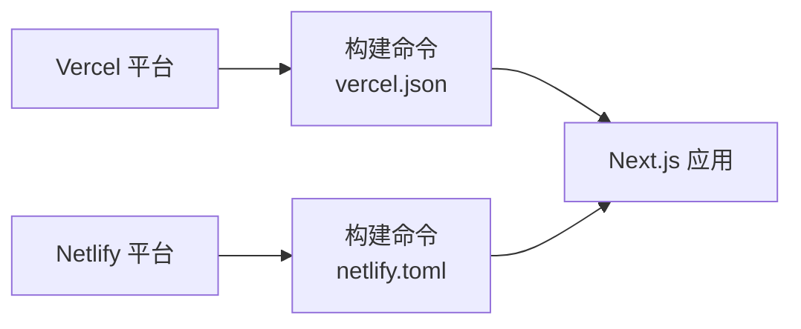
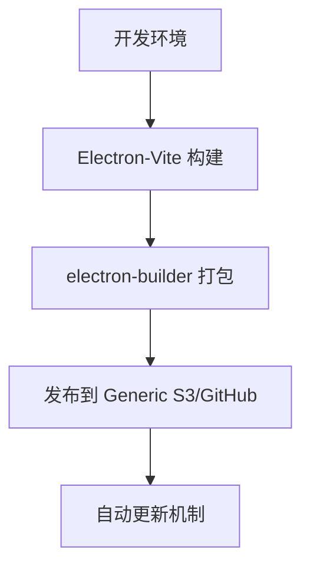
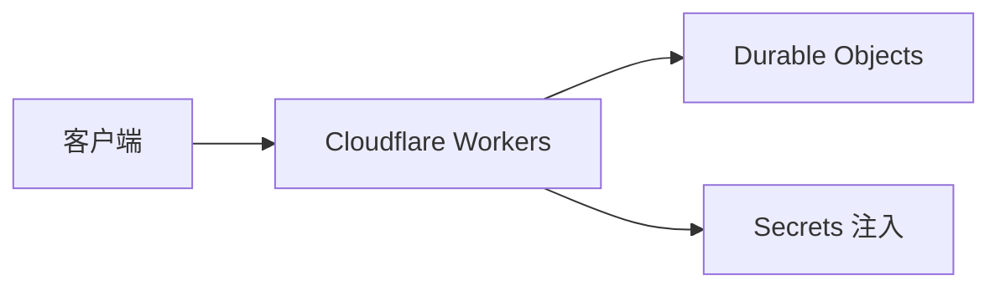
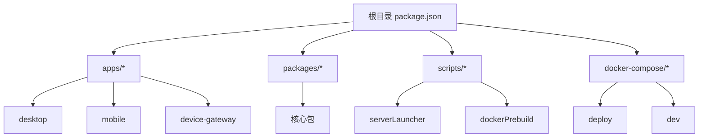

# 部署架构设计

<cite>
**本文引用的文件**
- [Dockerfile](file://Dockerfile)
- [docker-compose/deploy/docker-compose.yml](file://docker-compose/deploy/docker-compose.yml)
- [docker-compose/dev/docker-compose.yml](file://docker-compose/dev/docker-compose.yml)
- [docker-compose/setup.sh](file://docker-compose/setup.sh)
- [scripts/serverLauncher/startServer.js](file://scripts/serverLauncher/startServer.js)
- [scripts/dockerPrebuild.mts](file://scripts/dockerPrebuild.mts)
- [vercel.json](file://vercel.json)
- [netlify.toml](file://netlify.toml)
- [apps/desktop/electron.vite.config.ts](file://apps/desktop/electron.vite.config.ts)
- [apps/desktop/electron-builder.mjs](file://apps/desktop/electron-builder.mjs)
- [apps/mobile/app.json](file://apps/mobile/app.json)
- [apps/device-gateway/wrangler.toml](file://apps/device-gateway/wrangler.toml)
- [package.json](file://package.json)
- [pnpm-workspace.yaml](file://pnpm-workspace.yaml)
</cite>

## 目录

1. [简介](#简介)
2. [项目结构](#项目结构)
3. [核心组件](#核心组件)
4. [架构总览](#架构总览)
5. [详细组件分析](#详细组件分析)
6. [依赖关系分析](#依赖关系分析)
7. [性能考量](#性能考量)
8. [故障排查指南](#故障排查指南)
9. [结论](#结论)
10. [附录](#附录)

## 简介

本文件面向 LobeHub 项目的多平台部署需求，系统化梳理 Web 应用、桌面应用、移动应用的部署策略，给出容器化部署的多阶段构建、镜像优化与依赖管理方案，并结合 docker-compose 提供生产与开发环境的编排参考。同时，针对云平台部署（含 AWS、Azure、Google Cloud 等）给出最佳实践建议，覆盖负载均衡、反向代理、SSL 证书、微服务下的服务发现与配置管理、高可用与容灾备份、自动扩缩容等企业级主题。文末提供可直接落地的部署拓扑图与架构示意图。

## 项目结构

LobeHub 采用 Monorepo 结构，核心应用与工具分布在 apps、packages、scripts 等目录中。部署相关的关键文件集中在根目录的 Dockerfile、vercel.json、netlify.toml，以及 docker-compose 目录中的开发与生产编排文件。桌面应用与移动应用分别通过独立的构建配置与打包脚本实现跨平台分发。

**图表来源**

- [package.json](file://package.json#L30-L35)
- [pnpm-workspace.yaml](file://pnpm-workspace.yaml#L1-L5)

**章节来源**

- [package.json](file://package.json#L30-L35)
- [pnpm-workspace.yaml](file://pnpm-workspace.yaml#L1-L5)

## 核心组件

- 容器镜像与多阶段构建：基于 Node.js slim 基础镜像，通过多阶段构建分离依赖安装、构建与运行时，最终以最小化运行时镜像交付。
- docker-compose 编排：提供开发与生产两套编排，包含数据库、缓存、对象存储、搜索引擎等依赖服务。
- 启动器与预构建：启动器负责数据库迁移、代理链路配置与服务启动；预构建脚本校验环境变量与打印构建信息。
- 云平台适配：提供 Vercel 与 Netlify 的构建配置入口，便于云端一键部署。
- 桌面应用：基于 Electron 的多平台打包与更新发布，支持稳定 / 夜间 / 金丝雀频道。
- 移动应用：基于 Expo 的跨平台应用配置与构建。
- 边缘网关：基于 Cloudflare Workers 的设备网关示例，展示边缘部署能力。

**章节来源**

- [Dockerfile](file://Dockerfile#L1-L344)
- [scripts/serverLauncher/startServer.js](file://scripts/serverLauncher/startServer.js#L1-L210)
- [scripts/dockerPrebuild.mts](file://scripts/dockerPrebuild.mts#L1-L125)
- [docker-compose/deploy/docker-compose.yml](file://docker-compose/deploy/docker-compose.yml#L1-L144)
- [docker-compose/dev/docker-compose.yml](file://docker-compose/dev/docker-compose.yml#L1-L123)
- [vercel.json](file://vercel.json#L1-L15)
- [netlify.toml](file://netlify.toml#L1-L10)
- [apps/desktop/electron.vite.config.ts](file://apps/desktop/electron.vite.config.ts#L1-L116)
- [apps/desktop/electron-builder.mjs](file://apps/desktop/electron-builder.mjs#L1-L307)
- [apps/mobile/app.json](file://apps/mobile/app.json#L1-L35)
- [apps/device-gateway/wrangler.toml](file://apps/device-gateway/wrangler.toml#L1-L17)

## 架构总览

下图展示了 LobeHub 在容器化与云平台上的总体部署视图，涵盖 Web 应用、桌面应用、移动应用、边缘网关以及后端依赖服务（数据库、缓存、对象存储、搜索引擎）。

**图表来源**

- [docker-compose/deploy/docker-compose.yml](file://docker-compose/deploy/docker-compose.yml#L3-L131)
- [apps/device-gateway/wrangler.toml](file://apps/device-gateway/wrangler.toml#L1-L17)
- [vercel.json](file://vercel.json#L1-L15)
- [netlify.toml](file://netlify.toml#L1-L10)

## 详细组件分析

### Web 应用容器化与多阶段构建

- 多阶段构建流程
  - 基础镜像阶段：基于 slim 版 Node.js，准备运行时所需的二进制与证书。
  - 构建阶段：安装依赖、执行预构建检查、构建 SPA 与 Next.js 应用，拷贝迁移脚本与共享脚本。
  - 应用镜像阶段：复制基础运行时与构建产物，仅保留必要依赖，减少体积。
  - 最终运行镜像：基于 scratch，设置非 root 用户、暴露端口、设置环境变量与入口命令。
- 关键优化点
  - 使用 Next.js 输出追踪裁剪静态资源与运行时依赖。
  - 仅复制必要的 node_modules 子集，避免全量依赖进入镜像。
  - 使用只读文件系统与非 root 用户提升安全性。
- 环境变量与功能开关
  - 支持通过构建参数注入前端路径、分析服务、特性开关等。
  - 运行时环境变量覆盖数据库、认证、缓存、邮件、S3、模型提供商等配置。

**图表来源**

- [Dockerfile](file://Dockerfile#L5-L135)

**章节来源**

- [Dockerfile](file://Dockerfile#L1-L344)

### docker-compose 生产与开发编排

- 生产编排（deploy）
  - 包含应用容器、PostgreSQL、Redis、RustFS 对象存储、SearXNG 搜索引擎。
  - 通过健康检查保证依赖就绪后再启动主应用。
  - 支持 S3 兼容存储与匿名访问策略配置。
- 开发编排（dev）
  - 通过共享网络与宿主机端口映射，便于联调与调试。
  - RustFS 与 S3 设置通过 mc 初始化桶与权限。
- 启动顺序与依赖
  - 应用容器依赖数据库、缓存、对象存储与搜索引擎健康状态。
  - 通过条件等待确保依赖服务可用。

**图表来源**

- [docker-compose/deploy/docker-compose.yml](file://docker-compose/deploy/docker-compose.yml#L3-L131)

**章节来源**

- [docker-compose/deploy/docker-compose.yml](file://docker-compose/deploy/docker-compose.yml#L1-L144)
- [docker-compose/dev/docker-compose.yml](file://docker-compose/dev/docker-compose.yml#L1-L123)

### 启动器与预构建流程

- 启动器职责
  - 迁移数据库脚本（若存在）。
  - 可选的代理链路配置（ProxyChains），支持 HTTP/HTTPS/SOCKS4/5。
  - 启动设备网关（通过本地 API）。
  - 启动主服务进程。
- 预构建检查
  - 校验废弃的认证环境变量并提示迁移。
  - 校验必需的环境变量（如 AUTH_SECRET、KEY_VAULTS_SECRET）。
  - 打印构建环境信息（Node/npm/pnpm/bun 版本、认证与 SSO 配置概览）。

**图表来源**

- [scripts/serverLauncher/startServer.js](file://scripts/serverLauncher/startServer.js#L167-L209)
- [scripts/dockerPrebuild.mts](file://scripts/dockerPrebuild.mts#L24-L53)

**章节来源**

- [scripts/serverLauncher/startServer.js](file://scripts/serverLauncher/startServer.js#L1-L210)
- [scripts/dockerPrebuild.mts](file://scripts/dockerPrebuild.mts#L1-L125)

### 云平台部署方案（Vercel / Netlify）

- Vercel
  - 构建命令与安装命令由 vercel.json 指定，支持重写规则。
  - 适合 Next.js 应用的云端一键部署与边缘加速。
- Netlify
  - 构建命令与 Node 内存参数在 netlify.toml 中配置。
  - 适合静态站点与函数部署场景。

**图表来源**

- [vercel.json](file://vercel.json#L1-L15)
- [netlify.toml](file://netlify.toml#L1-L10)

**章节来源**

- [vercel.json](file://vercel.json#L1-L15)
- [netlify.toml](file://netlify.toml#L1-L10)

### 桌面应用部署（Electron）

- 构建配置
  - Electron-Vite 配置，区分主进程、预加载与渲染进程，按需拆分代码块与国际化资源。
  - 外部化原生模块，避免打包导致的兼容性问题。
- 打包与发布
  - electron-builder 支持多平台目标（AppImage、snap、deb、rpm、dmg、zip、nsis）。
  - 更新通道（稳定 / 夜间 / 金丝雀）与发布源（Generic S3 或 GitHub Releases）可配置。
  - 支持 macOS 硬化运行时与公证流程，按需签名。

**图表来源**

- [apps/desktop/electron.vite.config.ts](file://apps/desktop/electron.vite.config.ts#L45-L115)
- [apps/desktop/electron-builder.mjs](file://apps/desktop/electron-builder.mjs#L45-L69)

**章节来源**

- [apps/desktop/electron.vite.config.ts](file://apps/desktop/electron.vite.config.ts#L1-L116)
- [apps/desktop/electron-builder.mjs](file://apps/desktop/electron-builder.mjs#L1-L307)

### 移动应用部署（Expo）

- 应用元数据
  - app.json 定义应用名称、版本、图标、启动页、平台特定配置（iOS/Android/Web 插件等）。
- 构建与分发
  - 基于 Expo 的统一构建流程，支持 iOS/Android 应用商店与 Web 发布。

**图表来源**

- [apps/mobile/app.json](file://apps/mobile/app.json#L1-L35)

**章节来源**

- [apps/mobile/app.json](file://apps/mobile/app.json#L1-L35)

### 边缘网关（Cloudflare Workers）

- 设计要点
  - 使用 Wrangler 配置 Durable Objects 绑定与迁移。
  - 通过密钥注入实现服务间鉴权（JWKS Public Key、Service Token）。
- 适用场景
  - 设备网关、边缘计算、低延迟 API 转发与鉴权。

**图表来源**

- [apps/device-gateway/wrangler.toml](file://apps/device-gateway/wrangler.toml#L1-L17)

**章节来源**

- [apps/device-gateway/wrangler.toml](file://apps/device-gateway/wrangler.toml#L1-L17)

### 云平台部署最佳实践（AWS / Azure / GCP）

- 基础设施与网络
  - 使用 VPC / 虚拟网络隔离，子网划分（公共 / 私有），NAT 网关访问互联网。
  - 负载均衡器（ALB/NLB）前置，启用 WAF/OWASP 规则，TLS 终止于 LB。
- 容器化与编排
  - ECS/EKS/AKS + Helm/Kustomize 管理应用与依赖。
  - 数据库使用托管实例（RDS/Elasticache/ 云存储），开启自动备份与跨区复制。
- 微服务与服务治理
  - 服务发现（Consul/Service Mesh）、配置中心（Vault / 云配置管理）、可观测性（APM / 日志 / 指标）。
- 高可用与容灾
  - 多可用区部署、自动扩缩容（HPA/VPA）、蓝绿 / 金丝雀发布。
- 安全与合规
  - IAM / 服务账号最小权限、密钥轮换、审计日志、合规扫描。

\[本节为通用实践总结，不直接分析具体文件，故无 “章节来源”]

## 依赖关系分析

- Monorepo 工作区
  - pnpm-workspace.yaml 声明工作区范围与覆盖规则，确保依赖解析一致性。
- 应用脚本与构建命令
  - package.json 提供统一的构建、迁移、开发与打包命令，贯穿 Web、桌面与移动应用。
- docker-compose 依赖
  - 应用容器依赖数据库、缓存、对象存储与搜索引擎的健康状态，确保启动顺序与稳定性。

**图表来源**

- [pnpm-workspace.yaml](file://pnpm-workspace.yaml#L1-L5)
- [package.json](file://package.json#L36-L123)
- [docker-compose/deploy/docker-compose.yml](file://docker-compose/deploy/docker-compose.yml#L1-L144)
- [docker-compose/dev/docker-compose.yml](file://docker-compose/dev/docker-compose.yml#L1-L123)

**章节来源**

- [pnpm-workspace.yaml](file://pnpm-workspace.yaml#L1-L23)
- [package.json](file://package.json#L36-L123)

## 性能考量

- 镜像体积与启动时间
  - 多阶段构建与输出追踪裁剪，减少镜像体积与冷启动时间。
  - 非 root 用户与只读文件系统降低运行时开销与风险。
- 数据库与缓存
  - 使用连接池与持久化缓存，合理设置索引与查询计划。
- CDN 与边缘
  - 利用云平台边缘节点与缓存，缩短静态资源与 API 响应路径。
- 监控与告警
  - 集成 APM、日志聚合与指标监控，建立性能基线与异常告警。

\[本节提供通用指导，不直接分析具体文件，故无 “章节来源”]

## 故障排查指南

- 启动器常见问题
  - DNS 解析失败：检查 DNS 服务器与网络连通性。
  - 代理链路错误：确认协议、端口与凭据正确，验证 IP 合法性。
  - 数据库迁移失败：确认迁移脚本存在与可执行权限，检查数据库连接字符串。
- 预构建检查
  - 缺少必需环境变量：根据提示补充 AUTH_SECRET、KEY_VAULTS_SECRET 等。
  - 废弃变量：按提示迁移至新变量名。
- docker-compose
  - 依赖服务未就绪：查看健康检查输出，确认端口映射与卷挂载。
  - RustFS 初始化失败：检查 mc 命令与桶配置 JSON，确认凭证正确。
- 云平台部署
  - Vercel/Netlify 构建失败：核对构建命令、环境变量与 Node 版本。
  - 反向代理与 SSL：确认证书链完整、域名解析与防火墙放行。

**章节来源**

- [scripts/serverLauncher/startServer.js](file://scripts/serverLauncher/startServer.js#L21-L64)
- [scripts/dockerPrebuild.mts](file://scripts/dockerPrebuild.mts#L24-L53)
- [docker-compose/deploy/docker-compose.yml](file://docker-compose/deploy/docker-compose.yml#L48-L56)
- [docker-compose/setup.sh](file://docker-compose/setup.sh#L631-L704)

## 结论

LobeHub 的部署架构围绕容器化与多平台应用展开，结合 docker-compose 实现快速拉起与生产级编排，配合启动器与预构建脚本保障部署一致性与安全性。云平台（Vercel/Netlify）与边缘网关（Workers）提供了灵活的扩展路径。企业级场景建议进一步完善微服务治理、高可用与容灾备份、自动扩缩容与安全合规体系，以满足大规模生产需求。

## 附录

- 快速部署步骤（docker-compose）
  - 下载编排文件与示例环境变量，按提示生成密钥与配置。
  - 选择部署模式（域名 / 端口 / 本地），配置反向代理与端口放行。
  - 启动依赖服务与应用容器，查看日志并验证健康状态。
- 一键安装脚本
  - setup.sh 提供交互式配置与密钥生成，简化首次部署体验。

**章节来源**

- [docker-compose/setup.sh](file://docker-compose/setup.sh#L519-L773)
