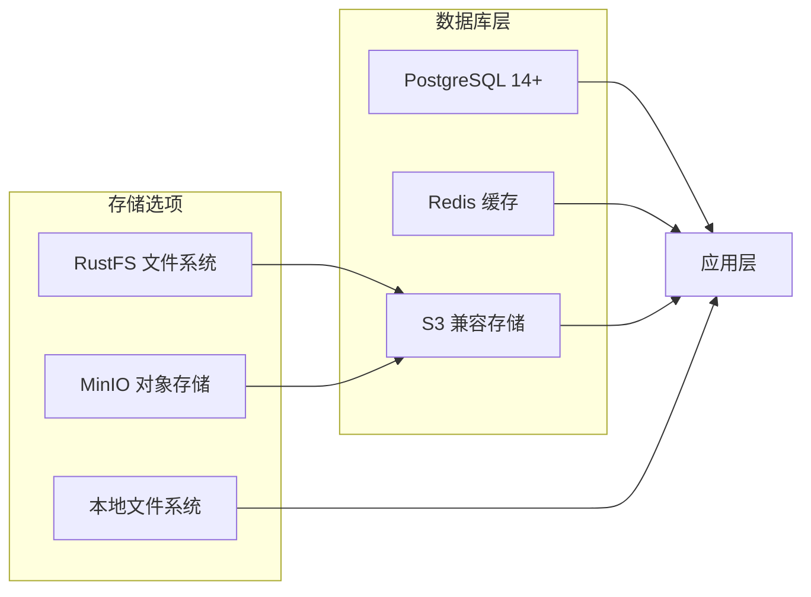
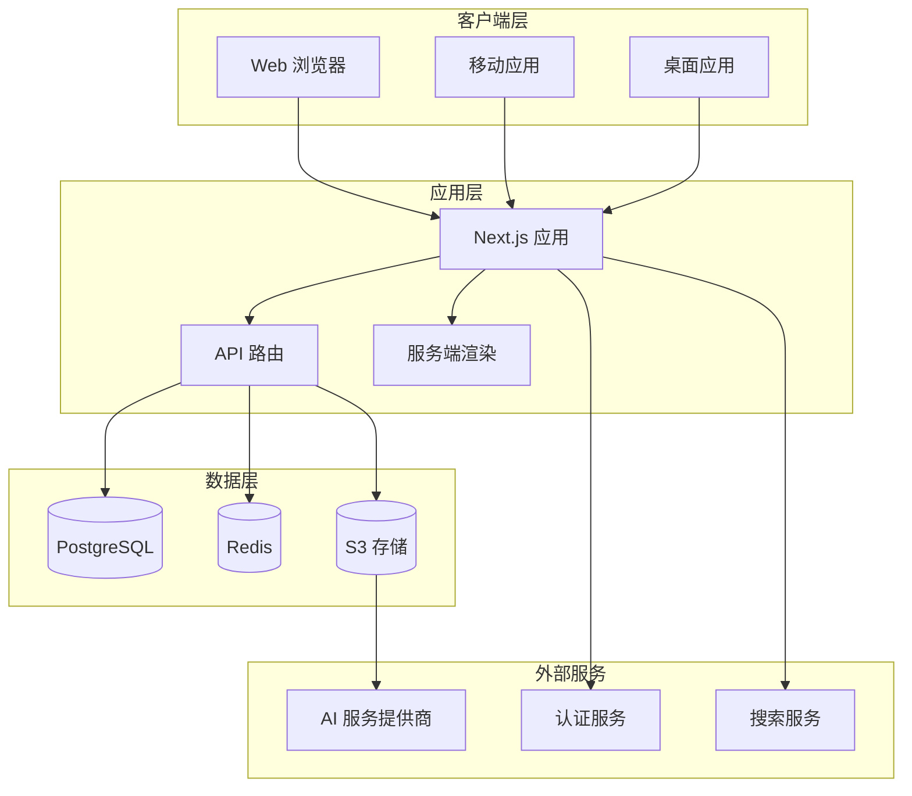
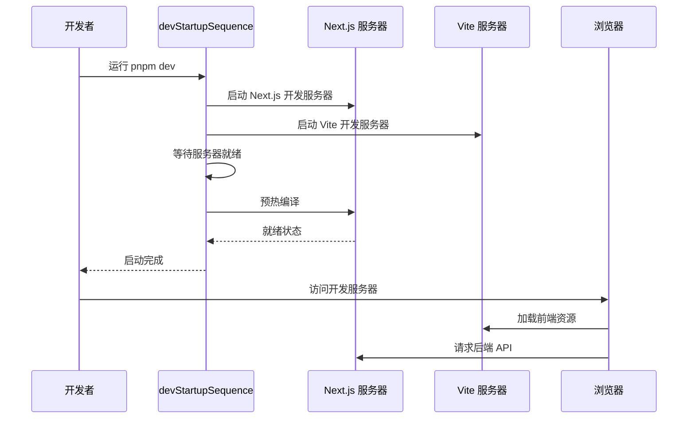
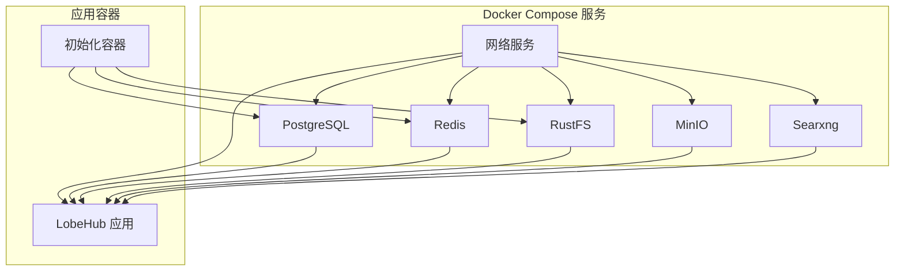
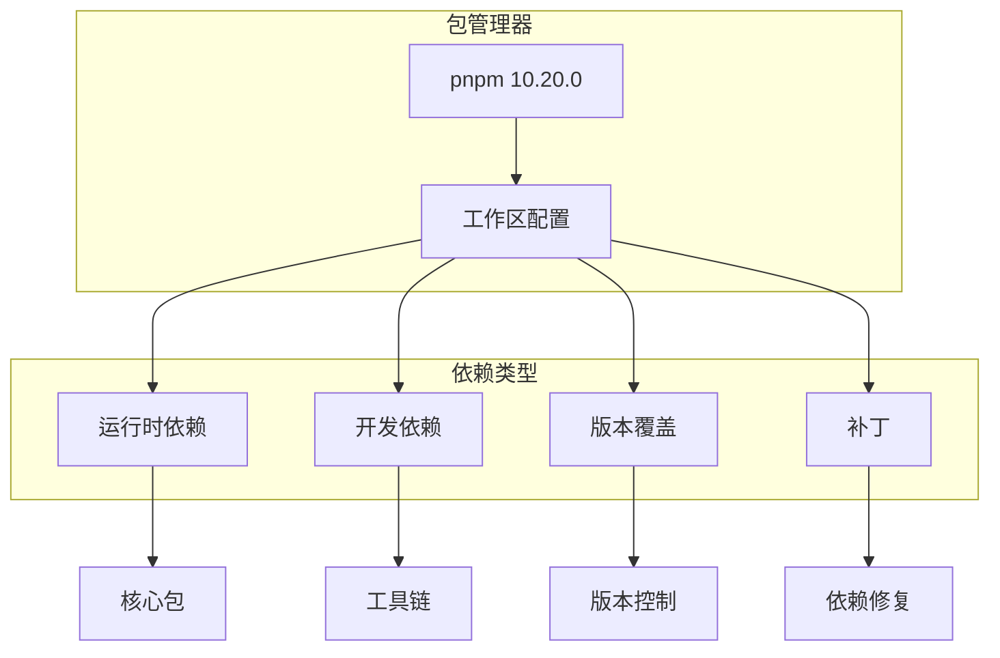
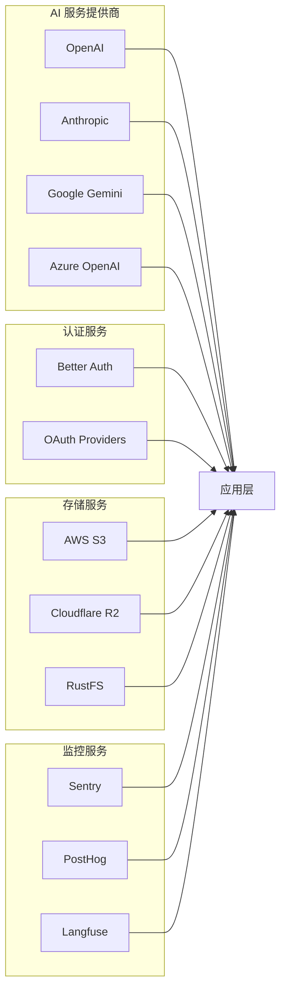
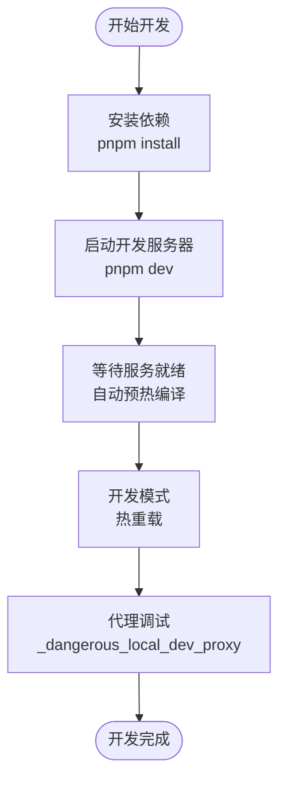
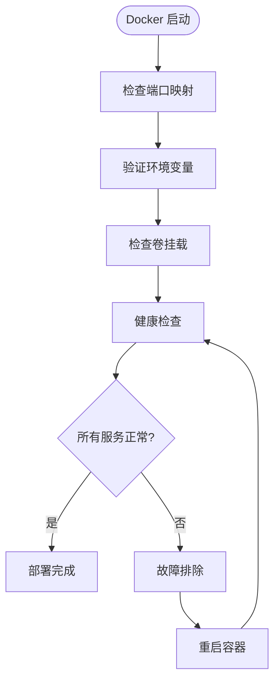

# 快速开始指南

<cite>
**本文档引用的文件**
- [README.md](file://README.md)
- [package.json](file://package.json)
- [pnpm-workspace.yaml](file://pnpm-workspace.yaml)
- [docker-compose/dev/docker-compose.yml](file://docker-compose/dev/docker-compose.yml)
- [Dockerfile](file://Dockerfile)
- [vercel.json](file://vercel.json)
- [next.config.ts](file://next.config.ts)
- [vite.config.ts](file://vite.config.ts)
- [apps/desktop/package.json](file://apps/desktop/package.json)
- [apps/mobile/package.json](file://apps/mobile/package.json)
- [docs/self-hosting/start.mdx](file://docs/self-hosting/start.mdx)
- [docs/self-hosting/environment-variables.mdx](file://docs/self-hosting/environment-variables.mdx)
- [scripts/devStartupSequence.mts](file://scripts/devStartupSequence.mts)
- [docker-compose/dev/bucket.config.json](file://docker-compose/dev/bucket.config.json)
- [docker-compose/dev/searxng-settings.yml](file://docker-compose/dev/searxng-settings.yml)
</cite>

## 目录
1. [简介](#简介)
2. [项目结构](#项目结构)
3. [核心组件](#核心组件)
4. [架构概览](#架构概览)
5. [详细组件分析](#详细组件分析)
6. [依赖分析](#依赖分析)
7. [性能考虑](#性能考虑)
8. [故障排除指南](#故障排除指南)
9. [结论](#结论)
10. [附录](#附录)

## 简介

LobeHub 是一个开源的综合性 AI Agent 框架，支持语音合成、多模态交互和可扩展的功能调用插件系统。该项目提供了从零开始的完整开发和部署体验，支持本地开发、Docker 部署、云平台部署等多种方式。

## 项目结构

LobeHub 采用现代化的 monorepo 架构，包含多个应用程序和包：

```mermaid
graph TB
subgraph "根目录"
Root[项目根目录]
PackageJSON[package.json]
Workspace[pnpm-workspace.yaml]
end
subgraph "应用层"
Web[Web 应用 (Next.js)]
Desktop[桌面应用 (Electron)]
Mobile[移动应用 (React Native)]
CLI[命令行工具]
end
subgraph "核心包"
Business[业务逻辑包]
Utils[工具库]
Types[类型定义]
Config[配置管理]
end
subgraph "基础设施"
Docker[Docker 配置]
Docs[文档]
Scripts[构建脚本]
end
Root --> Web
Root --> Desktop
Root --> Mobile
Root --> CLI
Root --> Business
Root --> Utils
Root --> Types
Root --> Config
Root --> Docker
Root --> Docs
Root --> Scripts
```

**图表来源**
- [package.json](file://package.json#L30-L35)
- [pnpm-workspace.yaml](file://pnpm-workspace.yaml#L1-L5)

**章节来源**
- [package.json](file://package.json#L30-L35)
- [pnpm-workspace.yaml](file://pnpm-workspace.yaml#L1-L5)

## 核心组件

### 开发环境组件

LobeHub 提供了完整的开发环境配置，支持多种开发模式：

| 组件 | 端口 | 功能 | 启动命令 |
|------|------|------|----------|
| Next.js 服务端 | 3010 | 主应用服务端渲染 | `pnpm dev:next` |
| Vite 前端 | 9876 | 单页应用开发服务器 | `pnpm dev:spa` |
| 移动端开发 | 3012 | 移动端开发服务器 | `pnpm dev:spa:mobile` |
| 桌面应用 | 5173 | Electron 桌面应用 | `pnpm dev:desktop` |

### 数据库组件

项目集成了多种数据库和存储解决方案：



**图表来源**
- [docker-compose/dev/docker-compose.yml](file://docker-compose/dev/docker-compose.yml#L17-L36)
- [docs/self-hosting/start.mdx](file://docs/self-hosting/start.mdx#L25-L37)

**章节来源**
- [docker-compose/dev/docker-compose.yml](file://docker-compose/dev/docker-compose.yml#L17-L36)
- [docs/self-hosting/start.mdx](file://docs/self-hosting/start.mdx#L25-L37)

## 架构概览

LobeHub 采用微服务架构，支持多种部署模式：



**图表来源**
- [docs/self-hosting/start.mdx](file://docs/self-hosting/start.mdx#L21-L38)
- [Dockerfile](file://Dockerfile#L162-L212)

## 详细组件分析

### 开发启动流程

LobeHub 提供了智能的开发启动序列，自动管理多个开发服务器：



**图表来源**
- [scripts/devStartupSequence.mts](file://scripts/devStartupSequence.mts#L119-L134)

**章节来源**
- [scripts/devStartupSequence.mts](file://scripts/devStartupSequence.mts#L1-L140)

### Docker 部署架构

Docker 部署提供了完整的基础设施栈：



**图表来源**
- [docker-compose/dev/docker-compose.yml](file://docker-compose/dev/docker-compose.yml#L1-L123)

**章节来源**
- [docker-compose/dev/docker-compose.yml](file://docker-compose/dev/docker-compose.yml#L1-L123)

### 环境变量配置

LobeHub 支持丰富的环境变量配置，涵盖多个方面：

| 类别 | 关键变量 | 描述 | 示例值 |
|------|----------|------|--------|
| 基础配置 | `APP_URL`, `PORT` | 应用基础配置 | `http://localhost:3210` |
| 数据库 | `DATABASE_URL`, `REDIS_URL` | 数据库连接配置 | `postgresql://...` |
| AI 服务 | `OPENAI_API_KEY`, `ANTHROPIC_API_KEY` | AI 服务密钥 | `sk-...` |
| 认证 | `AUTH_SECRET`, `AUTH_GITHUB_ID` | 用户认证配置 | `secret-key` |
| 存储 | `S3_ACCESS_KEY_ID`, `NEXT_PUBLIC_S3_DOMAIN` | 对象存储配置 | `AKI...` |

**章节来源**
- [Dockerfile](file://Dockerfile#L154-L335)
- [docs/self-hosting/environment-variables.mdx](file://docs/self-hosting/environment-variables.mdx#L15-L27)

## 依赖分析

### 包管理器配置

LobeHub 使用 pnpm 作为包管理器，支持工作区管理：



**图表来源**
- [package.json](file://package.json#L500-L516)
- [pnpm-workspace.yaml](file://pnpm-workspace.yaml#L11-L23)

**章节来源**
- [package.json](file://package.json#L500-L516)
- [pnpm-workspace.yaml](file://pnpm-workspace.yaml#L11-L23)

### 外部依赖关系

项目集成了多个重要的外部服务：



**图表来源**
- [Dockerfile](file://Dockerfile#L214-L335)

## 性能考虑

### 构建优化

LobeHub 在构建过程中采用了多项优化策略：

1. **输出文件追踪优化**：在 Vercel 平台上排除 musl 二进制文件，节省约 45MB 空间
2. **依赖预优化**：使用共享优化配置减少打包体积
3. **缓存策略**：PWA 缓存配置优化静态资源加载

### 开发体验优化



**图表来源**
- [vite.config.ts](file://vite.config.ts#L40-L62)

## 故障排除指南

### 常见启动问题

| 问题 | 可能原因 | 解决方案 |
|------|----------|----------|
| 服务器无法启动 | 端口被占用 | 修改端口号或终止占用进程 |
| 依赖安装失败 | 网络连接问题 | 使用国内镜像源或代理 |
| 数据库连接失败 | 连接字符串错误 | 检查 DATABASE_URL 配置 |
| AI 服务调用失败 | API 密钥无效 | 验证 API 密钥配置 |

### Docker 部署问题



**图表来源**
- [docker-compose/dev/docker-compose.yml](file://docker-compose/dev/docker-compose.yml#L27-L70)

**章节来源**
- [docker-compose/dev/docker-compose.yml](file://docker-compose/dev/docker-compose.yml#L27-L70)

### 环境变量配置问题

当遇到环境变量相关问题时，建议：

1. **检查必需变量**：确保 `OPENAI_API_KEY` 等关键变量已正确设置
2. **验证格式**：确认变量格式符合预期（如数据库 URL 格式）
3. **测试连接**：使用简单的连接测试验证配置正确性
4. **查看日志**：通过 Docker 日志或应用日志定位具体问题

## 结论

LobeHub 提供了一个完整、灵活且易于使用的 AI Agent 开发和部署平台。通过本文档的指导，开发者可以快速搭建开发环境、理解项目架构，并选择合适的部署方式。无论是个人开发者还是团队用户，都能在 LobeHub 上找到适合自己的使用场景。

## 附录

### 快速开始命令

```bash
# 克隆项目
git clone https://github.com/lobehub/lobe-chat.git
cd lobe-chat

# 安装依赖
pnpm install

# 启动开发服务器
pnpm dev

# 或仅启动前端
pnpm dev:spa

# 或仅启动后端
pnpm dev:next
```

### 部署选项对比

| 部署方式 | 优点 | 缺点 | 适用场景 |
|----------|------|------|----------|
| Docker Compose | 完整栈、易更新、功能完整 | 需要服务器管理 | 自托管、团队部署 |
| Vercel | 一键部署、自动扩缩容、免费 | 有函数超时限制 | 快速原型、个人项目 |
| 云平台 | 地理位置优势、定价灵活 | 配置复杂度较高 | 企业级部署 |

### 支持的 AI 服务提供商

LobeHub 支持多种主流 AI 服务提供商，包括但不限于：
- OpenAI (GPT 系列)
- Anthropic (Claude 系列)
- Google (Gemini 系列)
- Azure OpenAI
- 本地模型 (Ollama)