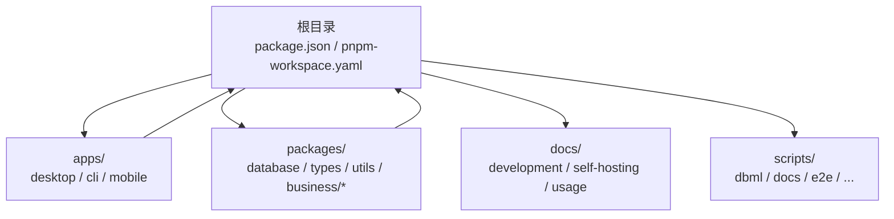
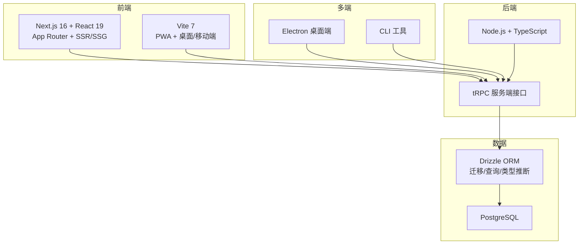
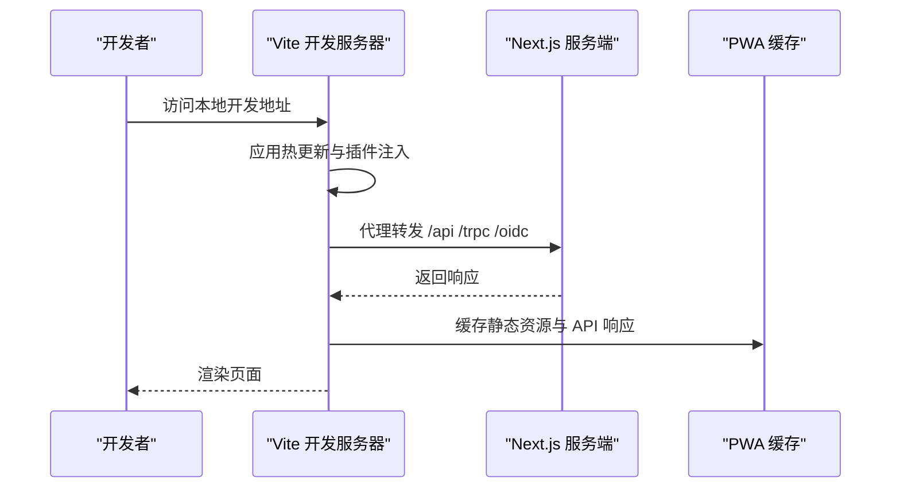
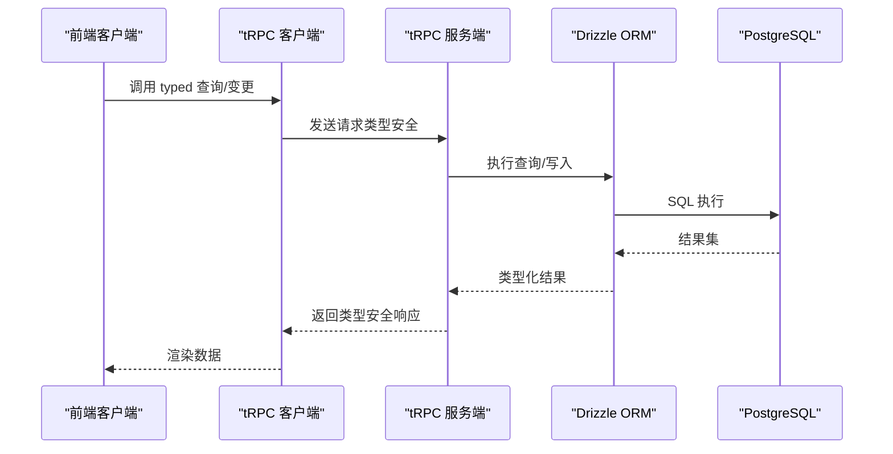
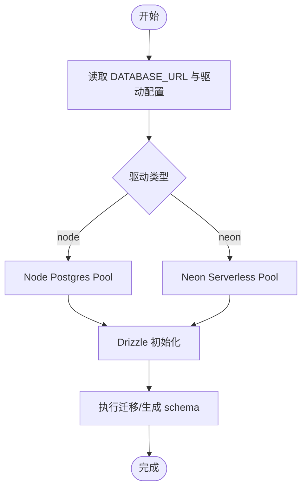
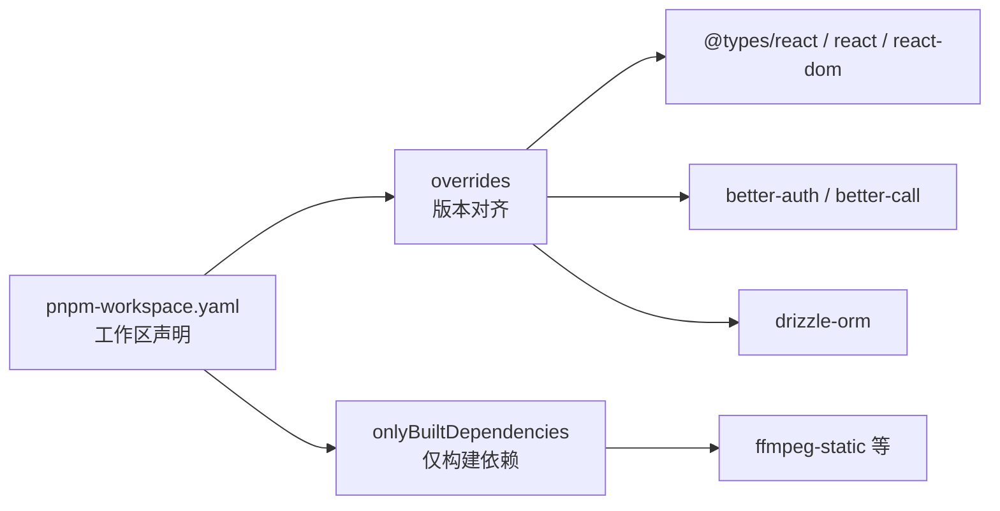
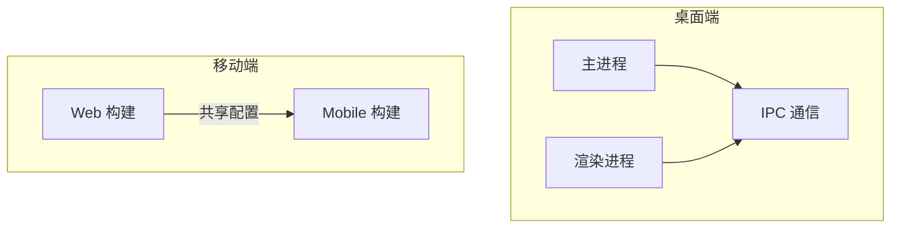
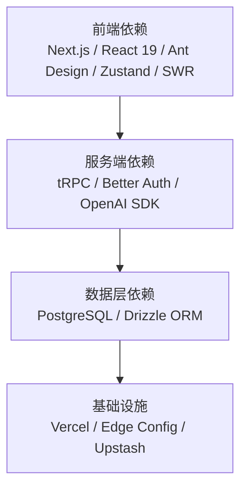

# 技术栈与架构选型

<cite>
**本文引用的文件**
- [package.json](file://package.json)
- [pnpm-workspace.yaml](file://pnpm-workspace.yaml)
- [next.config.ts](file://next.config.ts)
- [vite.config.ts](file://vite.config.ts)
- [tsconfig.json](file://tsconfig.json)
- [drizzle.config.ts](file://drizzle.config.ts)
- [apps/desktop/package.json](file://apps/desktop/package.json)
- [apps/cli/package.json](file://apps/cli/package.json)
- [packages/database/package.json](file://packages/database/package.json)
- [packages/types/package.json](file://packages/types/package.json)
- [packages/utils/package.json](file://packages/utils/package.json)
- [docs/development/start.mdx](file://docs/development/start.mdx)
- [scripts/clerk-to-betterauth/_internal/db.ts](file://scripts/clerk-to-betterauth/_internal/db.ts)
- [scripts/nextauth-to-betterauth/_internal/db.ts](file://scripts/nextauth-to-betterauth/_internal/db.ts)
</cite>

## 目录
1. [引言](#引言)
2. [项目结构](#项目结构)
3. [核心组件](#核心组件)
4. [架构总览](#架构总览)
5. [详细组件分析](#详细组件分析)
6. [依赖关系分析](#依赖关系分析)
7. [性能考量](#性能考量)
8. [故障排查指南](#故障排查指南)
9. [结论](#结论)
10. [附录](#附录)

## 引言
本文件系统性梳理 LobeHub 的技术栈与架构选型，覆盖前端（Next.js 16、React 19、Vite 7）、后端（Node.js、TypeScript）、数据库（PostgreSQL、Drizzle ORM）以及微服务与包管理策略（pnpm workspace）。我们将解释每项技术选择的原因、优势及在项目中的具体应用，并给出学习路径与最佳实践建议，帮助开发者快速掌握并高效迭代。

## 项目结构
LobeHub 采用 monorepo 架构，使用 pnpm workspace 管理多应用与多包，典型结构如下：
- 根目录：统一的包管理、脚本与工作区配置
- apps：多端应用（桌面端 Electron、CLI 工具）
- packages：业务与通用能力包（数据库、类型、工具库等）
- docs：开发与自托管文档
- scripts：迁移、构建、发布等自动化脚本

**图表来源**
- [package.json](file://package.json#L30-L35)
- [pnpm-workspace.yaml](file://pnpm-workspace.yaml#L1-L6)

**章节来源**
- [package.json](file://package.json#L30-L35)
- [pnpm-workspace.yaml](file://pnpm-workspace.yaml#L1-L6)

## 核心组件
- 前端框架与构建
  - Next.js 16：App Router + 路由器处理器 + SSR/SSG，适配多端与部署平台优化
  - React 19：最新渲染模型与并发特性，提升交互体验
  - Vite 7：SPA/桌面端/移动端一体化构建与热更新
- 后端与运行时
  - Node.js（配合 Next.js 与 Vite）：统一的 TypeScript 运行时
  - TypeScript：强类型保障，贯穿全栈与包内类型安全
- 数据层
  - PostgreSQL：企业级关系型数据库，支持事务与扩展
  - Drizzle ORM：类型安全、可演进的迁移与查询，严格模式与 DBML 可视化
- 状态与数据流
  - Zustand：轻量状态管理，适合复杂 UI 与跨域状态
  - SWR：客户端数据获取与缓存
  - tRPC：端到端类型安全 API
- 多端与打包
  - Electron（桌面端）：原生体验与系统集成
  - PWA（Vite PWA 插件）：离线与渐进式体验
  - CLI：命令行工具链，便于本地与 CI 场景

**章节来源**
- [docs/development/start.mdx](file://docs/development/start.mdx#L18-L37)
- [package.json](file://package.json#L158-L404)
- [vite.config.ts](file://vite.config.ts#L1-L123)
- [next.config.ts](file://next.config.ts#L1-L27)

## 架构总览
整体采用“多端一体”的微前端/微服务风格：Web SPA（Next.js App Router + React 19）承载主业务；Vite 作为多端构建基座（桌面端/移动端）；数据库通过 Drizzle ORM 统一访问；tRPC 提供类型安全 API；桌面端 Electron 与 CLI 作为独立子系统。

**图表来源**
- [docs/development/start.mdx](file://docs/development/start.mdx#L18-L37)
- [package.json](file://package.json#L158-L404)
- [drizzle.config.ts](file://drizzle.config.ts#L1-L22)
- [apps/desktop/package.json](file://apps/desktop/package.json#L43-L123)
- [apps/cli/package.json](file://apps/cli/package.json#L1-L43)

## 详细组件分析

### 前端技术栈：Next.js 16 + React 19 + Vite 7
- Next.js 16
  - 使用 App Router 与路由处理器，结合 SSR/SSG 提升首屏性能与 SEO
  - 在 Vercel 环境下启用输出追踪排除策略，减少冷启动体积
- React 19
  - 并发渲染与新特性，降低大组件重绘成本
- Vite 7
  - 一体化构建：Web/桌面/移动端三端共享配置
  - PWA 缓存策略：字体、图片、API 缓存分级处理
  - 开发代理：统一转发 /api、/trpc、/oidc 到本地服务端

**图表来源**
- [vite.config.ts](file://vite.config.ts#L106-L122)
- [next.config.ts](file://next.config.ts#L5-L21)

**章节来源**
- [next.config.ts](file://next.config.ts#L1-L27)
- [vite.config.ts](file://vite.config.ts#L1-L123)
- [package.json](file://package.json#L36-L123)

### 后端技术栈：Node.js + TypeScript + tRPC
- Node.js + TypeScript：统一运行时与类型约束
- tRPC：端到端类型安全 API，服务端与客户端共享类型定义，减少样板代码
- 数据访问：通过 Drizzle ORM 访问 PostgreSQL，支持严格模式与迁移

**图表来源**
- [docs/development/start.mdx](file://docs/development/start.mdx#L27-L27)
- [drizzle.config.ts](file://drizzle.config.ts#L1-L22)

**章节来源**
- [docs/development/start.mdx](file://docs/development/start.mdx#L18-L37)
- [package.json](file://package.json#L158-L404)

### 数据库方案：PostgreSQL + Drizzle ORM
- 数据库：PostgreSQL，具备企业级事务、扩展与生态
- ORM：Drizzle ORM，提供类型安全、严格模式、迁移与 DBML 可视化
- 驱动选择：根据环境自动选择 Neon Serverless 或 Node Postgres，WebSocket 兼容处理
- 迁移与可视化：通过 drizzle-kit 生成迁移，dbdocs 可视化 schema

**图表来源**
- [drizzle.config.ts](file://drizzle.config.ts#L1-L22)
- [scripts/clerk-to-betterauth/_internal/db.ts](file://scripts/clerk-to-betterauth/_internal/db.ts#L1-L32)
- [scripts/nextauth-to-betterauth/_internal/db.ts](file://scripts/nextauth-to-betterauth/_internal/db.ts#L1-L32)

**章节来源**
- [drizzle.config.ts](file://drizzle.config.ts#L1-L22)
- [scripts/clerk-to-betterauth/_internal/db.ts](file://scripts/clerk-to-betterauth/_internal/db.ts#L1-L32)
- [scripts/nextauth-to-betterauth/_internal/db.ts](file://scripts/nextauth-to-betterauth/_internal/db.ts#L1-L32)

### 包管理策略：pnpm workspace 与版本治理
- 工作区：packages/*、apps/desktop/src/main、e2e 等纳入统一管理
- 版本治理：全局 overrides 与 onlyBuiltDependencies，确保 React 19、better-auth、drizzle-orm 等关键依赖一致性
- 补丁：对第三方包进行补丁修复（如 swagger 与 qstash）

**图表来源**
- [pnpm-workspace.yaml](file://pnpm-workspace.yaml#L1-L23)
- [package.json](file://package.json#L505-L516)

**章节来源**
- [pnpm-workspace.yaml](file://pnpm-workspace.yaml#L1-L23)
- [package.json](file://package.json#L505-L516)

### 多端与模块化设计
- 桌面端（Electron）：独立构建与打包流程，主进程与渲染进程分离，IPC 通信
- 移动端（Vite SPA）：通过环境变量区分 web/mobile，共享构建配置
- 模块化：packages 下按领域拆分（database、types、utils、business），通过 workspace:* 引用，避免循环依赖

**图表来源**
- [apps/desktop/package.json](file://apps/desktop/package.json#L13-L42)
- [vite.config.ts](file://vite.config.ts#L16-L32)

**章节来源**
- [apps/desktop/package.json](file://apps/desktop/package.json#L1-L123)
- [apps/cli/package.json](file://apps/cli/package.json#L1-L43)
- [vite.config.ts](file://vite.config.ts#L1-L123)

## 依赖关系分析
- 依赖分层
  - 前端层：Next.js、React 19、Ant Design、@lobehub/ui、Zustand、SWR、React Router DOM
  - 服务层：tRPC、Better Auth、OpenAI/Anthropic 等模型 SDK、Redis/PostgreSQL
  - 基础设施：Drizzle ORM、Vercel/Edge Config、Upstash QStash/Workflow
- 关键依赖选择标准
  - 类型安全优先：tRPC、Zustand、Zod、Drizzle ORM
  - 生态成熟度：Next.js、React、Ant Design、Vite
  - 可维护性：统一的 monorepo 与 pnpm workspace，集中版本治理
- 替代方案
  - 路由：App Router 与 React Router DOM 并存，兼顾静态页与 SPA
  - 状态：Zustand 替代 Redux/Zustand，更轻量；SWR 替代 React Query，专注客户端缓存
  - 数据库：PostgreSQL + Drizzle ORM 替代 MongoDB 等，强调类型安全与迁移可控

**图表来源**
- [package.json](file://package.json#L158-L404)
- [docs/development/start.mdx](file://docs/development/start.mdx#L18-L37)

**章节来源**
- [package.json](file://package.json#L158-L404)
- [docs/development/start.mdx](file://docs/development/start.mdx#L18-L37)

## 性能考量
- 构建与体积
  - Next.js 输出追踪排除 musl 二进制与 SPA/桌面/移动端产物，减少冷启动体积
  - Vite PWA 缓存策略：字体、图片、API 分级缓存，提升二次加载速度
- 运行时
  - Drizzle ORM 使用 builder API，避免复杂 lateral join 导致的性能问题
  - tRPC 类型安全减少序列化开销，提升前后端交互效率
- 多端优化
  - 桌面端 Electron 主进程与渲染进程分离，IPC 通信降低主线程压力
  - 移动端构建通过环境变量切换，减少不必要资源打包

**章节来源**
- [next.config.ts](file://next.config.ts#L5-L21)
- [vite.config.ts](file://vite.config.ts#L64-L103)
- [.agents/skills/drizzle/SKILL.md](file://.agents/skills/drizzle/SKILL.md#L118-L139)

## 故障排查指南
- 数据库连接
  - 确认 DATABASE_URL 与驱动配置（Neon/Node），WebSocket 构造函数兼容
  - 使用 drizzle-kit 生成/执行迁移，dbdocs 可视化 schema 排查
- 构建问题
  - Vite 开发代理：检查 /api、/trpc、/oidc 代理是否指向本地 3010 端口
  - Next.js Vercel 优化：确认 outputFileTracingExcludes 是否包含桌面/移动端产物
- 包管理
  - pnpm overrides 与 onlyBuiltDependencies：确保 React 19、better-auth、drizzle-orm 一致
  - 仅构建依赖：ffmpeg-static 等原生包需仅构建，避免安装失败

**章节来源**
- [drizzle.config.ts](file://drizzle.config.ts#L1-L22)
- [scripts/clerk-to-betterauth/_internal/db.ts](file://scripts/clerk-to-betterauth/_internal/db.ts#L1-L32)
- [vite.config.ts](file://vite.config.ts#L106-L122)
- [next.config.ts](file://next.config.ts#L5-L21)
- [pnpm-workspace.yaml](file://pnpm-workspace.yaml#L7-L23)

## 结论
LobeHub 的技术栈以“类型安全 + 生态成熟 + 可维护性”为核心目标：前端采用 Next.js 16 + React 19 + Vite 7，后端基于 Node.js + TypeScript + tRPC，数据库以 PostgreSQL + Drizzle ORM 为基础，辅以 pnpm workspace 实现多端一体化与版本治理。该选型在保证开发效率的同时，兼顾性能与可演进性，适合中大型 AI Agent 平台的长期发展。

## 附录
- 学习路径建议
  - 前端：从 Next.js App Router 与 React 19 并发特性入手，再深入 Vite 多端构建与 PWA
  - 后端：掌握 tRPC 类型安全 API 设计，结合 Drizzle ORM 的迁移与查询
  - 数据库：理解 Drizzle ORM 的类型推断与严格模式，配合 DBML 可视化
  - 包管理：熟悉 pnpm workspace 的工作区、overrides 与仅构建依赖策略
- 最佳实践
  - 保持 monorepo 内部依赖通过 workspace:* 引用，避免版本漂移
  - 使用 Drizzle builder API，避免复杂关系查询导致的性能与可维护性问题
  - 在 Vercel 环境下充分利用输出追踪排除策略，减少冷启动体积