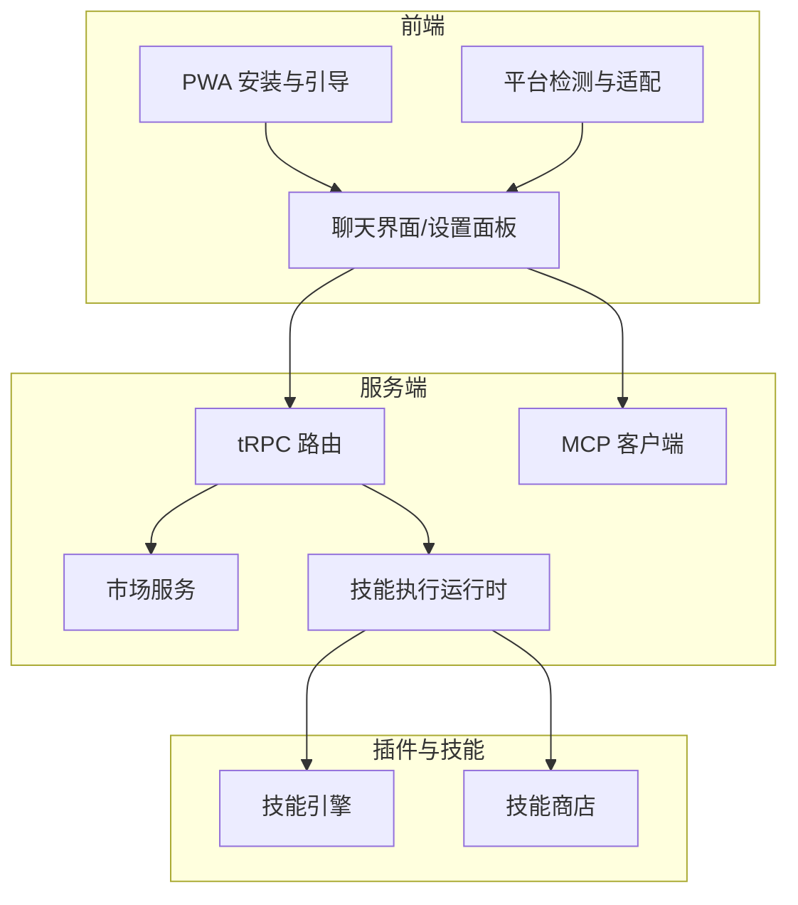
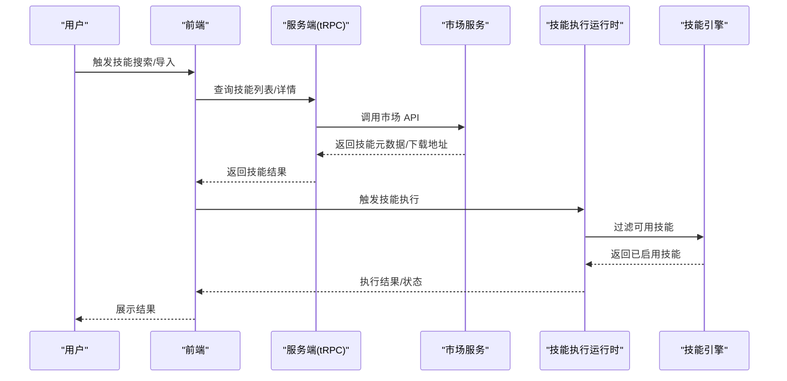
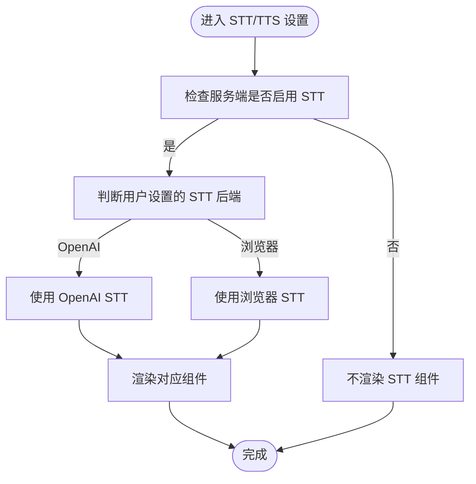
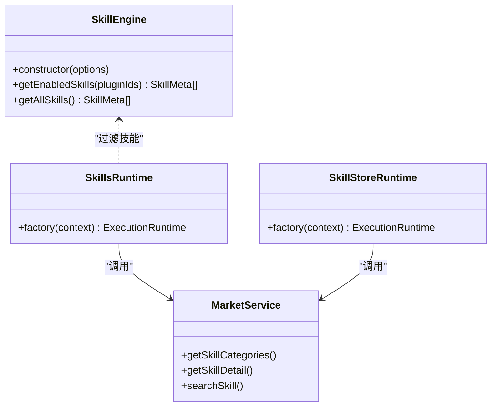
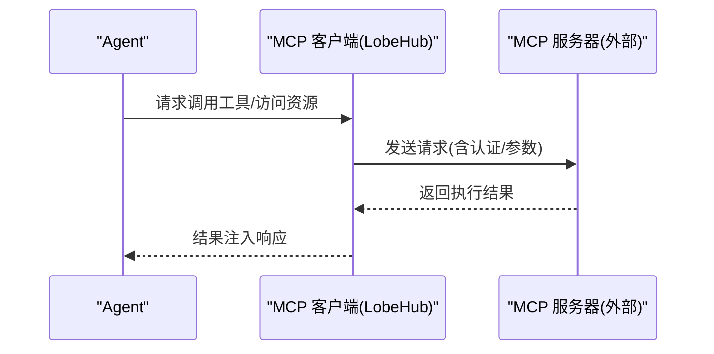
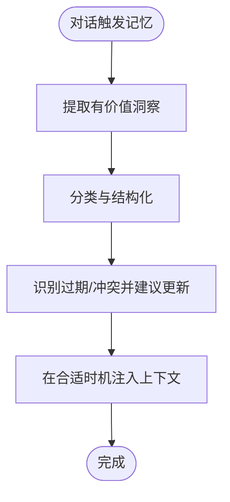
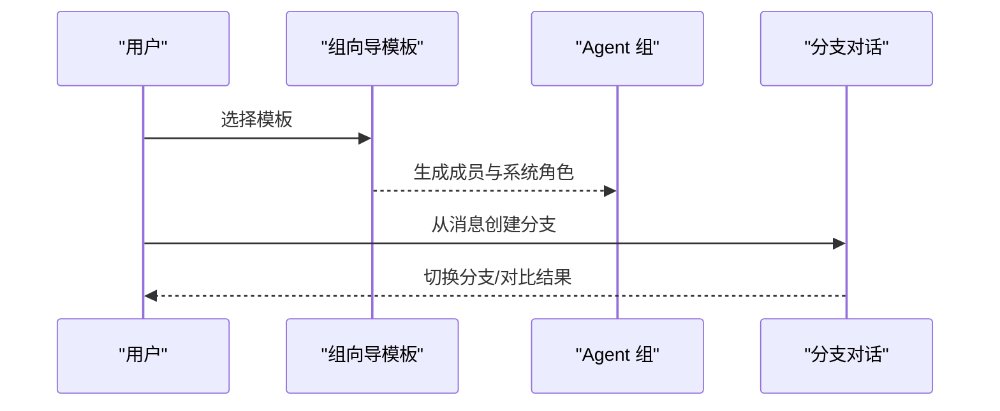
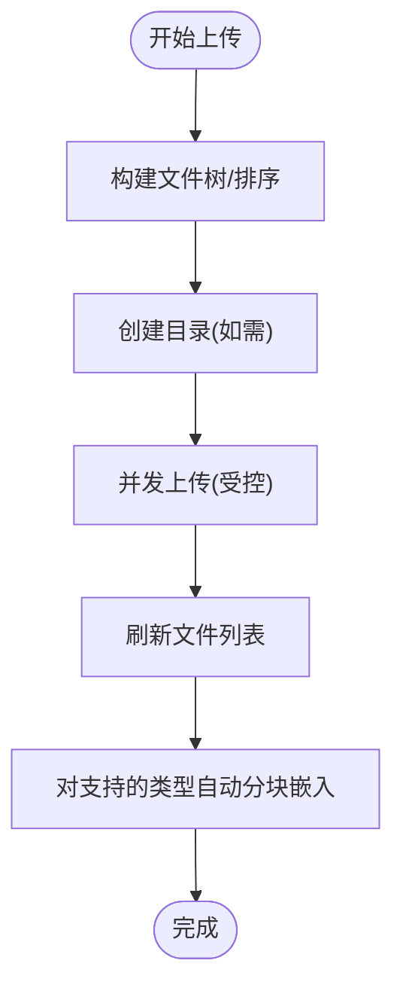
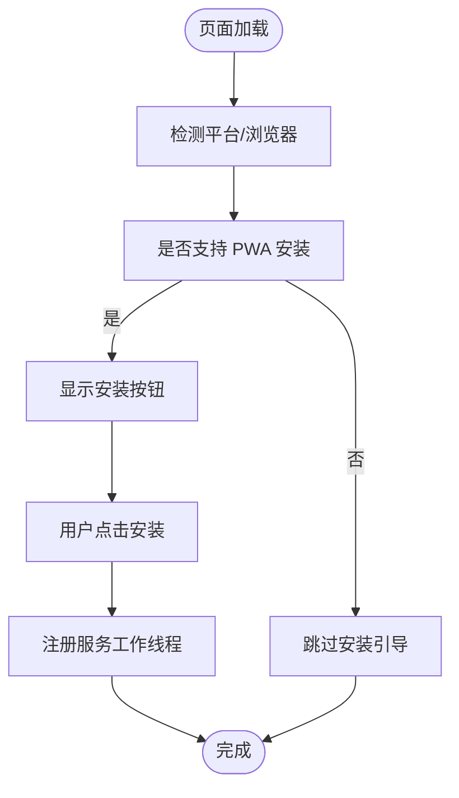
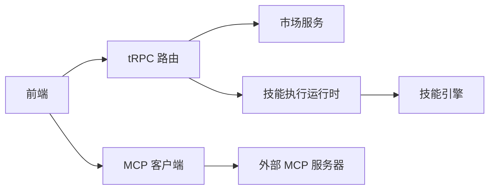

# 核心特性与技术亮点

<cite>
**本文引用的文件**
- [README.md](file://README.md)
- [README.zh-CN.md](file://README.zh-CN.md)
- [STT/index.tsx](file://src/features/ChatInput/ActionBar/STT/index.tsx)
- [tts.ts](file://packages/types/src/user/settings/tts.ts)
- [SkillEngine.ts](file://packages/context-engine/src/engine/skills/SkillEngine.ts)
- [skills.ts](file://src/server/services/toolExecution/serverRuntimes/skills.ts)
- [skillStore.ts](file://src/server/services/toolExecution/serverRuntimes/skillStore.ts)
- [index.ts](file://packages/builtin-tool-skill-store/src/executor/index.ts)
- [mcp-market.mdx](file://docs/usage/community/mcp-market.mdx)
- [client.ts](file://src/libs/mcp/client.ts)
- [templates.ts](file://src/components/ChatGroupWizard/templates.ts)
- [usePlatform.ts](file://src/hooks/usePlatform.ts)
- [usePWAInstall.ts](file://src/hooks/usePWAInstall.ts)
- [Install.tsx](file://src/features/PWAInstall/Install.tsx)
- [vision.zh-CN.mdx](file://docs/usage/getting-started/vision.zh-CN.mdx)
- [useModelSupportVision.ts](file://src/hooks/useModelSupportVision.ts)
- [skill.ts](file://src/server/routers/lambda/market/skill.ts)
- [marketApi.ts](file://src/services/marketApi.ts)
- [chat.mdx](file://docs/usage/getting-started/chat.mdx)
- [memory.mdx](file://docs/usage/getting-started/memory.mdx)
- [2023-11-19-tts-stt.mdx](file://docs/changelog/2023-11-19-tts-stt.mdx)
- [2024-11-27-forkable-chat.mdx](file://docs/changelog/2024-11-27-forkable-chat.mdx)
- [action.ts](file://src/store/file/slices/fileManager/action.ts)
</cite>

## 目录
1. [简介](#简介)
2. [项目结构](#项目结构)
3. [核心组件](#核心组件)
4. [架构总览](#架构总览)
5. [详细组件分析](#详细组件分析)
6. [依赖关系分析](#依赖关系分析)
7. [性能考量](#性能考量)
8. [故障排查指南](#故障排查指南)
9. [结论](#结论)
10. [附录](#附录)

## 简介
本文件聚焦 LobeHub 的核心特性与技术亮点，围绕多模态交互（TTS/STT、视觉识别）、可扩展插件系统（含 MCP 协议支持）、智能代理管理与技能商店、Agent 团队协作、文件与知识库、跨平台部署（PWA/桌面/移动端）等维度，系统阐述技术实现原理、典型应用场景与优势，并提供可操作的使用场景与排障建议，帮助开发者快速理解并高效落地。

## 项目结构
LobeHub 采用前后端一体化的现代化前端工程与多包（monorepo）组织方式，核心模块包括：
- 前端应用：Next.js + React，提供聊天、Agent 管理、文件与知识库、PWA 安装等能力
- 服务端路由与运行时：基于 Lambda/Edge 的 tRPC 路由，封装市场、技能商店、工具执行等服务
- 插件与技能：内置工具包、技能引擎、市场服务、MCP 客户端与服务端运行时
- 平台与部署：PWA 安装、平台检测、跨平台适配、Docker 与云平台一键部署

图表来源
- [Install.tsx](file://src/features/PWAInstall/Install.tsx#L67-L74)
- [usePlatform.ts](file://src/hooks/usePlatform.ts#L11-L43)
- [skill.ts](file://src/server/routers/lambda/market/skill.ts#L27-L103)
- [skills.ts](file://src/server/services/toolExecution/serverRuntimes/skills.ts#L252-L301)
- [SkillEngine.ts](file://packages/context-engine/src/engine/skills/SkillEngine.ts#L17-L38)
- [client.ts](file://src/libs/mcp/client.ts#L299-L342)

章节来源
- [README.md](file://README.md#L125-L561)
- [README.zh-CN.md](file://README.zh-CN.md#L122-L535)

## 核心组件
- 多模态交互：TTS/STT 语音与视觉识别能力，支持浏览器与 OpenAI 两种后端路径，模型与参数由用户设置与服务端开关控制
- 可扩展插件系统：内置工具与技能引擎，结合市场服务实现技能的搜索、导入与执行；支持 MCP 协议的客户端与服务端运行时
- 智能代理管理：个人记忆（Memory Agent）与记忆面板，支持提取、组织、维护与应用；支持分支对话与多 Agent 协作模板
- 文件与知识库：支持文件上传、分块嵌入、并发上传与知识库关联
- 跨平台部署：PWA 安装与引导、平台检测与适配、桌面应用与移动端适配

章节来源
- [STT/index.tsx](file://src/features/ChatInput/ActionBar/STT/index.tsx#L12-L27)
- [tts.ts](file://packages/types/src/user/settings/tts.ts#L1-L10)
- [SkillEngine.ts](file://packages/context-engine/src/engine/skills/SkillEngine.ts#L17-L38)
- [skills.ts](file://src/server/services/toolExecution/serverRuntimes/skills.ts#L252-L301)
- [skillStore.ts](file://src/server/services/toolExecution/serverRuntimes/skillStore.ts#L83-L125)
- [index.ts](file://packages/builtin-tool-skill-store/src/executor/index.ts#L52-L111)
- [mcp-market.mdx](file://docs/usage/community/mcp-market.mdx#L31-L64)
- [client.ts](file://src/libs/mcp/client.ts#L299-L342)
- [templates.ts](file://src/components/ChatGroupWizard/templates.ts#L16-L36)
- [usePlatform.ts](file://src/hooks/usePlatform.ts#L11-L43)
- [usePWAInstall.ts](file://src/hooks/usePWAInstall.ts#L9-L38)
- [Install.tsx](file://src/features/PWAInstall/Install.tsx#L42-L76)
- [vision.zh-CN.mdx](file://docs/usage/getting-started/vision.zh-CN.mdx#L135-L153)
- [useModelSupportVision.ts](file://src/hooks/useModelSupportVision.ts#L1-L5)
- [action.ts](file://src/store/file/slices/fileManager/action.ts#L202-L512)

## 架构总览
LobeHub 的核心架构围绕“前端交互 + tRPC 服务 + 市场/技能执行 + MCP 协议”展开。前端通过设置与服务端开关决定 STT 后端路径；服务端路由对接市场与技能执行运行时；技能引擎负责筛选与聚合技能；MCP 客户端负责与外部 MCP 服务器交互；PWA 与平台检测确保跨平台体验。

图表来源
- [skill.ts](file://src/server/routers/lambda/market/skill.ts#L27-L103)
- [skills.ts](file://src/server/services/toolExecution/serverRuntimes/skills.ts#L252-L301)
- [SkillEngine.ts](file://packages/context-engine/src/engine/skills/SkillEngine.ts#L28-L30)
- [marketApi.ts](file://src/services/marketApi.ts#L224-L236)

## 详细组件分析

### 多模态交互：TTS/STT 与视觉识别
- TTS/STT 选择逻辑：根据服务端开关与用户设置决定使用浏览器端或 OpenAI 后端；用户可选择模型与自动停止策略
- 视觉识别：支持多提供商视觉模型，前端提供能力检测与上传建议，注意尺寸与隐私限制

图表来源
- [STT/index.tsx](file://src/features/ChatInput/ActionBar/STT/index.tsx#L12-L27)
- [tts.ts](file://packages/types/src/user/settings/tts.ts#L1-L10)

章节来源
- [2023-11-19-tts-stt.mdx](file://docs/changelog/2023-11-19-tts-stt.mdx#L15-L19)
- [vision.zh-CN.mdx](file://docs/usage/getting-started/vision.zh-CN.mdx#L135-L153)
- [useModelSupportVision.ts](file://src/hooks/useModelSupportVision.ts#L1-L5)

应用场景与优势
- 语音会话：为听觉学习者与多任务场景提供自然交互体验
- 视觉识别：在设计、研发、内容创作等领域实现图文联合理解

### 可扩展插件系统与技能商店
- 技能引擎：按 Agent 启用的插件 ID 过滤技能清单，支持内置与外部来源合并
- 技能执行运行时：封装市场令牌、文件服务、资源服务等，支持导入与搜索
- 市场服务：提供分类、详情、列表查询，配合下载地址与令牌鉴权
- 内置工具：封装错误处理与状态返回，统一插件执行结果

图表来源
- [SkillEngine.ts](file://packages/context-engine/src/engine/skills/SkillEngine.ts#L17-L38)
- [skills.ts](file://src/server/services/toolExecution/serverRuntimes/skills.ts#L252-L301)
- [skillStore.ts](file://src/server/services/toolExecution/serverRuntimes/skillStore.ts#L83-L125)
- [skill.ts](file://src/server/routers/lambda/market/skill.ts#L27-L103)

章节来源
- [index.ts](file://packages/builtin-tool-skill-store/src/executor/index.ts#L52-L111)
- [marketApi.ts](file://src/services/marketApi.ts#L224-L236)

应用场景与优势
- 快速扩展：通过市场与内置技能实现能力即插即用
- 企业集成：结合市场令牌与权限控制，实现私有化技能分发

### MCP 协议支持与外部连接
- 架构：MCP 服务器（外部工具/资源）与 LobeHub 客户端（Agent）通过协议通信，支持 STDIO 与 HTTP 两类连接
- 客户端：提供连接管理、工具与资源列举、断开与错误处理
- 使用：在 Agent 设置中启用 MCP 服务器，按需组合多工具形成工作流

图表来源
- [mcp-market.mdx](file://docs/usage/community/mcp-market.mdx#L31-L64)
- [client.ts](file://src/libs/mcp/client.ts#L299-L342)

章节来源
- [mcp-market.mdx](file://docs/usage/community/mcp-market.mdx#L31-L64)

应用场景与优势
- 低代码集成：将本地脚本、数据库、API 等能力以工具形式暴露给 Agent
- 可观测性：开启思维链（CoT）可追踪工具调用与参数

### 智能代理管理与个人记忆
- 记忆管理：提供提取、组织、维护、应用四大能力，支持搜索、编辑、删除与批量清理
- 记忆 Agent：内置代理负责记忆生命周期管理，便于用户直接对话式维护

图表来源
- [memory.mdx](file://docs/usage/getting-started/memory.mdx#L153-L169)

章节来源
- [memory.mdx](file://docs/usage/getting-started/memory.mdx#L135-L169)

应用场景与优势
- 白盒记忆：结构化与可编辑，提升可控性与透明度
- 持续学习：随工作习惯演进，适配个人偏好

### Agent 团队协作与分支对话
- 团队协作：提供模板化 Agent 组（头脑风暴、分析、写作、规划、产品、游戏），一键装配成员与系统角色
- 分支对话：从任意消息创建新分支，支持延续模式与独立模式，便于对比与深度探索

图表来源
- [templates.ts](file://src/components/ChatGroupWizard/templates.ts#L16-L36)
- [chat.mdx](file://docs/usage/getting-started/chat.mdx#L36-L91)

章节来源
- [2024-11-27-forkable-chat.mdx](file://docs/changelog/2024-11-27-forkable-chat.mdx#L12-L30)
- [chat.mdx](file://docs/usage/getting-started/chat.mdx#L36-L170)

应用场景与优势
- 多角色协同：模拟真实团队分工，提升复杂任务处理效率
- 自然探索：分支对话贴近人类思维路径，便于并行比较与迭代

### 文件上传与知识库
- 并发上传：限制并发数量，逐文件上传并汇总状态，最后统一刷新列表
- 自动嵌入：对支持分块的文件类型自动切片与向量化，支持重嵌入
- 知识库集成：上传时可指定知识库与父目录，保持结构化组织

图表来源
- [action.ts](file://src/store/file/slices/fileManager/action.ts#L202-L512)

章节来源
- [action.ts](file://src/store/file/slices/fileManager/action.ts#L202-L512)

应用场景与优势
- 高效入库：批量与并发上传减少等待，自动嵌入提升检索质量
- 结构化管理：目录与知识库联动，便于长期维护与复用

### 跨平台部署与体验
- PWA 安装：检测平台与浏览器兼容性，提供引导与安装入口，支持服务工作线程注册
- 平台适配：识别 Android/iOS/macOS/Safari/Edge 等，按平台差异提供安装与体验策略
- 桌面与移动端：提供桌面应用与移动端适配，确保一致的交互与性能

图表来源
- [usePlatform.ts](file://src/hooks/usePlatform.ts#L11-L43)
- [usePWAInstall.ts](file://src/hooks/usePWAInstall.ts#L9-L38)
- [Install.tsx](file://src/features/PWAInstall/Install.tsx#L42-L76)

章节来源
- [README.md](file://README.md#L492-L549)
- [README.zh-CN.md](file://README.zh-CN.md#L470-L534)

## 依赖关系分析
- 前端与服务端：前端通过 tRPC 路由调用市场与技能相关接口，服务端路由再委托市场服务与技能执行运行时
- 技能与市场：技能执行运行时依赖市场令牌与用户信息，统一从用户设置读取
- MCP：前端通过 MCP 客户端与外部服务器交互，支持 HTTP 与 STDIO 两类连接

图表来源
- [skill.ts](file://src/server/routers/lambda/market/skill.ts#L27-L103)
- [skills.ts](file://src/server/services/toolExecution/serverRuntimes/skills.ts#L252-L301)
- [SkillEngine.ts](file://packages/context-engine/src/engine/skills/SkillEngine.ts#L17-L38)
- [client.ts](file://src/libs/mcp/client.ts#L299-L342)

章节来源
- [skillStore.ts](file://src/server/services/toolExecution/serverRuntimes/skillStore.ts#L83-L125)
- [marketApi.ts](file://src/services/marketApi.ts#L224-L236)

## 性能考量
- 并发上传：通过并发限制避免阻塞 UI 与服务端压力，上传完成后统一刷新，减少闪烁
- 技能执行：按需过滤与聚合技能，减少无效调用；MCP 错误分类与降级处理，提升鲁棒性
- PWA：服务工作线程与缓存策略减少重复加载，提升离线与弱网体验

## 故障排查指南
- STT 不可用
  - 检查服务端开关与用户设置，确认后端类型
  - 若使用浏览器端，确认浏览器支持与权限
- MCP 连接失败
  - 校验连接类型（HTTP/STDIO）与凭据
  - 查看调试日志（DEBUG_MCP=1）定位协议交互问题
- 技能导入失败
  - 确认市场令牌与用户权限
  - 检查技能分类/版本与下载地址
- PWA 安装不可用
  - 确认平台与浏览器兼容性
  - 检查安装按钮可见性与服务工作线程注册

章节来源
- [STT/index.tsx](file://src/features/ChatInput/ActionBar/STT/index.tsx#L12-L27)
- [mcp-market.mdx](file://docs/usage/community/mcp-market.mdx#L505-L534)
- [client.ts](file://src/libs/mcp/client.ts#L299-L342)
- [marketApi.ts](file://src/services/marketApi.ts#L224-L236)
- [usePlatform.ts](file://src/hooks/usePlatform.ts#L11-L43)
- [usePWAInstall.ts](file://src/hooks/usePWAInstall.ts#L9-L38)

## 结论
LobeHub 以“Agent 为工作单元”的理念，结合多模态交互、可扩展插件系统（含 MCP 协议）、智能代理管理与个人记忆、团队协作与分支对话、文件与知识库、跨平台部署等能力，构建了面向未来的智能代理协作平台。其技术亮点体现在：
- 以技能引擎与市场服务为核心的可插拔能力体系
- 以 MCP 为桥梁的外部系统连接范式
- 以 PWA/平台检测为基础的跨端一致体验
- 以记忆与分支对话为代表的认知增强与协作范式

这些特性共同支撑开发者与用户在多样化场景中高效构建、协作与演进智能代理。

## 附录
- 快速部署：支持 Vercel、Zeabur、Sealos、阿里云等平台一键部署，亦可使用 Docker Compose 快速搭建
- 环境变量：OPENAI_API_KEY、OPENAI_PROXY_URL、OPENAI_MODEL_LIST 等关键配置项
- 生态体系：@lobehub/ui、@lobehub/icons、@lobehub/tts、@lobehub/lint 等周边工具与组件库

章节来源
- [README.md](file://README.md#L571-L660)
- [README.zh-CN.md](file://README.zh-CN.md#L545-L630)