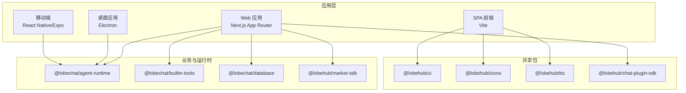
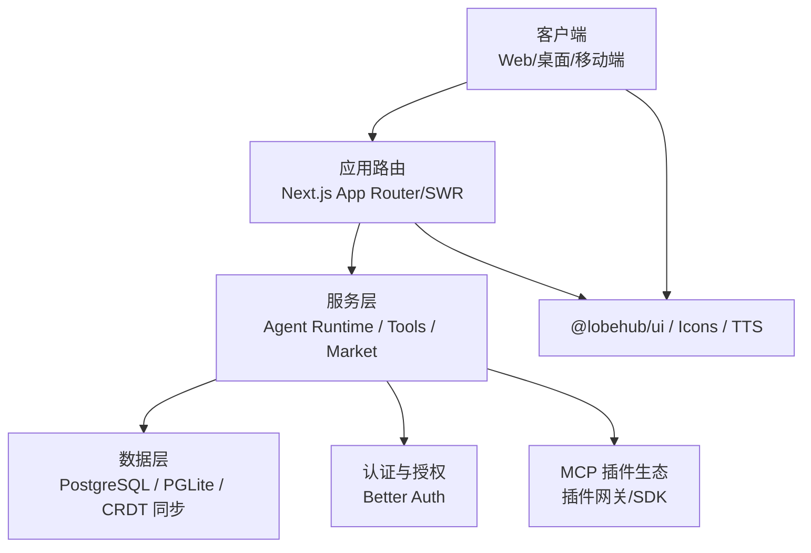
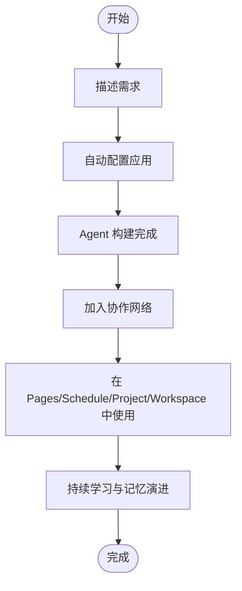
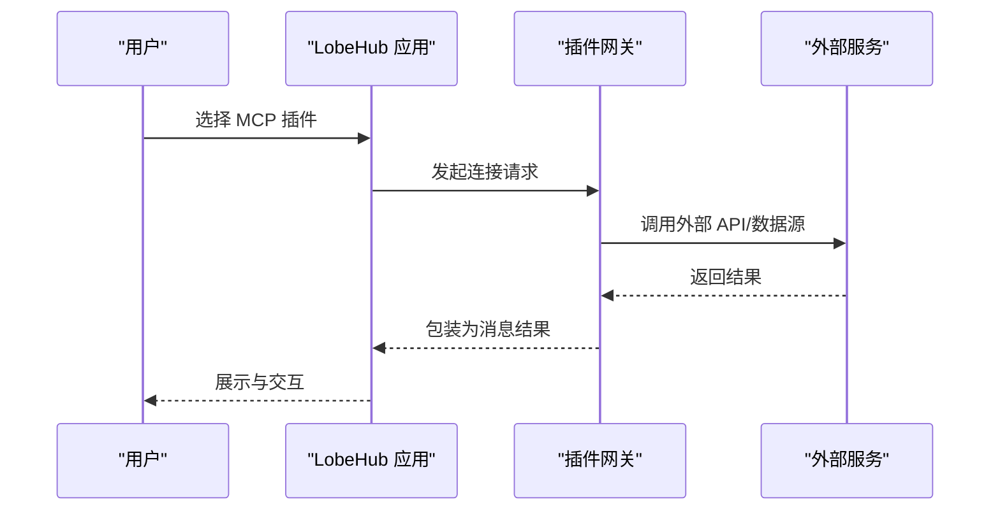
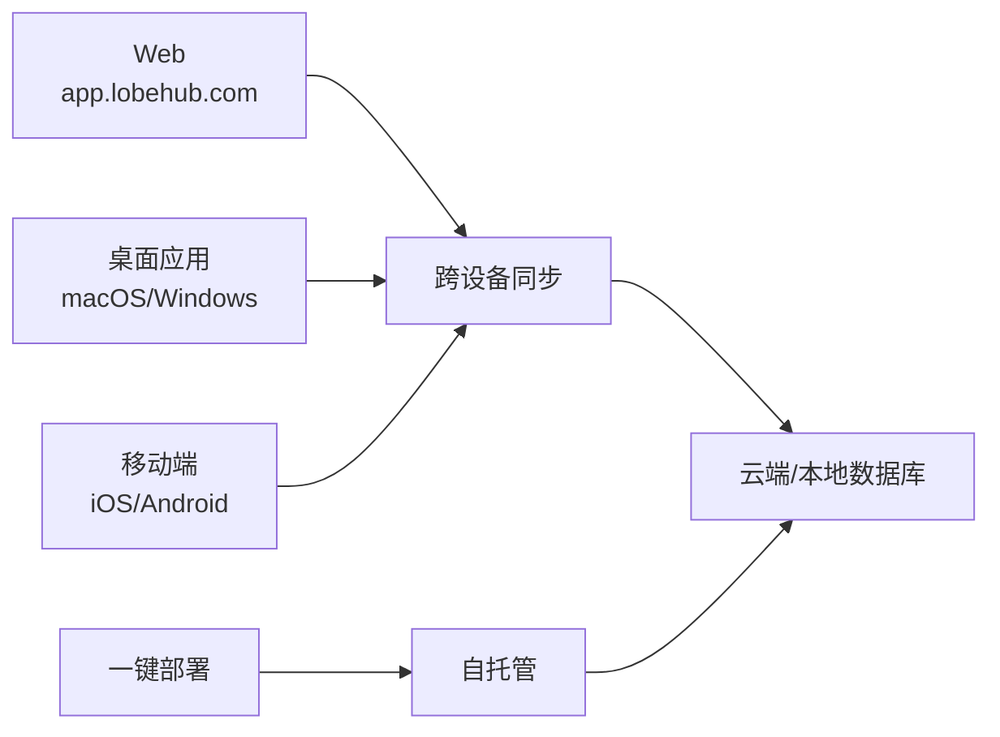
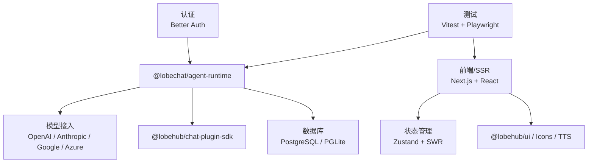

# 项目介绍与愿景

<cite>
**本文档引用的文件**
- [README.md](file://README.md)
- [README.zh-CN.md](file://README.zh-CN.md)
- [CONTRIBUTING.md](file://CONTRIBUTING.md)
- [CODE_OF_CONDUCT.md](file://CODE_OF_CONDUCT.md)
- [AGENTS.md](file://AGENTS.md)
- [CHANGELOG.md](file://CHANGELOG.md)
- [package.json](file://package.json)
- [docs/usage/getting-started/get-lobehub.mdx](file://docs/usage/getting-started/get-lobehub.mdx)
- [docs/usage/getting-started/get-lobehub.zh-CN.mdx](file://docs/usage/getting-started/get-lobehub.zh-CN.mdx)
</cite>

## 目录

1. [引言](#引言)
2. [项目结构](#项目结构)
3. [核心组件](#核心组件)
4. [架构总览](#架构总览)
5. [详细组件分析](#详细组件分析)
6. [依赖分析](#依赖分析)
7. [性能考量](#性能考量)
8. [故障排查指南](#故障排查指南)
9. [结论](#结论)
10. [附录](#附录)

## 引言

LobeHub 是一个面向工作与生活的 AI Agent 工作空间，致力于打造 “人类与 AI 共同进化” 的协作网络。项目以 “将 Agent 视为工作单元” 的核心理念，提供统一智能、可组合技能、跨设备协同与持续学习的基础设施，帮助用户构建、发现与协作使用 Agent 队友，实现从 “一次性任务工具” 到 “可成长的智能伙伴” 的转变。

- 核心使命：让每个用户都能拥有可成长、可协作、可进化的 AI 团队。
- 价值主张：统一接入多模态与多模型，提供开箱即用的 Agent 构建、协作与演进能力，支持多端同步与自托管部署。
- 定位：开源、现代化、可扩展的 AI Agent 框架，覆盖 Web、桌面与移动端，支持 MCP 插件生态与本地 / 远程数据库。

**章节来源**

- [README.md](file://README.md#L100-L106)
- [README.zh-CN.md](file://README.zh-CN.md#L98-L104)

## 项目结构

LobeHub 采用多包（monorepo）结构，结合前端框架、共享包、桌面应用与测试体系，支撑全平台部署与生态扩展。

- apps/desktop：Electron 桌面应用
- packages/\*：共享业务与运行时包（如 agent-runtime、builtin-tools、database 等）
- src/app、src/spa、src/routes、src/features：基于 Next.js 的应用路由与功能域组件
- e2e：端到端测试（Cucumber + Playwright）
- .agents/skills：AI 开发技能清单（前端、状态、后端、测试、UI、配置、架构等）

**图表来源**

- [AGENTS.md](file://AGENTS.md#L18-L38)
- [package.json](file://package.json#L30-L35)

**章节来源**

- [AGENTS.md](file://AGENTS.md#L18-L38)
- [package.json](file://package.json#L30-L35)

## 核心组件

- Agent 构建与运行时：提供统一的 Agent 生命周期管理、上下文与记忆、工具调用与多模态交互。
- 插件与 MCP 生态：通过 MCP（模型上下文协议）实现与外部工具、数据源与服务的动态连接，支持插件市场与一键安装。
- 协作与工作空间：支持 Pages、Schedule、Project、Workspace 等协作模式，实现并行协作与迭代改进。
- 个人记忆与持续学习：提供结构化、可编辑的记忆体系，支持白盒记忆与持续学习，帮助 Agent 更贴合用户习惯。
- 多端与自托管：支持 Web、桌面（macOS/Windows）、移动端（iOS/Android），提供一键部署与自托管方案。

**章节来源**

- [README.md](file://README.md#L125-L182)
- [README.zh-CN.md](file://README.zh-CN.md#L122-L179)

## 架构总览

LobeHub 的整体架构围绕 “统一智能 + 可组合技能 + 多端协同 + 可演进记忆” 展开，前端采用 Next.js + Vite，运行时与工具通过共享包注入，桌面与移动端提供原生体验，数据库与认证模块支持本地与远程部署。

**图表来源**

- [README.md](file://README.md#L125-L182)
- [package.json](file://package.json#L158-L404)

**章节来源**

- [README.md](file://README.md#L125-L182)
- [package.json](file://package.json#L158-L404)

## 详细组件分析

### Agent 构建与协作

- Agent 作为工作单元：通过 Agent Builder 快速描述需求，自动应用配置，实现即开即用。
- Agent Groups：将多个 Agent 组织为团队，支持并行协作、迭代改进与所有权清晰。
- Pages/Schedule/Project/Workspace：提供内容协作、定时运行、项目化组织与团队共享空间。

**图表来源**

- [README.md](file://README.md#L135-L160)
- [README.zh-CN.md](file://README.zh-CN.md#L132-L157)

**章节来源**

- [README.md](file://README.md#L135-L160)
- [README.zh-CN.md](file://README.zh-CN.md#L132-L157)

### MCP 插件与生态

- 一键安装与连接：通过 MCP 插件系统无缝连接数据库、API、文件系统等外部能力。
- 市场与扩展：提供 MCP 市场，支持插件发现、连接与扩展，加速工作流构建。

**图表来源**

- [README.md](file://README.md#L189-L210)
- [README.zh-CN.md](file://README.zh-CN.md#L186-L202)

**章节来源**

- [README.md](file://README.md#L189-L210)
- [README.zh-CN.md](file://README.zh-CN.md#L186-L202)

### 多端与自托管

- 平台覆盖：Web、macOS/Windows 桌面、iOS/Android 移动端，支持 PWA 与原生应用。
- 自托管与一键部署：支持 Vercel、Zeabur、Sealos、阿里云等平台一键部署，或使用 Docker 快速启动。

**图表来源**

- [docs/usage/getting-started/get-lobehub.mdx](file://docs/usage/getting-started/get-lobehub.mdx#L19-L28)
- [docs/usage/getting-started/get-lobehub.zh-CN.mdx](file://docs/usage/getting-started/get-lobehub.zh-CN.mdx#L17-L26)

**章节来源**

- [docs/usage/getting-started/get-lobehub.mdx](file://docs/usage/getting-started/get-lobehub.mdx#L19-L28)
- [docs/usage/getting-started/get-lobehub.zh-CN.mdx](file://docs/usage/getting-started/get-lobehub.zh-CN.mdx#L17-L26)

## 依赖分析

- 前端与 UI：Next.js 16、React 19、TypeScript、Ant Design、@lobehub/ui、antd-style。
- 状态与数据：Zustand、SWR、Drizzle ORM、PostgreSQL、PGLite、CRDT 同步。
- 多模态与语音：OpenAI、Anthropic、Google GenAI、Azure AI、Hugging Face、TTS/STT。
- 插件与 MCP：@lobehub/chat-plugin-sdk、@lobehub/chat-plugins-gateway、@modelcontextprotocol/sdk。
- 认证与安全：Better Auth、OIDC、Passkey、Stripe、Resend。
- 测试与质量：Vitest、Testing Library、Playwright、ESLint、Stylelint、Prettier、Knip。

**图表来源**

- [package.json](file://package.json#L158-L404)

**章节来源**

- [package.json](file://package.json#L158-L404)

## 性能考量

- 轻量化与多端体验：PWA 与原生应用减少延迟，提升交互流畅度。
- 数据同步与一致性：CRDT 技术保障多端数据同步，降低冲突与延迟。
- 模块化与按需加载：插件与工具按需加载，减少首屏负担。
- 服务端优化：Edge Functions 与 CDN 结合，缩短边缘延迟。

\[本节为通用指导，无需具体文件引用]

## 故障排查指南

- 账户与认证：若遇到登录或会话问题，检查 Better Auth 配置与 OIDC 设置。
- 插件与 MCP：确认插件网关可达、权限配置正确，查看插件市场与文档。
- 数据库：本地 / 远程数据库配置差异可能导致同步异常，优先核对连接参数与迁移脚本。
- 多端同步：若出现数据不一致，尝试触发 CRDT 同步或清理缓存后重试。
- 环境变量：确保 OPENAI_API_KEY、代理地址与模型列表配置正确。

**章节来源**

- [README.md](file://README.md#L642-L660)
- [README.zh-CN.md](file://README.zh-CN.md#L616-L630)

## 结论

LobeHub 以 “Agent 作为工作单元” 的理念，构建了统一智能、可组合技能、跨设备协同与持续学习的 AI Agent 框架。通过 MCP 生态、多端部署与自托管能力，LobeHub 不仅降低了 AI 应用的使用门槛，也为开发者提供了可扩展、可演进的技术基座。项目坚持开源、透明与用户友好，致力于打造人类与 AI 共同进化的最大网络。

\[本节为总结性内容，无需具体文件引用]

## 附录

### 项目发展历程与版本

- 通过变更日志可追踪功能迭代、修复与改进，体现持续演进与社区协作。
- 建议关注版本号与发布节奏，结合自托管与一键部署策略进行升级与迁移。

**章节来源**

- [CHANGELOG.md](file://CHANGELOG.md#L1-L200)

### 贡献与行为准则

- 贡献流程：Fork → 分支 → 编码 → 提交 → 同步上游 → 提交 PR。
- 行为准则：倡导包容、尊重与建设性反馈，维护健康社区。

**章节来源**

- [CONTRIBUTING.md](file://CONTRIBUTING.md#L1-L89)
- [CODE_OF_CONDUCT.md](file://CODE_OF_CONDUCT.md#L1-L129)
