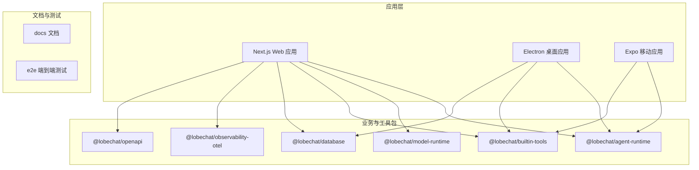
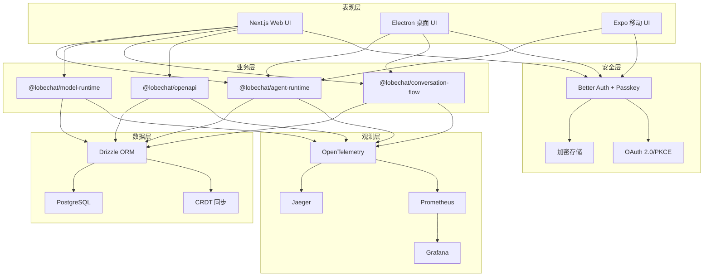
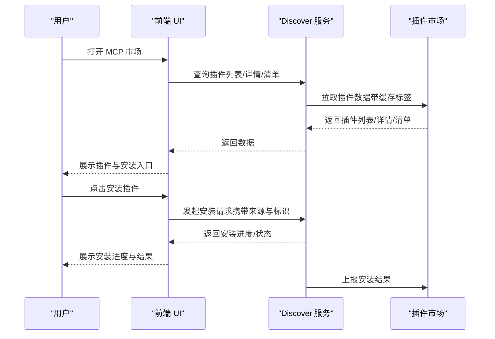
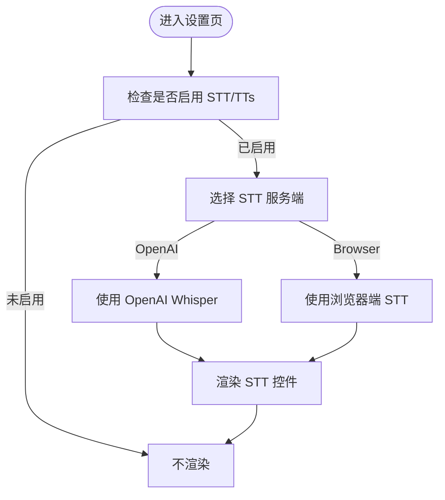
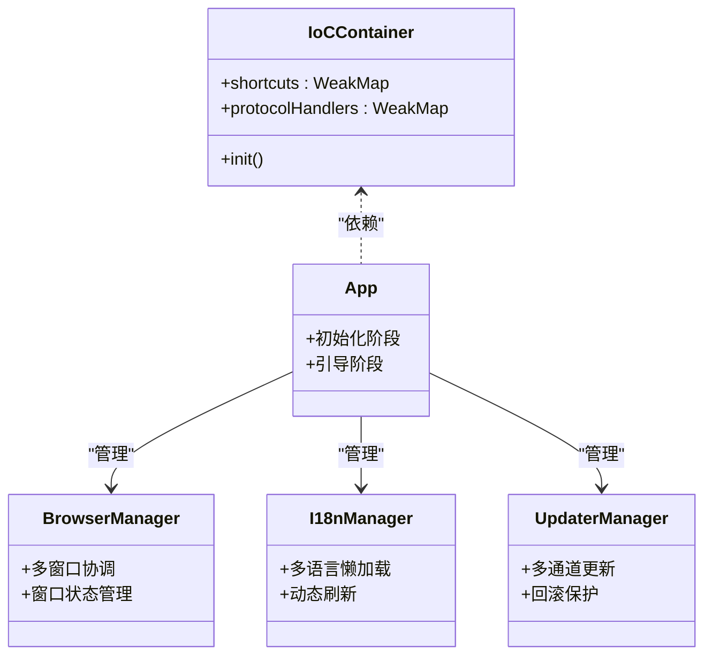
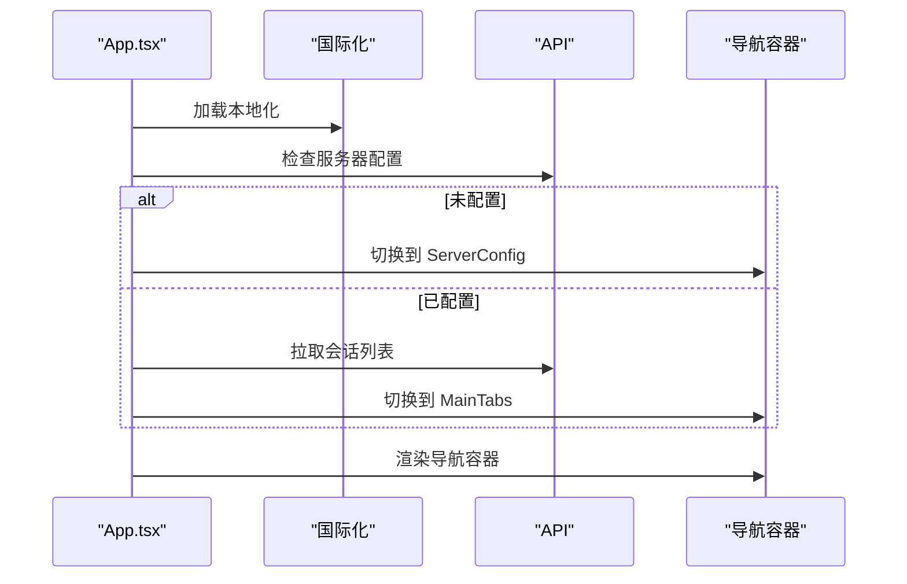
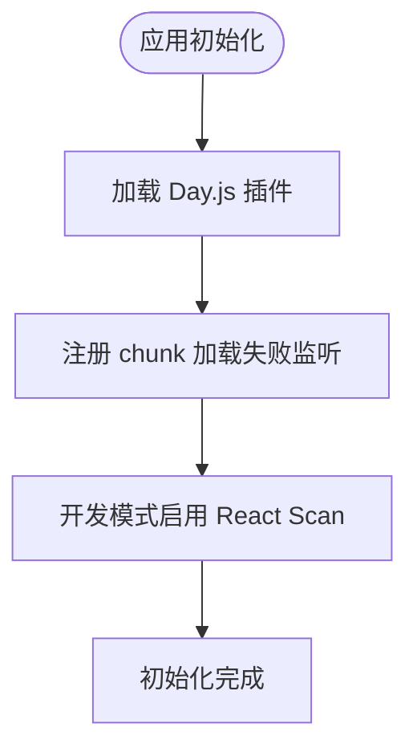
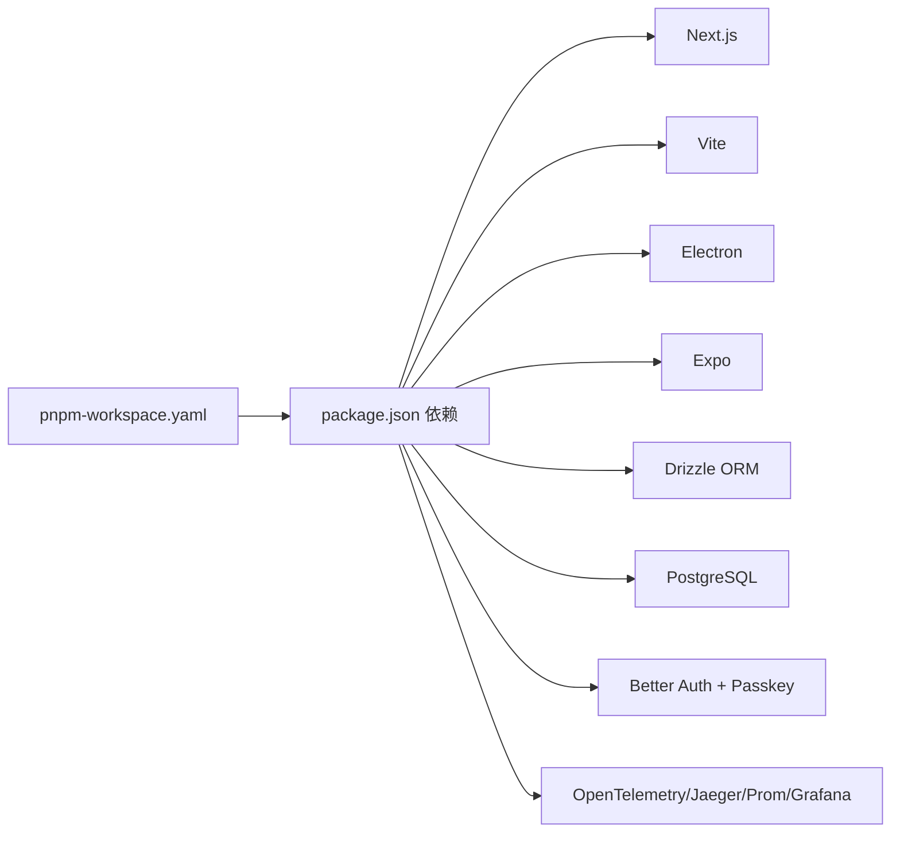

# 项目概述

<cite>
**本文档引用的文件**
- [README.md](file://README.md)
- [README.zh-CN.md](file://README.zh-CN.md)
- [package.json](file://package.json)
- [apps/desktop/README.md](file://apps/desktop/README.md)
- [apps/mobile/App.tsx](file://apps/mobile/App.tsx)
- [src/initialize.ts](file://src/initialize.ts)
- [pnpm-workspace.yaml](file://pnpm-workspace.yaml)
- [src/features/ChatInput/ActionBar/STT/index.tsx](file://src/features/ChatInput/ActionBar/STT/index.tsx)
- [src/routes/(main)/settings/tts/features/const.tsx](file://src/routes/(main)/settings/tts/features/const.tsx)
- [packages/const/src/settings/tts.ts](file://packages/const/src/settings/tts.ts)
- [src/server/services/discover/index.ts](file://src/server/services/discover/index.ts)
- [src/features/ProtocolUrlHandler/InstallPlugin/types.ts](file://src/features/ProtocolUrlHandler/InstallPlugin/types.ts)
- [src/store/tool/slices/mcpStore/initialState.ts](file://src/store/tool/slices/mcpStore/initialState.ts)
- [apps/desktop/src/main/core/infrastructure/IoCContainer.ts](file://apps/desktop/src/main/core/infrastructure/IoCContainer.ts)
- [apps/desktop/Development.md](file://apps/desktop/Development.md)
- [docs/wiki/HOME.md](file://docs/wiki/HOME.md)
</cite>

## 目录

1. [简介](#简介)
2. [项目结构](#项目结构)
3. [核心组件](#核心组件)
4. [架构总览](#架构总览)
5. [详细组件分析](#详细组件分析)
6. [依赖关系分析](#依赖关系分析)
7. [性能考量](#性能考量)
8. [故障排查指南](#故障排查指南)
9. [结论](#结论)
10. [附录](#附录)

## 简介

LobeHub 是一个面向工作与生活的开源 AI Agent 框架，致力于 “以 Agent 为工作单元”，构建人类与 Agent 共同进化的协作网络。项目提供多模态交互（语音合成、语音识别、视觉识别）、可扩展的 MCP 插件系统、跨平台部署支持（Web、桌面、移动端），并内置 Agent 市场、知识库、分支对话、思维链（CoT）等前沿能力。通过统一智能与 10,000+ 技能生态，LobeHub 让每个用户都能拥有可成长、可协作、可扩展的智能伙伴。

- 核心价值主张
  - 以 Agent 为工作单元，统一接入多模型与多模态
  - 10,000+ 技能与 MCP 插件生态，支持 Function Calling 与可视化结果渲染
  - 多平台部署与跨平台体验（Web、桌面、移动端）
  - 支持本地 / 远程数据库、多用户管理、PWA、移动适配与自定义主题

- 技术特色
  - 多模态交互：TTS/STT、视觉识别（如 GPT-4 Vision）
  - 插件系统：MCP 插件市场、一键安装、安全可信来源
  - 跨平台：Next.js + Vite SPA + Electron 桌面 + Expo 移动
  - 数据与安全：Better Auth、Passkey、加密存储、OAuth 2.0/PKCE
  - 可观测性：OpenTelemetry、Jaeger、Prometheus、Grafana

- 应用场景
  - 个人智能智能体：Agent Builder、个人记忆、Agent 市场
  - 团队协作：Agent Groups、Pages、Schedule、Workspace
  - 内容创作：Artifacts、文生图、分支对话、思维链可视化
  - 研究与开发：知识库、文件上传、插件扩展、本地 / 远程数据库

- 快速开始
  - 在线体验：访问官网与文档中心
  - 一键部署：Vercel/Zeabur/Sealos/ 阿里云，或 Docker
  - 本地开发：pnpm 安装、bun dev 或 pnpm dev

**章节来源**

- [README.md](file://README.md#L100-L180)
- [README.zh-CN.md](file://README.zh-CN.md#L98-L179)

## 项目结构

LobeHub 采用 Monorepo 结构，核心由以下部分组成：

- apps：应用层（Next.js Web、Electron 桌面、Expo 移动）
- packages：业务与工具包（Agent Runtime、Model Runtime、内置工具、数据库、可观测性等）
- docs：文档与 Wiki
- e2e：端到端测试
- scripts：CI/CD、工作流、迁移脚本

**图表来源**

- [pnpm-workspace.yaml](file://pnpm-workspace.yaml#L1-L6)
- [package.json](file://package.json#L30-L35)

**章节来源**

- [pnpm-workspace.yaml](file://pnpm-workspace.yaml#L1-L23)
- [package.json](file://package.json#L30-L35)

## 核心组件

- Agent Runtime 与模型运行时
  - 统一抽象 Agent 生命周期、上下文与工具调用
  - 支持多模型提供商（OpenAI、Anthropic、Azure AI、Google GenAI、Bedrock 等）
  - 提供本地模型（Ollama）与云端模型的统一接口

- 插件系统（MCP）
  - 通过 Model Context Protocol（MCP）实现与外部工具、数据源、服务的动态连接
  - 支持插件市场、一键安装、测试连接、进度追踪与错误处理
  - 插件安装状态、进度映射与中止控制器集中管理

- 多模态交互
  - TTS/STT：支持浏览器端与 OpenAI Whisper；可配置模型与自动停止策略
  - 视觉识别：集成 GPT-4 Vision 等多模态模型，支持图片上传与智能对话
  - 文生图：集成 DALL・E 3、MidJourney、Pollinations 等工具

- 跨平台体验
  - Web：Next.js + Vite SPA，支持 PWA、主题切换、国际化
  - 桌面：Electron + Vite，多窗口、IPC、自动更新、安全存储
  - 移动：Expo，路由初始化、主题与国际化

- 数据与安全
  - Better Auth + Passkey：OAuth 2.0/PKCE、加密令牌存储、多因素认证
  - 数据库：PostgreSQL、CRDT 多端同步（实验）
  - 安全：自定义协议处理、请求过滤、CSP 控制

**章节来源**

- [package.json](file://package.json#L158-L404)
- [src/features/ChatInput/ActionBar/STT/index.tsx](file://src/features/ChatInput/ActionBar/STT/index.tsx#L1-L29)
- [src/routes/(main)/settings/tts/features/const.tsx](<file://src/routes/(main)/settings/tts/features/const.tsx#L1-L37>)
- [packages/const/src/settings/tts.ts](file://packages/const/src/settings/tts.ts#L1-L10)
- [apps/desktop/README.md](file://apps/desktop/README.md#L1-L16)

## 架构总览

LobeHub 采用分层架构与模块化设计：

- 表现层：Next.js Web、Electron 桌面、Expo 移动
- 业务层：Agent Runtime、Model Runtime、Conversation Flow、OpenAPI
- 数据层：Drizzle ORM、PostgreSQL、CRDT 同步
- 观测层：OpenTelemetry、Jaeger、Prometheus、Grafana
- 安全层：Better Auth、Passkey、加密存储、OAuth 2.0/PKCE

**图表来源**

- [package.json](file://package.json#L158-L404)
- [apps/desktop/README.md](file://apps/desktop/README.md#L90-L120)

**章节来源**

- [package.json](file://package.json#L158-L404)
- [apps/desktop/README.md](file://apps/desktop/README.md#L90-L120)

## 详细组件分析

### 组件 A：插件系统（MCP）与市场

- 功能要点
  - 插件市场：分类、排序、搜索、相关推荐
  - 一键安装：进度追踪、中止控制器、错误收集
  - 可信来源：官方、市场、自定义三种来源，支持第三方可信市场
  - 安装上报：安装结果分析与上报

**图表来源**

- [src/server/services/discover/index.ts](file://src/server/services/discover/index.ts#L802-L888)
- [src/features/ProtocolUrlHandler/InstallPlugin/types.ts](file://src/features/ProtocolUrlHandler/InstallPlugin/types.ts#L1-L45)
- [src/store/tool/slices/mcpStore/initialState.ts](file://src/store/tool/slices/mcpStore/initialState.ts#L1-L35)

**章节来源**

- [src/server/services/discover/index.ts](file://src/server/services/discover/index.ts#L802-L888)
- [src/features/ProtocolUrlHandler/InstallPlugin/types.ts](file://src/features/ProtocolUrlHandler/InstallPlugin/types.ts#L1-L45)
- [src/store/tool/slices/mcpStore/initialState.ts](file://src/store/tool/slices/mcpStore/initialState.ts#L1-L35)

### 组件 B：多模态交互（TTS/STT）

- 功能要点
  - STT：浏览器端与 OpenAI Whisper 二选一，支持自动停止
  - TTS：OpenAI Audio、Microsoft Edge Speech 等高质量语音
  - 设置：模型选择、服务端切换、自动停止开关

**图表来源**

- [src/features/ChatInput/ActionBar/STT/index.tsx](file://src/features/ChatInput/ActionBar/STT/index.tsx#L1-L29)
- [src/routes/(main)/settings/tts/features/const.tsx](<file://src/routes/(main)/settings/tts/features/const.tsx#L1-L37>)
- [packages/const/src/settings/tts.ts](file://packages/const/src/settings/tts.ts#L1-L10)

**章节来源**

- [src/features/ChatInput/ActionBar/STT/index.tsx](file://src/features/ChatInput/ActionBar/STT/index.tsx#L1-L29)
- [src/routes/(main)/settings/tts/features/const.tsx](<file://src/routes/(main)/settings/tts/features/const.tsx#L1-L37>)
- [packages/const/src/settings/tts.ts](file://packages/const/src/settings/tts.ts#L1-L10)

### 组件 C：桌面应用（Electron）

- 技术栈与架构
  - Electron + Node.js + TypeScript + Vite
  - 依赖注入容器、事件驱动架构、模块联邦、观察者模式
  - 多窗口管理、主题同步、自动更新、安全存储

**图表来源**

- [apps/desktop/src/main/core/infrastructure/IoCContainer.ts](file://apps/desktop/src/main/core/infrastructure/IoCContainer.ts#L1-L11)
- [apps/desktop/README.md](file://apps/desktop/README.md#L121-L196)

**章节来源**

- [apps/desktop/README.md](file://apps/desktop/README.md#L90-L120)
- [apps/desktop/README.md](file://apps/desktop/README.md#L121-L196)
- [apps/desktop/src/main/core/infrastructure/IoCContainer.ts](file://apps/desktop/src/main/core/infrastructure/IoCContainer.ts#L1-L11)

### 组件 D：移动端（Expo）

- 初始化流程
  - 加载本地化、检查服务器配置、拉取会话列表、闪屏与导航容器

**图表来源**

- [apps/mobile/App.tsx](file://apps/mobile/App.tsx#L1-L67)

**章节来源**

- [apps/mobile/App.tsx](file://apps/mobile/App.tsx#L1-L67)

### 组件 E：初始化与全局错误处理

- 初始化要点
  - Day.js 插件扩展（相对时间、UTC、今日 / 昨日）
  - 全局异步 chunk 加载失败兜底通知
  - 开发模式下的 React Scan

**图表来源**

- [src/initialize.ts](file://src/initialize.ts#L1-L37)

**章节来源**

- [src/initialize.ts](file://src/initialize.ts#L1-L37)

## 依赖关系分析

- Monorepo 管理
  - pnpm workspace 管理 packages、apps、e2e
  - overrides 与 patchedDependencies 确保依赖一致性与修复

- 关键依赖
  - Next.js、Vite、Electron、Expo
  - Drizzle ORM、PostgreSQL、CRDT
  - Better Auth、Passkey、OAuth 2.0/PKCE
  - OpenTelemetry、Jaeger、Prometheus、Grafana

**图表来源**

- [pnpm-workspace.yaml](file://pnpm-workspace.yaml#L1-L23)
- [package.json](file://package.json#L158-L404)

**章节来源**

- [pnpm-workspace.yaml](file://pnpm-workspace.yaml#L1-L23)
- [package.json](file://package.json#L158-L404)

## 性能考量

- 首屏与增量加载
  - Vite + React.lazy + chunk 错误兜底，减少首屏体积
  - Day.js 插件按需加载，避免重复扩展
- 数据与网络
  - 插件市场使用缓存标签与 revalidate，降低重复请求
  - 本地 / 远程数据库选择与 CRDT 同步（实验）平衡一致性与性能
- 观测与监控
  - OpenTelemetry 自动采集指标，结合 Jaeger、Prometheus、Grafana 实时监控
- 跨平台体验
  - PWA 与桌面应用减少网络往返，移动端路由懒加载与闪屏优化

\[本节为通用指导，无需具体文件分析]

## 故障排查指南

- 插件安装失败
  - 检查安装进度映射与中止控制器，确认网络与权限
  - 查看错误收集与重试机制
- STT/TTs 不生效
  - 确认服务端配置与模型选择，检查浏览器兼容性与权限
- 桌面应用更新问题
  - 检查多通道更新与回滚保护，确认签名与沙箱配置
- 移动端初始化异常
  - 检查服务器配置检查、会话拉取与导航容器主题

**章节来源**

- [src/store/tool/slices/mcpStore/initialState.ts](file://src/store/tool/slices/mcpStore/initialState.ts#L1-L35)
- [src/features/ChatInput/ActionBar/STT/index.tsx](file://src/features/ChatInput/ActionBar/STT/index.tsx#L1-L29)
- [apps/desktop/README.md](file://apps/desktop/README.md#L214-L227)
- [apps/mobile/App.tsx](file://apps/mobile/App.tsx#L1-L67)

## 结论

LobeHub 以 “Agent 为工作单元” 的理念，构建了统一智能、可扩展、可协作的 AI Agent 生态。通过多模态交互、MCP 插件系统、跨平台部署与完善的安全与可观测性，LobeHub 不仅适合个人使用，也为团队协作与企业自托管提供了坚实基础。项目持续演进，生态不断丰富，是探索人类与 Agent 共同进化的理想平台。

\[本节为总结，无需具体文件分析]

## 附录

- 快速开始
  - 在线体验：访问官网与文档中心
  - 一键部署：Vercel/Zeabur/Sealos/ 阿里云，或 Docker
  - 本地开发：pnpm 安装、bun dev 或 pnpm dev
- 贡献与 Wiki
  - Wiki 已迁移至文档中心，详见开发指南

**章节来源**

- [README.md](file://README.md#L571-L726)
- [README.zh-CN.md](file://README.zh-CN.md#L545-L736)
- [docs/wiki/HOME.md](file://docs/wiki/HOME.md#L11-L12)
