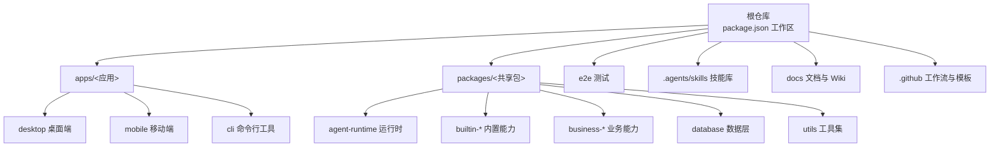
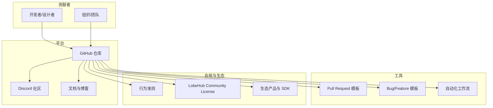
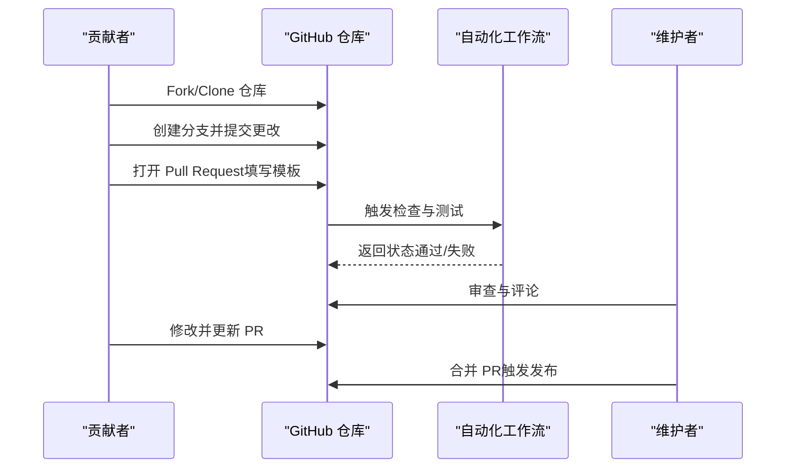
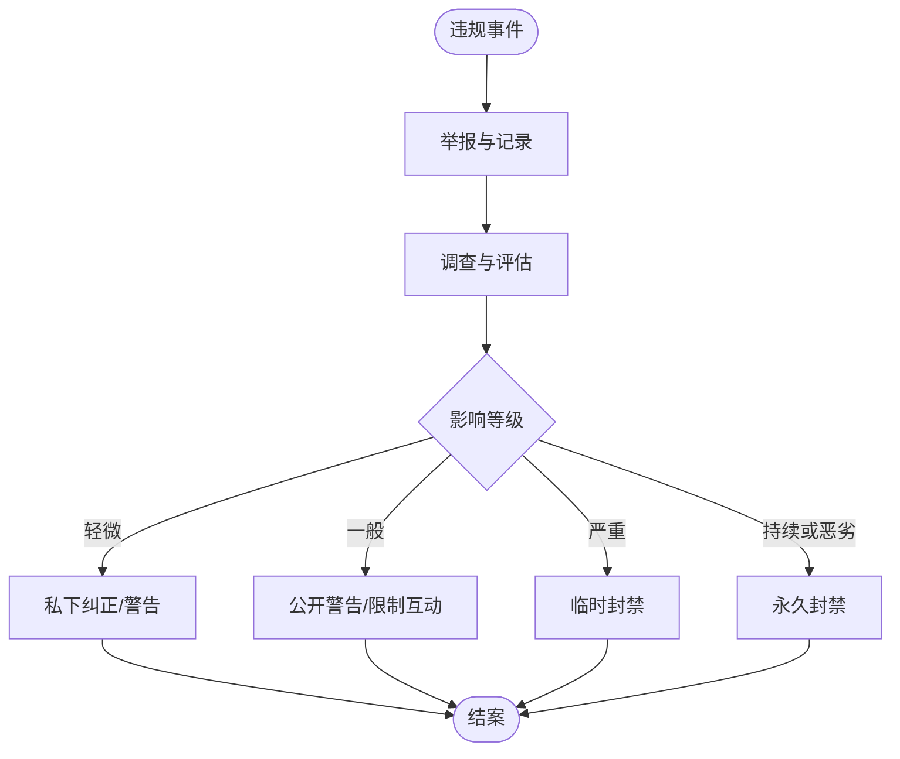
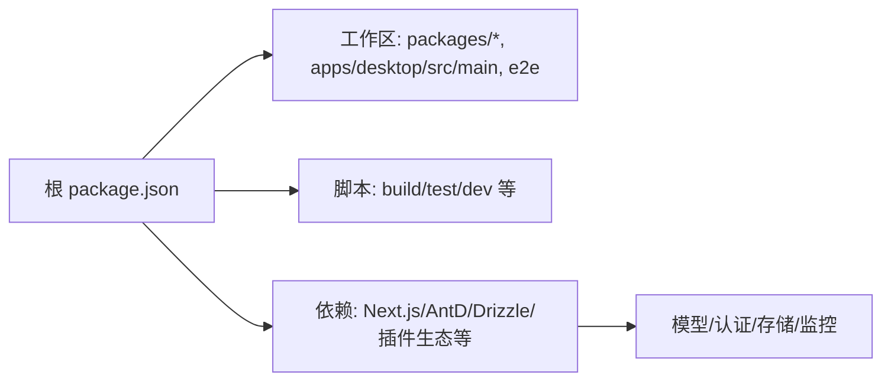

# 项目生态与社区

<cite>
**本文引用的文件**
- [README.md](file://README.md)
- [CONTRIBUTING.md](file://CONTRIBUTING.md)
- [CODE_OF_CONDUCT.md](file://CODE_OF_CONDUCT.md)
- [LICENSE](file://LICENSE)
- [package.json](file://package.json)
- [.github/FUNDING.yml](file://.github/FUNDING.yml)
- [.github/PULL_REQUEST_TEMPLATE.md](file://.github/PULL_REQUEST_TEMPLATE.md)
- [.github/ISSUE_TEMPLATE/1_bug_report.yml](file://.github/ISSUE_TEMPLATE/1_bug_report.yml)
- [.github/ISSUE_TEMPLATE/2_feature_request.yml](file://.github/ISSUE_TEMPLATE/2_feature_request.yml)
- [.github/ISSUE_TEMPLATE/config.yml](file://.github/ISSUE_TEMPLATE/config.yml)
- [AGENTS.md](file://AGENTS.md)
- [CLAUDE.md](file://CLAUDE.md)
</cite>

## 目录

1. [引言](#引言)
2. [项目结构](#项目结构)
3. [核心组件](#核心组件)
4. [架构总览](#架构总览)
5. [详细组件分析](#详细组件分析)
6. [依赖关系分析](#依赖关系分析)
7. [性能考量](#性能考量)
8. [故障排查指南](#故障排查指南)
9. [结论](#结论)
10. [附录](#附录)

## 引言

本文件系统性梳理 LobeHub 的开源生态与社区建设，覆盖社区贡献者与合作伙伴、技术社区与治理机制、贡献流程与代码规范、行为准则、开源许可与知识产权政策、商业化策略、社区活动与开发者支持渠道，以及参与方式与影响力展示。目标是帮助潜在贡献者与用户快速理解项目的活跃度、发展方向与参与路径。

## 项目结构

LobeHub 是一个大型多应用与多包（monorepo）项目，包含桌面端、移动端、Web 应用、共享包库、测试与脚手架工具等模块。整体采用多工作区组织，便于统一开发、测试与发布。

图表来源

- [package.json](file://package.json#L30-L35)
- [AGENTS.md](file://AGENTS.md#L18-L38)

章节来源

- [package.json](file://package.json#L30-L35)
- [AGENTS.md](file://AGENTS.md#L18-L38)

## 核心组件

- 社区与协作
  - 贡献指南：提供从 Fork 到 PR 的完整流程与最佳实践。
  - 行为准则：采用 Contributor Covenant 2.0，明确正向社区标准与执行范围。
  - 讨论与问题模板：通过 GitHub Discussions 与标准化 Issue 模板提升沟通效率。
- 开源许可与合规
  - 使用自定义 LobeHub Community License，在 Apache 2.0 基础上增加商业使用与衍生作品许可要求。
- 商业化与赞助
  - 提供多种赞助渠道（Open Collective、IssueHunt 等），支持项目可持续发展。
- 生态产品
  - UI 组件库、图标库、TTS/STT Hook、插件 SDK 与网关等周边产品，形成可复用的生态闭环。

章节来源

- [CONTRIBUTING.md](file://CONTRIBUTING.md#L1-L89)
- [CODE_OF_CONDUCT.md](file://CODE_OF_CONDUCT.md#L1-L129)
- [.github/ISSUE_TEMPLATE/1_bug_report.yml](file://.github/ISSUE_TEMPLATE/1_bug_report.yml#L1-L114)
- [.github/ISSUE_TEMPLATE/2_feature_request.yml](file://.github/ISSUE_TEMPLATE/2_feature_request.yml#L1-L22)
- [.github/ISSUE_TEMPLATE/config.yml](file://.github/ISSUE_TEMPLATE/config.yml#L1-L8)
- [LICENSE](file://LICENSE#L1-L25)
- [.github/FUNDING.yml](file://.github/FUNDING.yml#L1-L14)
- [README.md](file://README.md#L662-L675)

## 架构总览

LobeHub 的社区与生态由 “贡献者 — 平台 — 工具 — 文档” 四要素构成，围绕 GitHub Issues/Discussions、PR 流程、行为准则与许可证形成治理闭环；同时通过生态产品与部署方案降低使用门槛，扩大用户与贡献者规模。

图表来源

- [CONTRIBUTING.md](file://CONTRIBUTING.md#L1-L89)
- [CODE_OF_CONDUCT.md](file://CODE_OF_CONDUCT.md#L1-L129)
- [.github/PULL_REQUEST_TEMPLATE.md](file://.github/PULL_REQUEST_TEMPLATE.md#L1-L48)
- [.github/ISSUE_TEMPLATE/1_bug_report.yml](file://.github/ISSUE_TEMPLATE/1_bug_report.yml#L1-L114)
- [.github/ISSUE_TEMPLATE/2_feature_request.yml](file://.github/ISSUE_TEMPLATE/2_feature_request.yml#L1-L22)
- [LICENSE](file://LICENSE#L1-L25)
- [README.md](file://README.md#L662-L675)

## 详细组件分析

### 贡献流程与治理

- 分支策略与 PR 触发
  - 开发分支与发布分支分离，PR 标题前缀触发发布。
- 提交与审查
  - 使用标准化 PR 模板，明确变更类型、测试验证与附加信息。
- 问题反馈
  - 提供 Bug 与 Feature 模板，引导用户提供环境、版本、复现步骤与期望结果。
- 讨论与分流
  - 将咨询与想法迁移至 Discussions，避免 Issues 泛滥。

图表来源

- [CONTRIBUTING.md](file://CONTRIBUTING.md#L19-L89)
- [.github/PULL_REQUEST_TEMPLATE.md](file://.github/PULL_REQUEST_TEMPLATE.md#L1-L48)
- [.github/ISSUE_TEMPLATE/1_bug_report.yml](file://.github/ISSUE_TEMPLATE/1_bug_report.yml#L1-L114)
- [.github/ISSUE_TEMPLATE/2_feature_request.yml](file://.github/ISSUE_TEMPLATE/2_feature_request.yml#L1-L22)

章节来源

- [CONTRIBUTING.md](file://CONTRIBUTING.md#L1-L89)
- [.github/PULL_REQUEST_TEMPLATE.md](file://.github/PULL_REQUEST_TEMPLATE.md#L1-L48)
- [.github/ISSUE_TEMPLATE/1_bug_report.yml](file://.github/ISSUE_TEMPLATE/1_bug_report.yml#L1-L114)
- [.github/ISSUE_TEMPLATE/2_feature_request.yml](file://.github/ISSUE_TEMPLATE/2_feature_request.yml#L1-L22)
- [.github/ISSUE_TEMPLATE/config.yml](file://.github/ISSUE_TEMPLATE/config.yml#L1-L8)

### 行为准则与社区管理

- 明确承诺与正向标准，禁止骚扰、歧视与隐私泄露等行为。
- 规定执行职责与范围，涵盖社区空间与公共代表场景。
- 提供分级处置流程（纠正、警告、临时封禁、永久封禁）与保障措施（隐私与安全）。

图表来源

- [CODE_OF_CONDUCT.md](file://CODE_OF_CONDUCT.md#L39-L114)

章节来源

- [CODE_OF_CONDUCT.md](file://CODE_OF_CONDUCT.md#L1-L129)

### 开源许可与知识产权政策

- 许可证基础：Apache License 2.0
- 额外条款：
  - 商业使用允许（前端 / 后端服务可直接商用）
  - 衍生作品需另行获取商业许可
  - 项目方保留调整开源协议的权利
  - 贡献代码可能用于商业用途（含云版本）

章节来源

- [LICENSE](file://LICENSE#L1-L25)

### 生态产品与工具链

- 生态产品矩阵：UI 组件库、图标库、TTS/STT Hook、Lint 规范、插件 SDK 与网关等。
- 插件体系：提供索引、模板、SDK 与边缘运行网关，支撑功能扩展与动态加载。

章节来源

- [README.md](file://README.md#L662-L675)
- [README.md](file://README.md#L677-L698)

### 参与社区的方式与渠道

- GitHub Issues：Bug 报告与功能请求（带模板）
- GitHub Discussions：提问、想法与私有化部署咨询
- Discord：开发者与用户交流社区
- 文档与博客：使用指南、特性说明与更新日志
- 赞助渠道：Open Collective、IssueHunt 等

章节来源

- [.github/ISSUE_TEMPLATE/1_bug_report.yml](file://.github/ISSUE_TEMPLATE/1_bug_report.yml#L1-L114)
- [.github/ISSUE_TEMPLATE/2_feature_request.yml](file://.github/ISSUE_TEMPLATE/2_feature_request.yml#L1-L22)
- [.github/ISSUE_TEMPLATE/config.yml](file://.github/ISSUE_TEMPLATE/config.yml#L1-L8)
- [README.md](file://README.md#L100-L115)
- [.github/FUNDING.yml](file://.github/FUNDING.yml#L1-L14)

### 社区活动与影响力

- Star 历史与活跃度：提供 Star History 图表与统计
- 社区声量：在 Product Hunt 等平台获得关注
- 影响力指标：GitHub Stars、Forks、Issues、贡献者画像等

章节来源

- [README.md](file://README.md#L117-L123)
- [README.md](file://README.md#L100-L109)

## 依赖关系分析

- 工作区与包管理
  - pnpm monorepo 工作区组织 packages、apps、e2e 等目录
  - 通过脚本统一构建、测试、迁移与文档工作流
- 外部依赖与生态集成
  - 与多种模型提供商、认证与数据库、监控与可观测性等生态紧密耦合
  - 通过插件 SDK 与网关实现外部能力接入

图表来源

- [package.json](file://package.json#L30-L35)
- [package.json](file://package.json#L37-L123)
- [package.json](file://package.json#L158-L404)

章节来源

- [package.json](file://package.json#L30-L35)
- [package.json](file://package.json#L37-L123)
- [package.json](file://package.json#L158-L404)

## 性能考量

- 开发体验与调试
  - 提供 SPA 单独开发模式与全栈并发模式，配合调试代理加速本地联调
- 测试与质量
  - Vitest 与测试工具链，按需运行测试，避免全量耗时
- 发布与迁移
  - 通过脚本统一数据库迁移与 Sitemap 生成，减少手工操作

章节来源

- [CLAUDE.md](file://CLAUDE.md#L66-L85)
- [CLAUDE.md](file://CLAUDE.md#L101-L114)
- [package.json](file://package.json#L48-L51)
- [package.json](file://package.json#L46-L46)

## 故障排查指南

- 问题分类与模板
  - Bug 模板：客户端类型、操作系统、部署平台、版本、浏览器、复现步骤、预期结果、是否愿意提 PR 等
  - Feature 模板：问题描述、建议方案、附加信息
- 讨论分流
  - 咨询与想法优先放入 Discussions，避免重复与噪音
- 许可与合规
  - 商业使用与衍生品需另行授权，避免法律风险

章节来源

- [.github/ISSUE_TEMPLATE/1_bug_report.yml](file://.github/ISSUE_TEMPLATE/1_bug_report.yml#L1-L114)
- [.github/ISSUE_TEMPLATE/2_feature_request.yml](file://.github/ISSUE_TEMPLATE/2_feature_request.yml#L1-L22)
- [.github/ISSUE_TEMPLATE/config.yml](file://.github/ISSUE_TEMPLATE/config.yml#L1-L8)
- [LICENSE](file://LICENSE#L9-L23)

## 结论

LobeHub 在开源生态与社区建设方面形成了较为完善的治理体系：以标准化流程与模板提升协作效率，以行为准则保障社区健康，以灵活的许可与赞助机制促进可持续发展。通过生态产品与工具链降低使用与贡献门槛，结合活跃的社区渠道与影响力展示，为项目长期演进提供了坚实基础。

## 附录

- 贡献者与维护者
  - 维护者与贡献者统计与可视化入口
- 开发者支持
  - 本地开发指南、调试代理与文档工作流
- 商业化策略
  - 商用许可与衍生品授权说明

章节来源

- [README.md](file://README.md#L728-L780)
- [CLAUDE.md](file://CLAUDE.md#L66-L85)
- [LICENSE](file://LICENSE#L9-L23)
