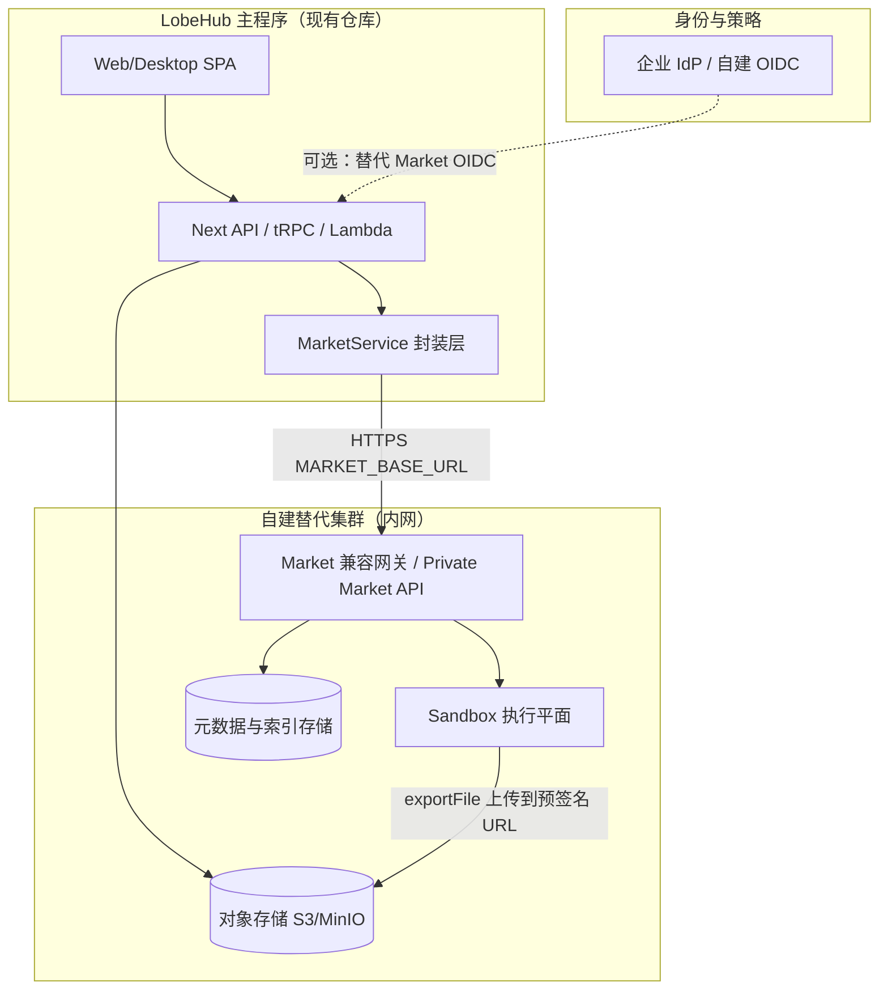
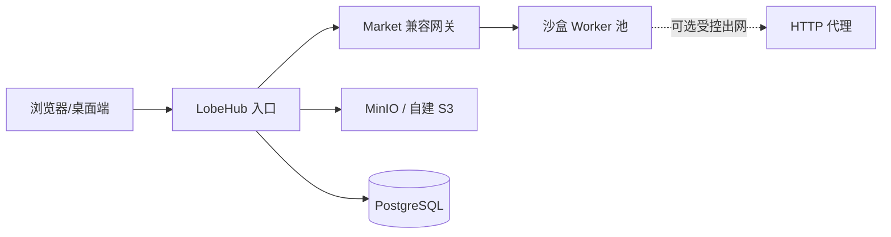

# 主程序内完整替代 Market + 云沙盒 — 架构说明

本文档面向 **完全离线 / 仅内网**、需在 **LobeHub 主程序内** 替代官方 `market.lobehub.com` 与云端 Code Interpreter（云沙盒）的架构设计，用于技术评审与分阶段实施。\
**说明**：官方 Market 服务端未随主仓库开源；下文「兼容」指 **行为上满足主程序已通过 `@lobehub/market-sdk` 发起的调用**，而非声称与公网服务逐字节一致。

---

## 1. 目标与约束

| 维度                 | 说明                                                                                                                              |
| -------------------- | --------------------------------------------------------------------------------------------------------------------------------- |
| **目标**             | 用户仍使用现有 LobeHub 客户端与内置 Skill（含 Cloud Sandbox），但 **所有原指向公网 Market 与沙盒执行的流量** 落在自建基础设施上。 |
| **典型约束**         | 仅内网、数十人规模；可接受适度运维成本；**安全隔离**（多租户代码执行）不可省略。                                                  |
| **非目标（可另文）** | 与公网 LobeHub Cloud 商业计费、全球 CDN、公共社区运营完全对齐。                                                                   |

---

## 2. 现状：主程序如何依赖 Market 与沙盒

### 2.1 配置入口

- **Market 基址**：`MARKET_BASE_URL`（默认 `https://market.lobehub.com`），见 `src/server/services/market/index.ts`。
- **可信客户端**（可选）：`MARKET_TRUSTED_CLIENT_ID` / `MARKET_TRUSTED_CLIENT_SECRET`，用于服务端代用户调用 Market API。

### 2.2 客户端 SDK 实例化

`MarketService` 构造时把 `baseURL` 设为 `MARKET_BASE_URL`，并注入 `MarketSDK`（`@lobehub/market-sdk`）。所有 Market 能力最终为 **HTTPS 请求到该基址**。

### 2.3 云沙盒专用路径（与替代强相关）

| 能力          | 主程序落点                                                       | 底层调用形态                                                                                                        |
| ------------- | ---------------------------------------------------------------- | ------------------------------------------------------------------------------------------------------------------- |
| 内置工具执行  | `ServerSandboxService` / `CloudSandboxExecutionRuntime`          | `market.plugins.runBuildInTool(toolName, params, { topicId, userId })`                                              |
| 浏览器经 tRPC | `src/server/routers/tools/market.ts` → `callCodeInterpreterTool` | 同上 + `execScript` 时服务端拼 `zipUrl`                                                                             |
| 导出文件      | `exportFile` / `exportAndUploadFile`                             | `runBuildInTool('exportFile', { path, uploadUrl })`，再由 **LobeHub 自有 S3 + `FileService.createFileRecord`** 落库 |

**结论**：沙盒「算力」在 Market 侧；**文件持久化与 URL** 已在主程序完成，替代时只需保证 **`runBuildInTool` 语义** 与 **预签名上传** 仍可用（上传目标可仍为本集群对象存储）。

### 2.4 广义的「Market」能力（完整替代需覆盖或显式降级）

除沙盒外，主程序还通过 `MarketService` / lambda `market` 路由使用例如：

- **社区 Discover**：助手 / MCP / 插件 / 模型 / Provider 等列表与详情（`src/services/discover.ts` 等）。
- **插件**：云端 MCP 网关 `callCloudGateway`、manifest、安装与上报。
- **技能商店**：搜索、下载 URL、分类（`skillStore` runtime 等）。
- **LobeHub Connect**：第三方 Skill 提供方 OAuth 与 `connectCallTool`（`src/store/tool/slices/lobehubSkillStore/action.ts`）。
- **Agent / Agent Group**：部分发布、归属校验（如 `useMarketGroupPublish`）。
- **OIDC**：`src/app/(backend)/market/oidc/...`、`src/libs/oidc-provider/config.ts` 与 `MARKET_BASE_URL` 联动。

**完整替代** = 要么 **自建服务实现兼容 API**，要么 **产品层关闭对应入口 + 二开短路**，二者常组合使用。

---

## 3. 目标架构总览

建议拆为 **三条平面**，便于分团队与分期交付：

- **控制平面**：Market 兼容网关 —— 路由插件 / Discover / 技能等请求；可先做 **只读索引 + 沙盒**，再补全。
- **数据平面**：沙盒执行 —— 强隔离运行时（见第 4 节）。
- **身份平面**：内网部署强烈建议 **不再依赖 Market 公网 OIDC**；用现有 Keycloak/Authelia 等与主程序 Auth 对齐，Market 兼容层仅校验 **M2M / 用户令牌**（由你们签发）。

---

## 4. 核心子系统设计

### 4.1 Market 兼容网关（Private Market API）

**职责**：

- 对外保持与 **`@lobehub/market-sdk` 期望的 REST 路径与 JSON 形态** 一致（至少覆盖主程序实际调用的子集）。
- 对内可拆多个微服务；对 LobeHub 仅暴露 **单一 `MARKET_BASE_URL`**。

**实现策略（二选一或混合）**：

1. **逆向兼容**：抓包 / 读 SDK 类型定义，按方法实现最小可用集；**工作量大但主程序改动最少**（仅改环境变量与密钥）。
2. **适配器 + 主程序二开**：在 `MarketService` 同目录增加 `InternalMarketAdapter`，按功能开关路由到自建 HTTP；**减少「假 Market」需要伪造的端点数量**，但需维护 fork。

**建议优先实现的 API 分组（按业务优先级）**：

| 优先级 | 能力                                                               | 说明                                            |
| ------ | ------------------------------------------------------------------ | ----------------------------------------------- |
| P0     | `plugins.runBuildInTool`（含 `exportFile`）                        | 云沙盒与导出；与 `CodeInterpreterToolName` 对齐 |
| P0     | 健康检查 / 鉴权                                                    | 与 `trustedClientToken` 或 Bearer 方案一致      |
| P1     | 技能：`marketSkills.getSkillList/getSkillDetail/getDownloadUrl` 等 | 技能商店与 `skillStore` runtime                 |
| P1     | `plugins.callCloudGateway`                                         | 若内网仍用「云端 MCP」模式                      |
| P2     | Discover 全量（agents/mcps/plugins/models/...）                    | 可用 **静态索引 + 内网同步工具** 替代实时公网   |
| P2     | `connect.*`（OAuth）                                               | 若内网禁用第三方 Skill，可整组降级              |
| P3     | 上报类（`reportCall`、`createEvent` 等）                           | 可空实现或写入本地审计日志                      |

### 4.2 沙盒执行平面（Sandbox Runtime）

**职责**：实现 **与官方 Code Interpreter 等价的工具语义**，至少包括 Cloud Sandbox manifest 中出现的操作（列表、读写文件、`executeCode`、`runCommand`、后台命令、`grep`/`glob`、`exportFile` 等）。

**推荐技术路线（内网、数十人）**：

| 方案                                        | 优点                      | 注意                                         |
| ------------------------------------------- | ------------------------- | -------------------------------------------- |
| **每会话容器**（Docker /containerd + 编排） | 隔离清晰，与 K8s 生态一致 | 需镜像管理、资源配额、网络出口策略           |
| **固定池 Worker + 会话目录**                | 实现快                    | 隔离弱，仅适合高信任内网，不推荐作为长期方案 |
| **Firecracker / gVisor** 等                 | 安全边界更强              | 运维与集成成本更高                           |

**会话模型**：与现网一致，使用 **`topicId` + `userId`** 绑定沙盒会话；网关将 `runBuildInTool` 映射为对具体 Worker 的 RPC/HTTP。

**`exportFile`**：Worker 将沙盒内文件 **PUT 到 LobeHub 已下发的预签名 URL**（与现逻辑一致），不在此服务长期存用户文件。

### 4.3 存储与文件

- **沙盒内临时存储**：执行器本地盘或 CSI，按会话 GC。
- **导出持久化**：仍由 LobeHub `exportAndUploadFile` / `ServerSandboxService.exportAndUploadFile` 写入 **你们配置的 S3 兼容存储** + `createFileRecord`；**替代 Market 不改变这一段**，除非你们连存储也迁走。

### 4.4 身份、密钥与审计

- **服务间**：Market 兼容网关 ↔ 沙盒 Worker 使用 **mTLS 或内网 JWT**。
- **用户维度**：`userId`、`topicId` 必须由网关校验（与 LobeHub 会话一致），防止横向越权。
- **审计**：记录工具名、资源用量、出口网络是否允许；内网也需防横向移动。

---

## 5. 与主程序的集成点（便于改造排期）

以下路径为实施或代码阅读时的 **锚点**：

| 模块                | 路径 / 说明                                                                                                |
| ------------------- | ---------------------------------------------------------------------------------------------------------- |
| Market 基址         | `src/server/services/market/index.ts`                                                                      |
| 沙盒服务端          | `src/server/services/sandbox/index.ts`、`src/server/services/toolExecution/serverRuntimes/cloudSandbox.ts` |
| tRPC 沙盒           | `src/server/routers/tools/market.ts`（`callCodeInterpreterTool`、`exportAndUploadFile`）                   |
| 客户端沙盒          | `src/services/cloudSandbox.ts`、`packages/builtin-tool-cloud-sandbox/`                                     |
| Discover            | `src/services/discover.ts`、`src/server/services/discover/index.ts`                                        |
| OIDC 与 Market 路由 | `src/app/(backend)/market/`、`src/libs/oidc-provider/config.ts`                                            |

---

## 6. 网络拓扑（仅内网）

- **默认**应禁止沙盒随意访问内网管理网段；若需「内网 API 工具」，用 **显式允许列表** 或独立 MCP，而非给沙盒全网权限。

---

## 7. 分阶段实施路线（建议）

| 阶段        | 交付物                                                      | 验收                                |
| ----------- | ----------------------------------------------------------- | ----------------------------------- |
| **Phase 0** | 梳理 `market-sdk` 实际命中端点（自动化集成测试或抓包）      | 清单与优先级确认                    |
| **Phase 1** | 自建 `MARKET_BASE_URL` + P0：`runBuildInTool` + 沙盒 Worker | 内置 Cloud Sandbox 端到端可用       |
| **Phase 2** | `exportFile` + 与现有 S3 / 文件记录联调                     | 导出链接与知识库 `spaceId` 策略不变 |
| **Phase 3** | 技能商店 / Discover 所需 API 或 **UI 降级**                 | 社区页可用或明确隐藏                |
| **Phase 4** | Connect / OIDC 替换或禁用                                   | 无公网依赖、符合等保 / 内网规范     |

---

## 8. 风险与未决项

| 风险                       | 缓解                                                                                                 |
| -------------------------- | ---------------------------------------------------------------------------------------------------- |
| SDK 与真实 Market 行为漂移 | 锁定 `@lobehub/market-sdk` 版本；对 `runBuildInTool` 做 **契约测试**（golden cases）                 |
| `execScript` + Skill zip   | 主程序在服务端解析 `zipUrl`（`market.ts`）；自建 Market 或 Worker 需支持 **从可访问 URL 拉取技能包** |
| 运维成本                   | 数十人规模可采用 **单集群多副本**，仍建议监控与会话 GC                                               |
| 法律与合规                 | 用户代码执行属高风险能力，需安全评审与应急预案                                                       |

---

## 9. 文档维护

- 与 `docs/development/discover-plugin-market.zh-CN.md`、`docs/development/resource-tree-sharing-security-plan.zh-CN.md` 交叉阅读：Discover 数据源与 `spaceId` 导出策略仍以主程序实现为准。
- 若后续主程序增加 **显式「内网模式」开关**（集中禁用公网 Market），宜在本文件追加 **版本化配置项** 说明。

---

**版本**：1.0（架构草案，随实现修订）
