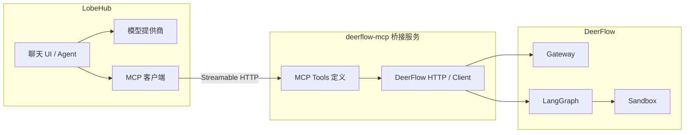

# DeerFlow × LobeHub 集成方案审计（框架文档）

> **文档性质**：架构与工程审计，非官方 DeerFlow/LobeHub 联合发布说明。\
> **适用读者**：要在自托管 LobeHub 中接入 DeerFlow 2.x 运行时的团队。

---

## 1. 结论摘要

| 维度             | 判断                                                                                                                                                                 |
| ---------------- | -------------------------------------------------------------------------------------------------------------------------------------------------------------------- |
| **能否集成**     | **能**。两边均为开源，集成属于「编排层 + 运行时」组合，不是同一抽象层上的即插即用。                                                                                  |
| **推荐主路径**   | **独立部署 DeerFlow + 薄层 MCP Bridge**（或等价 HTTP 工具服务），在 LobeHub 内以 **自定义 MCP 插件** 形式暴露 `run_task` / `continue_thread` / `upload` 等工具语义。 |
| **不推荐首选项** | 把 DeerFlow **伪装成 OpenAI 兼容 `/v1/chat/completions`** 再接进 LobeHub「模型提供商」—— 语义错位、流式与多轮状态难对齐，维护成本高。                                |
| **「嵌入 UI」**  | 无零代码路径；需在 LobeHub 源码中新增路由 / Feature（fork 或私有构建）。                                                                                             |

---

## 2. 语义对齐：两边在协议栈上的位置

### 2.1 DeerFlow（公开文档与常见部署）

- **LangGraph 运行时**：thread /run、流式事件（SSE 等），面向「agent 执行图」。
- **Gateway API**：模型列表、上传、skills、MCP 配置、产物（artifacts）等管理能力。
- **内嵌 `DeerFlowClient`**：Python 侧进程内调用，与 HTTP Gateway 返回结构对齐。

**要点**：对外主叙事是 **「Harness / 运行时 + Gateway」**，不是单一「聊天补全端点」。

### 2.2 LobeHub（本仓库）

- **对话主路径**：选模型提供商 → 走各 provider 的 chat/completions 语义；工具通过 **MCP / 内置工具 / 插件** 注入。
- **MCP**：服务端使用 `@modelcontextprotocol/sdk`（含 `StreamableHTTPClientTransport` 等），支持 **HTTP** 与 **stdio**（Web 环境限制见下）。
- **扩展点**：`DEFAULT_AGENT_CONFIG`、`AGENTS_INDEX_URL` 等用于默认助手与市场索引（见 §6）。

**要点**：LobeHub 的「一等公民」是 **模型 + 工具（MCP）**；DeerFlow 的「一等公民」是 **LangGraph 执行与 Gateway**。二者对齐需要 **显式适配层**。

---

## 3. 推荐方案：MCP Bridge —— 审计

### 3.1 架构



### 3.2 方案优点

1. **契合 LobeHub 工具模型**：MCP 工具一次调用一次语义边界清晰，与 DeerFlow「发任务 / 跟 thread」一致。
2. **职责分离**：LobeHub 负责对话、权限、用户偏好；DeerFlow 负责 sandbox、sub-agents、artifacts。
3. **演进独立**：DeerFlow 升级 Gateway/LangGraph 时，只要桥接层兼容 API，即可少改 LobeHub 本体。

### 3.3 方案风险与缓解

| 风险             | 说明                                                                              | 缓解                                                                                                                                                                   |
| ---------------- | --------------------------------------------------------------------------------- | ---------------------------------------------------------------------------------------------------------------------------------------------------------------------- |
| **流式体验**     | MCP 工具多为「请求–响应」；DeerFlow 侧为长流式执行。                              | Bridge 内聚合为阶段状态（`queued` / `running` / `done`）+ 可选轮询 `get_run_status`；或在 Bridge 内做 **SSE→文本块** 的受控摘要（产品上要接受「不是逐 token 跟手」）。 |
| **超时**         | LobeHub MCP 客户端默认工具超时约 **240s**（见 `MCP_TOOL_TIMEOUT`）。              | 长任务必须 **异步化**：工具立即返回 `run_id`，后续用 `continue` / `status` 拉取；或提高超时并文档化上限。                                                              |
| **附件**         | LobeHub 文件走自有存储与知识库链路；DeerFlow thread 上传走 **Gateway 自有上传**。 | Bridge 负责 **二次上传** 或 **可访问 URL 映射**（需鉴权与生命周期一致）。                                                                                              |
| **网络安全**     | 服务端 MCP 会请求配置的 URL；内网 DeerFlow 可能触发 **SSRF 相关策略**。           | 使用 `SSRF_ALLOW_PRIVATE_IP_ADDRESS` / 白名单等（仅可信内网开启）；Bridge 与 DeerFlow 同 VPC。                                                                         |
| **Web 与 stdio** | 本仓库中 **stdio MCP 在非 Desktop 环境不可用**（`mcp` router 校验）。             | 自托管 Web 场景 **优先 HTTP/SSE Bridge**；桌面客户端可考虑 stdio。                                                                                                     |

### 3.4 工具形状（建议）

以下为产品化时的 **逻辑工具** 划分（具体命名与 JSON Schema 在实现时与 DeerFlow Gateway 对齐）：

- `deerflow_run`：提交任务（映射 chat /stream 入口，返回 `thread_id` / `run_id`）。
- `deerflow_status`：查询运行状态与简要日志指针。
- `deerflow_upload`：将 LobeHub 侧文件推入 DeerFlow thread。
- `deerflow_list_artifacts` / `deerflow_fetch_artifact`：拉取产物元数据或下载链接。

**原则**：避免在单个工具里塞满 DeerFlow 全部能力；保持 **可测试、可超时、可重试**。

---

## 4. 备选方案对比

### 4.1 OpenAI 兼容「翻译代理」（不推荐作 v1）

- **做法**：在代理层把 `chat/completions` 转成 DeerFlow 的 thread/run。
- **问题**：多轮 `messages` 与 LangGraph state 映射复杂；流式 chunk 与 tool 事件交错；升级 DeerFlow 时易碎。
- **适用**：仅当必须让**第三方只认 OpenAI SDK** 且可接受大量定制时考虑。

### 4.2 源码级嵌入（iframe / 内嵌页面 / 统一会话）

- **做法**：在 `src/routes` + `src/features` 增加 DeerFlow 面板或 webview，会话 ID 与 LobeHub session 做映射。
- **优点**：体验可做到「一个产品」。
- **成本**：安全边界（Cookie、CORS、鉴权）、状态同步、发布流水线都要自建。

---

## 5. 实施路线图（建议）

| 阶段   | 内容                                                   | 验收                                      |
| ------ | ------------------------------------------------------ | ----------------------------------------- |
| **P0** | DeerFlow 独立部署稳定；Bridge 打通 `run` + `status`    | LobeHub 中一次对话可触发任务并看到终态    |
| **P1** | 附件二次上传；artifact 列表与下载                      | 论文 / 代码附件可进入同一次 DeerFlow 任务 |
| **P2** | 运维：日志、指标、Bridge 与 DeerFlow 版本矩阵          | 可回滚、可告警                            |
| **P3** | 可选：专用 Agent 模板、`DEFAULT_AGENT_CONFIG` 预装 MCP | 团队一键启用                              |

---

## 6. 本仓库可复核事实（LobeHub）

以下用于支撑 §3、§5，避免与「凭印象」的配置名混淆。

**MCP 传输与参数**：HTTP 使用 `type: 'http'`、`url` 等（见 `src/server/routers/tools/mcp.ts` 中 `httpParamsSchema`）。

**MCP 工具超时**：默认 `MCP_TOOL_TIMEOUT` 解析为数值，默认 **240000** ms（见 `src/libs/mcp/client.ts`）。

**stdio 限制**：`stdio` 在非 Desktop 会拒绝（见 `src/server/routers/tools/mcp.ts` 中 `checkStdioEnvironment`）。

**默认助手与市场索引**：

- `DEFAULT_AGENT_CONFIG`：服务端字符串，解析后合并为默认 Agent 配置（见 `src/envs/app.ts`）。
- `AGENTS_INDEX_URL`：可覆盖默认助手市场索引 URL（见 `src/envs/app.ts`）。

**需更正的常见误传**：

- 本仓库 **未发现** 名为 `ENABLED_MCP` 的全局环境变量用于「打开 MCP」。MCP 能力依赖 **插件安装与在 Agent 上启用** 等产品路径，而非单一开关。

---

## 7. 示例：LobeHub 侧 MCP 片段（示意）

以下为 **结构示意**；真实字段以当前 UI「自定义插件 / JSON」与 `mcpServers` schema 为准。

```json
{
  "mcpServers": {
    "deerflow": {
      "type": "http",
      "url": "https://your-bridge.example.com/mcp",
      "headers": {
        "Authorization": "Bearer ${DEERFLOW_BRIDGE_TOKEN}"
      }
    }
  }
}
```

Bridge 必须对 Token、TLS、内网地址策略做说明文档，与运维规范一致。

---

## 8. 总评

**该方案（独立 DeerFlow + MCP Bridge + LobeHub 前台）在架构上是成立的**，与两边公开能力匹配；主要工程量在 **Bridge 的正确语义封装、长任务异步化、附件与产物链路、以及运维安全**。若目标是一体化产品体验，再在 Bridge 稳定后考虑 **源码级嵌入或统一账号体系**，避免首版就绑定 UI 深度耦合。

---

## 9. 参考（外部）

- DeerFlow 仓库：`https://github.com/bytedance/deer-flow`（2.x 与 1.x 分支说明以官方 README 为准）。
- DeerFlow 文档链接见该项目 `README` / `backend/docs`。
