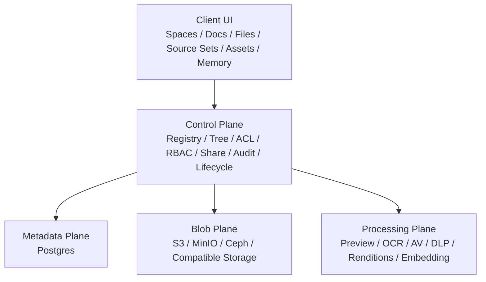

# 企业本地云、文件资产与权限控制架构方案

> 状态：Draft  
> 更新时间：2026-04-04  
> 适用范围：`Space / Files / Source Set / Docs / Assets / RBAC / ACL / Share / Audit`  
> 关联文档：
>
> - [resource-tree-sharing-security-plan.zh-CN.md](/Users/arthur/RustroverProjects/lobehub/docs/development/resource-tree-sharing-security-plan.zh-CN.md)
> - [space-first-content-architecture-plan.zh-CN.md](/Users/arthur/RustroverProjects/lobehub/docs/development/space-first-content-architecture-plan.zh-CN.md)
> - [space-root-workspace-redesign-plan.zh-CN.md](/Users/arthur/RustroverProjects/lobehub/docs/development/space-root-workspace-redesign-plan.zh-CN.md)

---

## 一、问题定义

随着 `space-first` 模型落地，`Files` 已经从“全局内容页”收口成 `Space` 内的原始文件工作面。  
下一阶段如果要支持：

- 企业级私有云盘
- 软资产管理（DAM）
- 团队级 RBAC / ACL
- 外部分享治理
- 合规、审计、保留策略
- 本地部署 / 私有化 / 自建对象存储

就必须回答一个更大的问题：

> 我们是否需要把现有 S3-based 架构替换成“更系统性的本地云”？

本文结论很明确：

> **不需要替换掉 S3-compatible object storage。**  
> **需要替换掉的是“让对象存储承担业务模型”的做法。**

也就是说：

- **S3 / MinIO / Ceph RGW** 继续作为 `Blob Plane`
- `Space / Files / Source Set / Share / ACL / Audit / Lifecycle` 由 **LobeHub 自己的 Control Plane** 掌握

---

## 二、核心结论

### 1. 现有 S3-based 架构够不够

分两层回答：

#### 够用的部分

作为下面这些能力的底层，现有架构是够用的：

- 二进制对象存储
- 分块上传 / 预签名上传
- 原始文件下载
- 缩略图、预览产物、导出物存储
- `space` 级 blob 隔离

#### 不够用的部分

作为下面这些企业能力的完整架构，现有架构还不够：

- 正式 RBAC / ACL / Policy Engine
- 企业级分享治理
- 软资产生命周期管理
- 加密密钥分层
- 审计、保留、法务冻结
- 病毒扫描 / DLP / OCR / 转码流水线

所以判断是：

> **现有 S3-based 架构可以继续做 blob 底座，但不能继续被当成企业文件系统的主模型。**

### 2. 未来要不要“本地云”

要，但不是做一个“替代 S3 的业务架构”，而是做：

- 一个 **可插拔 Blob Provider 层**
- 一个 **正式 Control Plane**
- 一个 **正式 Metadata / Policy / Processing 体系**

这才是更系统性的本地云。

---

## 三、最优雅的目标架构

### 1. Blob Plane

职责只保留：

- 原始对象存储
- multipart upload
- object metadata/head
- signed upload/download
- versioning / retention / lock（后续）
- encryption-at-rest（后续）

这一层可以由：

- AWS S3
- MinIO
- Ceph RGW
- 其他 S3-compatible provider

来承载。

### 2. Metadata Plane

负责保存：

- `space`
- `file`
- `document`
- `source_set`
- `resource_registry`
- `content_permissions`
- `share_links`
- `audit_logs`
- `asset metadata`

这一层必须继续以 Postgres 为主，而不是回到文件系统元数据或对象 key 推断。

### 3. Control Plane

这是未来企业能力的核心。

必须成为正式系统能力的包括：

- `resource registry`
- `tree / hierarchy`
- `ACL`
- `RBAC`
- `share governance`
- `retention / legal hold`
- `audit / access events`
- `policy evaluation`

也就是说：

> Blob 负责“存东西”，Control Plane 负责“这是什么、谁能看、能否分享、何时过期、能否下载、如何审计”。

### 4. Processing Plane

企业文件与资产管理不能只有上传/下载，还必须有异步处理层：

- thumbnail / preview
- PDF / Office / Markdown 转预览
- OCR
- 病毒扫描
- DLP / 敏感信息识别
- embedding / index
- 视频转码
- 派生版本（renditions）

---

## 四、为什么不能直接“替换掉 S3”

### 1. 错误问题定义

很多团队会把问题误解成：

> “S3 太原始，所以要换成本地云盘架构。”

真正的问题不是 S3 原始，而是之前系统容易把：

- 目录结构
- 权限
- 分享
- 回收站
- 版本
- 工作区边界

错误地寄托到对象存储之上。

这本来就不该由对象存储负责。

### 2. 直接改成本地文件系统的代价更差

如果把“企业本地云”理解成：

- 直接把业务结构映射到本地文件夹
- 直接对磁盘路径做 ACL
- 直接让前端或网关绑定目录结构

会立刻带来这些问题：

- 路径即权限，难以治理
- 改名/移动成本高
- 跨部署环境不一致
- 审计困难
- share / revoke 难以统一
- 对象预览、转码、加密、版本难以模块化

所以：

> **不该用“本地文件系统业务化”替代“对象存储 + 控制层”。**

### 3. 企业私有化不等于放弃对象存储

企业私有化真正需要的是：

- 部署在自己的网络边界内
- 使用自己的对象存储
- 使用自己的密钥
- 使用自己的权限体系
- 使用自己的审计与保留策略

这些都不要求放弃 S3-compatible。

---

## 五、未来“本地云”应该是什么

### 1. 本地云的正确定义

在本项目里，“本地云”更合理的定义是：

> **可私有部署、可自带对象存储、可自带密钥、可自带权限治理、可审计、可扩展处理流水线的统一企业文件与资产平台。**

而不是：

> “一个不用 S3 的文件上传模块”。

### 2. 本地云应具备的能力

最低需要：

- 私有部署
- Blob provider 抽象
- 空间级隔离
- 正式 RBAC / ACL
- 分享治理
- 审计日志
- 回收站 / 删除恢复
- 搜索与预览

企业级进一步需要：

- KMS / BYOK / key hierarchy
- DLP / malware scanning
- retention / legal hold
- external share policy
- version history
- asset classification
- watermark / download control

---

## 六、Files、Assets、Docs 的正确分工

### 1. `Files`

`Files` 是原始文件工作面，负责：

- 上传
- 下载
- 文件夹整理
- 移动
- 基础分享
- 与 `Source Set` 关联

它不是正式 DAM，也不应该承载复杂品牌/版权/审批元数据。

### 2. `Docs`

`Docs` 是知识成果工作面，负责：

- 创建文档
- 编辑文档
- 阅读文档
- 把知识沉淀为结构化内容

它不应该默认成为文件管理器。

### 3. `Assets`（后续新增）

如果未来要做企业软资产管理，应该新增 `Assets`，而不是继续把所有需求压到 `Files` 里。

`Assets` 负责：

- 资产分类
- 版本
- 品牌素材
- 权利/版权信息
- 使用限制
- 审批流
- 渲染版本
- 归档策略

也就是说：

- `Files` = 原始文件云盘
- `Assets` = 企业资产管理层
- `Docs` = 知识成果层

### 4. `Source Set`

`Source Set` 继续是专题容器，不是权限根，也不是 blob root。

职责是：

- 组织某个专题下的 `Docs` 与 `Files`
- 作为 AI / RAG / 记忆来源范围
- 作为工作集而不是存储边界

---

## 七、RBAC / ACL / Policy 的正确模型

### 1. 三层结构

企业级治理不应该只靠一层“角色判断”。

正确结构是：

#### `RBAC`

决定主体的大权限范围：

- org role
- space role
- service role

#### `ACL`

决定某个具体资源的访问：

- owner
- editor
- viewer
- explicit grants

#### `Policy`

决定在什么条件下允许：

- 是否可外链分享
- 是否允许下载
- 是否必须水印
- 是否必须走审批
- 是否受 retention / hold 约束

一句话：

> **RBAC 决定你大概能做什么，ACL 决定你对这个资源能做什么，Policy 决定在什么条件下能做。**

### 2. 未来主体类型

正式模型至少要支持：

- `user`
- `space_member`
- `group`
- `service_account`
- `share_link_visitor`

当前实现里最缺的是：

- `group`
- `service_account`
- 显式 deny / policy hook

---

## 八、加密与密钥体系

### 1. 目标

未来企业级版本至少要支持：

- default encryption at rest
- tenant / space scoped key metadata
- rotation-friendly key model
- 审计加密模式

### 2. 建议路线

短期：

- 保留 provider-managed encryption
- 在 `space_blobs` 或等价表里记录：
  - `encryptionMode`
  - `keyRef`
  - `complianceClass`

中期：

- 支持 `SSE-KMS`
- 支持按 tenant / deployment 配置 KMS

长期：

- 支持 `BYOK`
- 支持不同安全等级空间使用不同 key policy

### 3. 不建议的方向

不建议：

- 业务层自己做大文件自定义分片加密协议
- 让前端直接决定 key hierarchy
- 把“本地云”理解成“自己实现一套对象加密存储格式”

那会极大拉高复杂度，而且不会直接提升产品价值。

---

## 九、Share、审计、保留与合规

### 1. 分享

未来企业分享必须支持：

- internal member share
- space-internal share
- org share
- external share link
- expiring link
- password / domain restriction
- view-only / download-disabled
- watermark-required

### 2. 审计

企业必须能回答：

- 谁在什么时候访问了什么
- 谁创建了分享
- 谁下载了文件
- 谁修改了 ACL
- 谁把资产移到哪个空间或资料集

### 3. 生命周期

正式资产层必须逐步支持：

- versioning
- retention schedule
- legal hold
- archive / disposition
- recoverable delete

---

## 十、演进路线

### Phase 1：巩固 Blob Plane，不替换 S3

目标：

- 保留 S3-compatible provider
- 补正式 `BlobProvider` 抽象
- 保证上传/下载/导出/预览全走统一 provider

交付：

- `S3 / MinIO` 双目标支持
- 清理业务代码对 S3 细节的直接耦合

### Phase 2：补 Control Plane

目标：

- 正式化 `resource registry`
- ACL / share / audit / trash / revoke cache 收口
- 强化 `space-first` 的访问控制

交付：

- 统一资源解释入口
- 更明确的授权边界

### Phase 3：补企业治理

目标：

- `RBAC + ACL + Policy`
- share governance
- retention / hold
- encryption metadata
- processing pipeline

### Phase 4：新增 `Assets`

目标：

- 从 `Files` 中分出企业软资产层
- 支持审批、版本、版权、品牌、渲染版本

---

## 十一、明确禁止继续做的事

不要再做这些：

1. 把对象 key 当成目录树
2. 把对象存储当权限系统
3. 把分享逻辑绑在对象 URL 上
4. 把 `Files` 直接扩成万能 DAM
5. 把 `Source Set` 变成第二套主要权限根
6. 把“本地云”理解成“放弃 S3-compatible”

---

## 十二、最终建议

最终建议可以压缩成四句话：

1. **S3-compatible object storage 继续保留，只做 Blob Plane。**
2. **企业级能力的核心不在存储替换，而在 Control Plane。**
3. **Files 是原始文件云盘；Assets 才是未来软资产管理层。**
4. **本地云的正确方向是“可私有部署的统一文件与资产平台”，不是“改成另一套存储协议”。**

如果未来必须在“先做 memory”与“先做企业本地云”之间排序，优先级仍然应该是：

- 先做 `Memory v2 / Space Memory / Harness`
- 再补企业文件治理与资产层

因为后者更偏基础设施扩建，而前者是当前 AI 工作区的上层核心能力。
