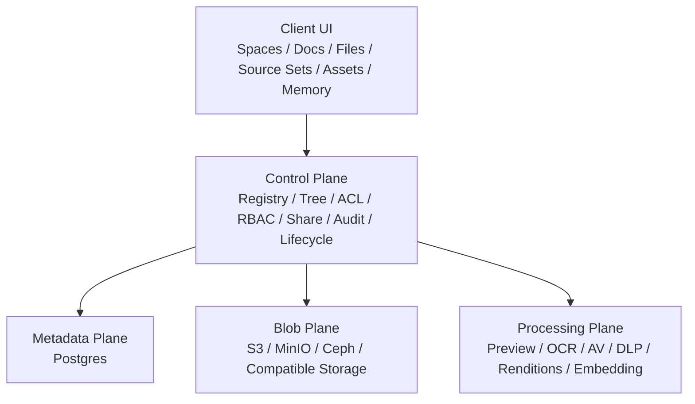

# 企业本地云、文件资产与权限控制架构方案

> 状态：Draft
> 更新时间：2026-04-05（已同步首批 Blob / Share / Capability Policy、`file_assets` sidecar、首个 Files 资产治理 UI、首版资产分类字段，以及首版 version /rendition typed surface 落地进展）
> 适用范围：`Space / Files / Source Set / Docs / Assets / RBAC / ACL / Share / Audit`
> 关联文档：
>
> - [resource-tree-sharing-security-plan.zh-CN.md](/Users/arthur/RustroverProjects/lobehub/docs/development/resource-tree-sharing-security-plan.zh-CN.md)
> - [space-first-content-architecture-plan.zh-CN.md](/Users/arthur/RustroverProjects/lobehub/docs/development/space-first-content-architecture-plan.zh-CN.md)
> - [space-root-workspace-redesign-plan.zh-CN.md](/Users/arthur/RustroverProjects/lobehub/docs/development/space-root-workspace-redesign-plan.zh-CN.md)

---

## 〇、当前落地进展（截至 2026-04-05）

以下内容已经在主干代码中开始落地，用于和下文路线图对齐：

- **Blob Provider 抽象已建立**：上传、下载 URL、对象元数据、字节读取、删除、服务端写入等能力，已经统一收口到 `BlobProvider`，而不再让业务代码直接散落依赖 `PrivateBlobS3 / FileS3`。
- **Blob Plane 第一批调用方已迁移**：上传 session、同域上传、OpenAPI 文件 URL、skills、sandbox、market、用户头像、文件服务实现等路径，已经开始改走 `BlobProvider`。
- **Download Policy 已抽离**：成员下载与分享下载的缓存 TTL / 预签名时效，已经从文件代理路由中抽成独立 helper。
- **Share Policy 已抽离**：分享链接的过期时间、URL 构建、密码归一化、带密码分享校验，已经从 router /route 中抽成独立 helper。
- **Capability Policy 已抽离**：`preview_content` 的 OR 规则、viewer 的 share-link 读取边界、以及 `owner / editor + canReshare` 的继续分享规则，已经从 `ContentAuthorizer` 中抽成可单测的显式 policy。
- **`file_assets` sidecar 已建立**：`Files` 与未来 `Assets` 之间已经补上第一层边界，新增 `file_assets` 表与 `FileAssetModel`，用来承载 classification、review status、usage policy、rights owner 等资产治理字段，而不再继续把这类元数据塞进 `files.metadata`。
- **Files 资产治理入口已接进现有详情面**：`FileDetail` 已经开始消费 `getFileAssetById / upsertFileAsset`，在现有文件详情弹窗里提供首批 `classification / review status / usage policy / rights owner` 治理字段，而不是另起一套孤立的 `Assets` 页面。
- **Files 资产治理详情面已开始具备完整编辑反馈**：`FileDetail` 不再只是“改完点保存”的薄表单；当前 `review status` 也已进入可编辑治理表单，并补上 `UnsavedChangesGuard`、`All changes saved / Unsaved changes / Saving changes` 状态、以及 `Reset` 回滚动作，开始具备真正可操作的治理编辑流。
- **Files 资产治理能力已切到动作级 policy**：文件资产不再只靠一个模糊的 `canManage` 开关；当前已经拆成 `canEditGovernance / canApprove / canArchive` 三个显式能力，默认 `editor` 只能编辑治理元数据，`owner / admin` 才能做批准和归档。
- **首版资产分类字段已落地**：`file_assets.classification` 已作为正式字段进入 schema /migration/list contract /detail UI；当前先以轻量枚举承载首版企业分类能力，后续再继续拆更细的 `asset_classifications` 模型。
- **首版资产版本 / 衍生版本 surface 已落地**：`file_assets.metadata` 已开始承载正式 typed 的 `version / renditions` contract，而不再只是完全自由的 JSON；`FileDetail` 也已接入 `Current Version / Derived From / Renditions` 首版治理入口，作为未来拆 `asset_versions / asset_renditions` 独立实体前的过渡层。
- **衍生版本 label 已进入可编辑 UI**：`FileDetail` 现已支持为每个 rendition 记录可选 `label`，不再把 typed contract 降级成只有 `kind`；只读视图也会直接展示 `Preview · Homepage` 这类带标签的衍生版本摘要。
- **compact list/card 已开始消费版本 /rendition summary**：Files 列表、masonry 卡片与首页 Recent 资源现在已经通过轻量 badge 消费 `assetVersionLabel` 与首个 rendition summary，不再把 typed `renditions` 永远困在详情页；同时 badge 顺序仍优先保留 `restricted/public` 这类更强治理信号。
- **compact list/card 已开始显式露出审核状态**：除 `archived` 外，`approved` 也开始进入 Files 列表、masonry 卡片与首页 Recent 资源的 compact governance badge；这样筛成 `review status=approved` 后，列表本身也能直接解释当前治理状态，而不会只剩版本 /rendition 徽标。
- **Files header 已开始暴露正式治理筛选面**：当前 `CategoryMenu` 里的 governance popover 已不再只停留在 `classification / usage policy`，而是补上了 `review status` 与 `rights owner` 维度；其中前三类受控维度会通过 URL /store/list query 贯通到 `file_assets` 查询层，`rights owner` 则以文本筛选形式补上最常见的治理检索路径，开始具备最小可用的资产治理筛选能力。
- **Files header 已开始把治理筛选显式外露成状态条**：除了 popover 内的治理筛选外，当前已生效的 `classification / review status / usage policy / rights owner` 也会在 header 里以可单独清除的 compact chips 显示，并显式带出 “维度 + 当前值”，不再只用一个 “Governance (3)” 总数按钮让用户猜测当前到底筛了什么。
- **治理筛选已真正作用到 Content 列表结果**：`getKnowledgeItems` 不再只是透传治理 query 参数；当前文件侧的 `classification / review status / usage policy` 已经会在列表结果里真正生效，并在筛选激活时自动排除不带资产治理语义的文档项，避免 UI 看起来在筛、结果却没变。
- **治理筛选 summary contract 已进入 Header**：Files header 现在不再只能显示 “当前筛了几个条件”，而是会通过独立的 server-side summary query 为 `classification / review status / usage policy` 选项显示当前 scope 下的实时计数，开始具备真正可用的治理决策辅助，而不只是 query 参数壳层。
- **治理筛选空态已开始具备恢复动作**：当 `classification / review status / usage policy / rights owner` 把当前列表筛空时，Files 空态不再退回默认上传文案，而会明确提示 “当前治理筛选下没有匹配的文件”，展示当前生效的治理筛选，并提供一键或逐项清除筛选的恢复入口。
- **治理筛选状态条已开始带出结果规模**：当前 header 里生效的 `classification / review status / usage policy` 不再只显示 compact chips；同一条状态条现在还会补一个 “{{count}} matching files / {{count}} 个匹配文件” 的 summary，让用户在不展开 popover 的情况下也能快速判断筛选是否过窄。
- **Files 多选已开始具备首批批量治理动作**：当前 Explorer 多选工具栏和 batch actions dropdown 已开始支持 `approve assets / archive assets`，并且 batch dropdown 还支持直接批量更新 `classification / review status / usage policy / rights owner`；reviewer 不再必须逐个点进 `FileDetail` 才能完成最常见的审核流转，这意味着 Files 资产治理已经从 “筛选 + 单条编辑” 进入 “最小批量操作闭环”。
- **Files 批量治理入口已开始消费正式 capability contract**：列表查询现在会返回当前 scope 的 `governanceCapabilities`，Explorer header 和 batch actions dropdown 不再对所有成员无脑露出 `approve / archive`；没有相应能力的成员仍可做元数据治理，但不会再看到本就会被后端拒绝的高权限批量动作。
- **Files 治理动作已开始落正式审计**：`updateFileAssetGovernance / approveFileAsset / archiveFileAsset` 现在会把 `classification / review status / usage policy / rights owner / metadata` 的变更写入 `content_audit_logs`，至少具备 “谁改了什么” 的服务端追踪基础，而不再只是把治理结果直接覆盖在 `file_assets` 上。
- **FileDetail 已开始消费最近一次治理审计摘要**：`getFileAssetById` 现在会返回最近一次 `file_asset_*` 审计，`FileDetail` 会直接显示最近一次治理变更的动作、时间、操作者与变更字段；资产治理不再只有当前结果，没有最近变更上下文。
- **FileDetail 已开始消费最近治理活动列表**：在最近一次摘要之外，`getFileAssetById` 现在还会返回最近几条 `file_asset_*` 审计；`FileDetail` 会把它们作为最小活动列表展示出来。Files 治理开始有真正可读的近端审计面，而不只是“最后一条是谁改的”。
- **FileDetail 治理活动列表已开始支持按需展开**：最近治理活动不再固定截断在首批返回结果；详情面现在会在活动超过首批数量时显式露出 `Load More`，并通过独立 query 按需继续拉取后续 `file_asset_*` 审计，开始具备最小可用的治理活动流，而不只是静态摘要。
- **FileDetail 治理活动已开始显示关键字段前后值**：对于 `classification / review status / usage policy / rights owner` 这类高频治理字段，活动列表不再只显示 “changedFields”；当前已经会直接展示 `before -> after` 的字段级变更内容，让 reviewer 在不展开原始审计 JSON 的情况下也能看懂具体改了什么。
- **compact 列表 / 卡片已开始显式露出最近治理活动摘要**：`getKnowledgeItems / recentFiles` 现在会为文件返回最近一次 `file_asset_*` 审计的动作、时间与操作者摘要；当最近一次治理活动涉及 `classification / review status / usage policy / rights owner` 这类关键字段时，Explorer 列表、masonry 卡片和首页 Recent 资源还会直接带出首个关键字段的变更结果，而不再只剩 “何时被更新” 这一层薄摘要。
- **List View 的治理摘要层级已与卡片面统一**：Files 列表行不再把最近治理活动挤进日期列；当前会把这类摘要放回主信息区的次信息层，与 recent / masonry 一致，避免更新时间和治理状态互相争抢同一列宽。
- **React Native 资源面已开始消费 Files governance 最小 contract**：`apps/mobile` 的 `ResourceScreen` 不再只停留在旧 `FileListItem`；当前已经开始对齐 `assetClassification / review status / usage policy / version / rendition` 的 compact badge，并补上移动端治理筛选 sheet（`review status / usage policy / classification`），公开分享页的时间格式也已与 web 统一到 `YYYY-MM-DD HH:mm`。

这说明：

> `Blob Plane + Control Plane` 的分层不是停留在方案里，而是已经开始进入代码主链。

当前审计判断补充：

- 整体进度大致处于 **Phase 1 完成、Phase 2 部分完成、Phase 4 起步**。
- `BlobProvider`、upload session、download/share/capability policy 与 `file_assets` sidecar 已经证明方案方向正确。
- 但 “企业本地云” 的多 provider、加密元数据、保留策略，以及 `asset_versions / asset_renditions / asset_classifications` 的独立实体化仍未开始或只完成首版 surface。

## 〇点五、收口口径（2026-04-06）

这份方案后续按 **`Blob / Control Plane v1`** 收口，不以“把所有企业文件系统能力一次性实现完”为目标。

本轮收口只要求以下能力稳定成立：

- **Blob Provider 抽象成为唯一上传/下载/读写入口**
  - 业务代码不再继续新增对 `PrivateBlobS3 / FileS3` 的散点直连
- **`space_blobs + upload session + private object` 成为 canonical 文件落点**
  - 新文件主链围绕 `space`、`storageKey`、`sha256` 与 `verified/quarantined` 工作
- **`file_assets` 成为 Files 资产治理 sidecar**
  - `classification / review status / usage policy / rights owner`
  - 以及首版 `version / renditions` typed metadata
- **Files 前台具备最小治理闭环**
  - 列表治理筛选
  - 详情治理编辑
  - 批量治理动作
  - 审计摘要与活动流

以下内容明确不再阻塞本文收口，而是拆到后续演进：

- **多 provider 正式产品化**
  - 例如 MinIO / Ceph / 多租户 provider 切换
- **企业保留 / 法务 / 加密治理**
  - retention
  - legal hold
  - KMS / key hierarchy
- **独立资产实体化**
  - `asset_versions`
  - `asset_renditions`
  - `asset_classifications`
- **完整异步处理平面**
  - OCR / DLP / AV / transcoding 的正式流水线

这份文档的收口含义应固定为：

> **先把“对象存储不是业务模型，Control Plane 才是业务模型”这件事在代码里站稳。**\
> **后续企业重能力继续拆专题文档推进。**

---

## 一、问题定义

随着 `space-first` 模型落地，`Files` 已经从 “全局内容页” 收口成 `Space` 内的原始文件工作面。\
下一阶段如果要支持：

- 企业级私有云盘
- 软资产管理（DAM）
- 团队级 RBAC / ACL
- 外部分享治理
- 合规、审计、保留策略
- 本地部署 / 私有化 / 自建对象存储

就必须回答一个更大的问题：

> 我们是否需要把现有 S3-based 架构替换成 “更系统性的本地云”？

本文结论很明确：

> **不需要替换掉 S3-compatible object storage。**\
> **需要替换掉的是 “让对象存储承担业务模型” 的做法。**

也就是说：

- **S3 / MinIO / Ceph RGW** 继续作为 `Blob Plane`
- `Space / Files / Source Set / Share / ACL / Audit / Lifecycle` 由 **LobeHub 自己的 Control Plane** 掌握

---

## 二、核心结论

### 1. 现有 S3-based 架构够不够

分两层回答：

#### 够用的部分

作为下面这些能力的底层，现有架构是够用的：

- 二进制对象存储
- 分块上传 / 预签名上传
- 原始文件下载
- 缩略图、预览产物、导出物存储
- `space` 级 blob 隔离

#### 不够用的部分

作为下面这些企业能力的完整架构，现有架构还不够：

- 正式 RBAC / ACL / Policy Engine
- 企业级分享治理
- 软资产生命周期管理
- 加密密钥分层
- 审计、保留、法务冻结
- 病毒扫描 / DLP / OCR / 转码流水线

所以判断是：

> **现有 S3-based 架构可以继续做 blob 底座，但不能继续被当成企业文件系统的主模型。**

### 2. 未来要不要 “本地云”

要，但不是做一个 “替代 S3 的业务架构”，而是做：

- 一个 **可插拔 Blob Provider 层**
- 一个 **正式 Control Plane**
- 一个 **正式 Metadata / Policy / Processing 体系**

这才是更系统性的本地云。

---

## 三、最优雅的目标架构

### 1. Blob Plane

职责只保留：

- 原始对象存储
- multipart upload
- object metadata/head
- signed upload/download
- versioning /retention/lock（后续）
- encryption-at-rest（后续）

这一层可以由：

- AWS S3
- MinIO
- Ceph RGW
- 其他 S3-compatible provider

来承载。

### 2. Metadata Plane

负责保存：

- `space`
- `file`
- `document`
- `source_set`
- `resource_registry`
- `content_permissions`
- `share_links`
- `audit_logs`
- `asset metadata`

这一层必须继续以 Postgres 为主，而不是回到文件系统元数据或对象 key 推断。

### 3. Control Plane

这是未来企业能力的核心。

必须成为正式系统能力的包括：

- `resource registry`
- `tree / hierarchy`
- `ACL`
- `RBAC`
- `share governance`
- `retention / legal hold`
- `audit / access events`
- `policy evaluation`

也就是说：

> Blob 负责 “存东西”，Control Plane 负责 “这是什么、谁能看、能否分享、何时过期、能否下载、如何审计”。

### 4. Processing Plane

企业文件与资产管理不能只有上传 / 下载，还必须有异步处理层：

- thumbnail / preview
- PDF / Office / Markdown 转预览
- OCR
- 病毒扫描
- DLP / 敏感信息识别
- embedding / index
- 视频转码
- 派生版本（renditions）

---

## 四、为什么不能直接 “替换掉 S3”

### 1. 错误问题定义

很多团队会把问题误解成：

> “S3 太原始，所以要换成本地云盘架构。”

真正的问题不是 S3 原始，而是之前系统容易把：

- 目录结构
- 权限
- 分享
- 回收站
- 版本
- 工作区边界

错误地寄托到对象存储之上。

这本来就不该由对象存储负责。

### 2. 直接改成本地文件系统的代价更差

如果把 “企业本地云” 理解成：

- 直接把业务结构映射到本地文件夹
- 直接对磁盘路径做 ACL
- 直接让前端或网关绑定目录结构

会立刻带来这些问题：

- 路径即权限，难以治理
- 改名 / 移动成本高
- 跨部署环境不一致
- 审计困难
- share /revoke 难以统一
- 对象预览、转码、加密、版本难以模块化

所以：

> **不该用 “本地文件系统业务化” 替代 “对象存储 + 控制层”。**

### 3. 企业私有化不等于放弃对象存储

企业私有化真正需要的是：

- 部署在自己的网络边界内
- 使用自己的对象存储
- 使用自己的密钥
- 使用自己的权限体系
- 使用自己的审计与保留策略

这些都不要求放弃 S3-compatible。

---

## 五、未来 “本地云” 应该是什么

### 1. 本地云的正确定义

在本项目里，“本地云” 更合理的定义是：

> **可私有部署、可自带对象存储、可自带密钥、可自带权限治理、可审计、可扩展处理流水线的统一企业文件与资产平台。**

而不是：

> “一个不用 S3 的文件上传模块”。

### 2. 本地云应具备的能力

最低需要：

- 私有部署
- Blob provider 抽象
- 空间级隔离
- 正式 RBAC / ACL
- 分享治理
- 审计日志
- 回收站 / 删除恢复
- 搜索与预览

企业级进一步需要：

- KMS / BYOK / key hierarchy
- DLP / malware scanning
- retention / legal hold
- external share policy
- version history
- asset classification
- watermark / download control

---

## 六、Files、Assets、Docs 的正确分工

### 1. `Files`

`Files` 是原始文件工作面，负责：

- 上传
- 下载
- 文件夹整理
- 移动
- 基础分享
- 与 `Source Set` 关联

它不是正式 DAM，也不应该承载复杂品牌 / 版权 / 审批元数据。

### 2. `Docs`

`Docs` 是知识成果工作面，负责：

- 创建文档
- 编辑文档
- 阅读文档
- 把知识沉淀为结构化内容

它不应该默认成为文件管理器。

### 3. `Assets`（后续新增）

如果未来要做企业软资产管理，应该新增 `Assets`，而不是继续把所有需求压到 `Files` 里。

当前已经开始落第一层 sidecar：

- `file_assets.file_id` 绑定 `files.id`
- 用 sidecar 承载 `classification / review_status / usage_policy / rights_owner / reviewed_by`
- 这意味着 `Files` 仍然是原始文件对象，而 `Assets` 的治理字段已经有了独立落点
- 当前已经补上首版 `version / renditions` typed surface
- `version.label` 已开始进入 Files / Recent Resources 的 list /card badge，而不再只停留在详情页
- 下一步才是继续往 `asset_versions / asset_renditions / asset_classifications` 这些更细的资产实体扩

`Assets` 负责：

- 资产分类
- 版本
- 品牌素材
- 权利 / 版权信息
- 使用限制
- 审批流
- 渲染版本
- 归档策略

也就是说：

- `Files` = 原始文件云盘
- `Assets` = 企业资产管理层
- `Docs` = 知识成果层

### 4. `Source Set`

`Source Set` 继续是专题容器，不是权限根，也不是 blob root。

职责是：

- 组织某个专题下的 `Docs` 与 `Files`
- 作为 AI / RAG / 记忆来源范围
- 作为工作集与共同范围，而不是第三套主页面或存储边界

---

## 七、RBAC / ACL / Policy 的正确模型

### 1. 三层结构

企业级治理不应该只靠一层 “角色判断”。

正确结构是：

#### `RBAC`

决定主体的大权限范围：

- org role
- space role
- service role

#### `ACL`

决定某个具体资源的访问：

- owner
- editor
- viewer
- explicit grants

#### `Policy`

决定在什么条件下允许：

- 是否可外链分享
- 是否允许下载
- 是否必须水印
- 是否必须走审批
- 是否受 retention /hold 约束

一句话：

> **RBAC 决定你大概能做什么，ACL 决定你对这个资源能做什么，Policy 决定在什么条件下能做。**

### 2. 未来主体类型

正式模型至少要支持：

- `user`
- `space_member`
- `group`
- `service_account`
- `share_link_visitor`

当前实现里最缺的是：

- `group`
- `service_account`
- 显式 deny /policy hook

---

## 八、加密与密钥体系

### 1. 目标

未来企业级版本至少要支持：

- default encryption at rest
- tenant / space scoped key metadata
- rotation-friendly key model
- 审计加密模式

### 2. 建议路线

短期：

- 保留 provider-managed encryption
- 在 `space_blobs` 或等价表里记录：
  - `encryptionMode`
  - `keyRef`
  - `complianceClass`

中期：

- 支持 `SSE-KMS`
- 支持按 tenant /deployment 配置 KMS

长期：

- 支持 `BYOK`
- 支持不同安全等级空间使用不同 key policy

### 3. 不建议的方向

不建议：

- 业务层自己做大文件自定义分片加密协议
- 让前端直接决定 key hierarchy
- 把 “本地云” 理解成 “自己实现一套对象加密存储格式”

那会极大拉高复杂度，而且不会直接提升产品价值。

---

## 九、Share、审计、保留与合规

### 1. 分享

未来企业分享必须支持：

- internal member share
- space-internal share
- org share
- external share link
- expiring link
- password / domain restriction
- view-only / download-disabled
- watermark-required

### 2. 审计

企业必须能回答：

- 谁在什么时候访问了什么
- 谁创建了分享
- 谁下载了文件
- 谁修改了 ACL
- 谁把资产移到哪个空间或资料集

### 3. 生命周期

正式资产层必须逐步支持：

- versioning
- retention schedule
- legal hold
- archive / disposition
- recoverable delete

---

## 十、演进路线

### Phase 1：巩固 Blob Plane，不替换 S3

目标：

- 保留 S3-compatible provider
- 补正式 `BlobProvider` 抽象
- 保证上传 / 下载 / 导出 / 预览全走统一 provider

交付：

- `S3 / MinIO` 双目标支持
- 清理业务代码对 S3 细节的直接耦合

### Phase 2：补 Control Plane

目标：

- 正式化 `resource registry`
- ACL /share/audit/trash/revoke cache 收口
- 强化 `space-first` 的访问控制

交付：

- 统一资源解释入口
- 更明确的授权边界

### Phase 3：补企业治理

目标：

- `RBAC + ACL + Policy`
- share governance
- retention / hold
- encryption metadata
- processing pipeline

### Phase 4：新增 `Assets`

目标：

- 从 `Files` 中分出企业软资产层
- 支持审批、版本、版权、品牌、渲染版本

当前进展：

- `file_assets` 已作为第一层 sidecar 落地
- 当前已落首版 `version / renditions` typed surface
- `version.label` 已在列表 / 卡片面开始可见，Recent / Files 会优先露出 compact version badge
- 下一步应继续拆 `asset_versions / asset_renditions / asset_classifications`

---

## 十一、明确禁止继续做的事

不要再做这些：

1. 把对象 key 当成目录树
2. 把对象存储当权限系统
3. 把分享逻辑绑在对象 URL 上
4. 把 `Files` 直接扩成万能 DAM
5. 把 `Source Set` 变成第二套主要权限根
6. 把 “本地云” 理解成 “放弃 S3-compatible”

---

## 十二、最终建议

最终建议可以压缩成四句话：

1. **S3-compatible object storage 继续保留，只做 Blob Plane。**
2. **企业级能力的核心不在存储替换，而在 Control Plane。**
3. **Files 是原始文件云盘；Assets 才是未来软资产管理层。**
4. **本地云的正确方向是 “可私有部署的统一文件与资产平台”，不是 “改成另一套存储协议”。**

如果未来必须在 “先做 memory” 与 “先做企业本地云” 之间排序，优先级仍然应该是：

- 先做 `Memory v2 / Space Memory / Harness`
- 再补企业文件治理与资产层

因为后者更偏基础设施扩建，而前者是当前 AI 工作区的上层核心能力。
