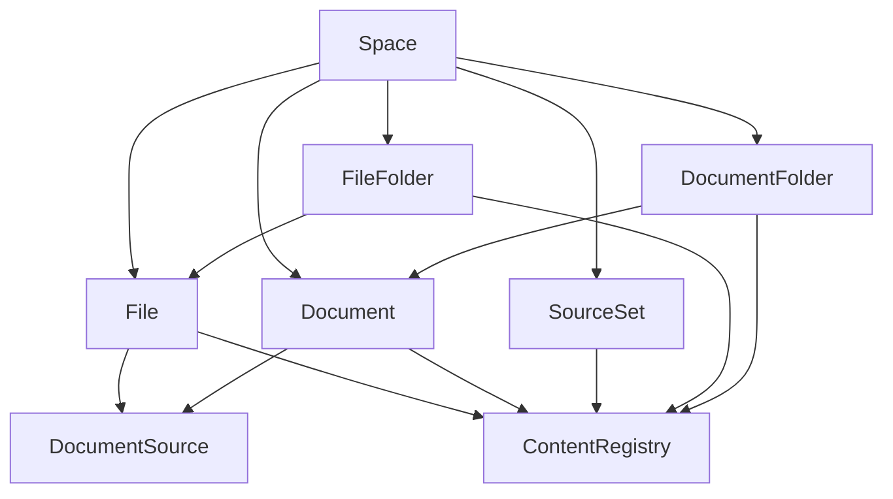

# File / Document 解耦重构方案

**状态**：greenfield 提案，不考虑后向兼容\
**日期**：2026-04-06\
**目标**：把 `file` 与 `document` 从身份、生命周期、ACL、分享语义、路由与列表模型上彻底解耦，同时保留 “文档来源于文件” 的显式 provenance 关系。

---

## 0. 执行摘要

我建议解耦，但不是 “完全没有关系”，而是：

- **解耦主身份**：`file` 是二进制资产；`document` 是编辑器原生内容；二者不再互为主资源。
- **解耦生命周期**：导入文件生成文档后，文档是一个新的资源；编辑文档不再隐式修改文件。
- **解耦 ACL 与分享**：文件分享永远分享文件；文档分享永远分享文档；不再存在 UI 上看起来在分享文档、实际上在分享文件的情况。
- **保留来源关系**：如果某文档来自文件，使用显式 `document_sources` 记录来源、导入模式与快照信息。
- **移除混合列表主模型**：`Files` 只展示文件；`Docs` 只展示文档；统一搜索、最近访问、全局视图变成聚合视图，而不是基础 CRUD 模型。

结论一句话概括：

> `file` 是资产，`document` 是内容，`folder` 是结构，`content_registry` 是实现层统一资源注册表，`document_sources` 是二者的来源关系，而不是共享身份。

---

## 1. 现状问题

当前系统最核心的结构问题，不是同时存在 `file` 和 `document`，而是它们被混成了一个半抽象、半产品化的对象层。

### 1.1 当前的耦合点

1. `documents` 表同时承载独立文档、文件派生文档与文件夹语义。
   见 `packages/database/src/schemas/file.ts`

2. 文件被解析后会持久化生成一条 `sourceType='file'`、带 `fileId` 的文档记录。
   见 `src/server/services/document/index.ts`

3. 知识库查询层会把 “文件背后的文档” 折叠回文件表面，让前端看到的资源语义和后端主资源不一致。
   见 `packages/database/src/repositories/knowledge/index.ts`

4. 前端分享、跳转、打开编辑器时必须猜当前项到底应该按 `file` 还是 `document` 处理。
   见 `src/features/ContentManager/components/Explorer/ItemDropdown/useFileItemDropdown.tsx`

### 1.2 这种耦合带来的直接后果

- 用户在 Files 里看到 “像文档” 的条目，但分享出去的其实是文件。
- 文档是否独立可授权，取决于它是不是 file-backed，而不是用户看到的产品形态。
- 前端必须靠 `id` 前缀、`fileId` 是否存在、`sourceType` 等隐式规则推断语义。
- 列表、Trash、Share、Search、Recent、Breadcrumb 都要不断做例外分支。
- `documents.fileId` 让 “来源关系” 和 “主身份” 粘在一起，导致导入、预览、分享、编辑语义互相污染。

这类模型会长期制造 “看起来像一个东西，实际上是另一个东西” 的体验偏差。

---

## 2. 设计目标

### 2.1 必须达成的目标

1. 用户能稳定理解 “我现在操作的是文件还是文档”。
2. 任一资源的 ACL、分享、URL、删除、恢复都只归属于它自己的主身份。
3. “从文件导入文档” 是显式关系，不再是共享身份。
4. `Files` 与 `Docs` 各自拥有清晰的 CRUD 模型和树结构。
5. 聚合视图仍然可做，但不能反向决定底层资源模型。

### 2.2 明确不做的事

1. 不保留当前 `file-backed document` 的兼容语义。
2. 不保留 “文件页里混入文档” 的默认主视图。
3. 不保证旧链接、旧 API、旧分享 token 继续可用。
4. 不把 “文件预览” 继续做成 “隐式持久化文档”。

---

## 3. 最终领域模型

### 3.1 核心对象

| 对象              | 定义             | 主职责                       |
| ----------------- | ---------------- | ---------------------------- |
| `Space`           | 工作区根         | 权限边界、成员边界、默认范围 |
| `File`            | 二进制或原始资产 | 上传、下载、校验、原始预览   |
| `Document`        | 编辑器原生内容   | 撰写、协作、分享、知识产出   |
| `FileFolder`      | 文件层级结构     | 组织文件                     |
| `DocumentFolder`  | 文档层级结构     | 组织文档                     |
| `SourceSet`       | 专题容器         | RAG / 检索 / 专题组织        |
| `ContentRegistry` | 实现层资源注册   | 统一 ACL、审计、搜索索引     |
| `DocumentSource`  | 文档来源关系     | 记录文档从何而来             |

### 3.2 关系图



### 3.3 最重要的语义约束

1. `File` 和 `Document` 永远不是同一个资源。
2. `Document` 可以 “来自” 某个 `File`，但不能 “等于” 某个 `File`。
3. `FileFolder` 和 `DocumentFolder` 分开建模，不再让 `documents` 表兼任 folder。
4. `SourceSet` 作为专题容器，可以同时引用 `File` 和 `Document`，但不承担任何一方的主身份。
5. `ContentRegistry` 只做实现层统一资源抽象，不暴露给用户作为产品主语。

---

## 4. 数据库方案

### 4.1 `files`

保留 `files`，但它只表示资产本身，不再承担 “文档的另一个入口”。

建议字段重点：

- `id`
- `spaceId`
- `blobId` / `storageKey`
- `name`
- `mimeType`
- `size`
- `metadata`
- `contentUid`
- `parentFolderId`
- `createdAt` / `updatedAt` / `deletedAt`

关键变化：

- `parentId` 不再引用 `documents.id`
- 只允许引用 `file_folders.id`

### 4.2 `documents`

`documents` 只存储编辑器原生内容，不再挂 `fileId` 作为主链路。

建议字段重点：

- `id`
- `spaceId`
- `title`
- `content`
- `editorData`
- `metadata`
- `contentUid`
- `parentFolderId`
- `createdAt` / `updatedAt` / `deletedAt`

必须删除的耦合字段：

- `fileId`
- `sourceType='file'` 这类把来源和主身份绑在一起的设计

可以保留但要重定义的字段：

- `source`
  - 如果继续存在，只表示 “文档的外部引用来源元数据”，不参与主资源决策

### 4.3 `file_folders`

新增独立文件夹表。

建议字段：

- `id`
- `spaceId`
- `name`
- `parentFolderId`
- `contentUid`
- `createdAt` / `updatedAt` / `deletedAt`

### 4.4 `document_folders`

新增独立文档文件夹表。

建议字段：

- `id`
- `spaceId`
- `name`
- `parentFolderId`
- `contentUid`
- `createdAt` / `updatedAt` / `deletedAt`

### 4.5 `document_sources`

新增显式来源关系表，替代 `documents.fileId`。

建议字段：

- `id`
- `documentId`
- `sourceKind`
  - `file`
  - `url`
  - `topic`
  - `message`
- `sourceFileId`
- `sourceUrl`
- `importMode`
  - `snapshot`
  - `refreshable`
- `importVersion`
- `importedBy`
- `importedAt`
- `lastRefreshAt`
- `refreshStatus`

关键规则：

- 一个 `Document` 可以有多个来源
- 来源关系不参与 `Document` 的 ACL、URL、分享、删除决策

### 4.6 `source_set_files` / `source_set_documents`

如果要彻底清晰，建议把专题容器与文件、文档的关联也拆成两张关系表：

- `source_set_files`
- `source_set_documents`

不要再靠 “只有 file 可以进 source set，doc 再绕 file 间接出现” 的方式表达。

---

## 5. ACL 与分享设计

### 5.1 统一原则

每个真正可见资源都有自己的 `contentUid`，但这个 `contentUid` 只归属于该资源本身。

### 5.2 资源级授权

| 资源             | 是否独立 ACL | 是否独立分享 |
| ---------------- | ------------ | ------------ |
| `File`           | 是           | 是           |
| `Document`       | 是           | 是           |
| `FileFolder`     | 是           | 是           |
| `DocumentFolder` | 是           | 是           |
| `SourceSet`      | 是           | 是           |

### 5.3 分享语义

1. 分享文档，只产生文档 share link。
2. 分享文件，只产生文件 share link。
3. 文档来源于文件，不意味着文件分享自动授予文档访问。
4. 文件是文档来源，不意味着文档分享自动授予文件下载。

### 5.4 对当前实现的直接替代

当前 `contentShare` 仍然可以保留一套统一 router，但它必须基于明确的目标资源：

- 要么输入 `contentUid`
- 要么输入强类型 `{ resourceType, resourceId }`

不能再允许前端在 UI 层通过 `fileId || id` 或 `sourceType` 去猜。

---

## 6. 导入、预览与编辑模型

### 6.1 文件预览

文件预览应该是 **transient render**，不是隐式创建持久化文档。

也就是说：

- 打开 PDF、Markdown、Office 文件进行预览时，只做渲染
- 不自动写入 `documents`
- 不自动生成新的 share / ACL /recent record 语义

### 6.2 导入为文档

如果用户希望编辑文件内容，必须显式执行：

- `Import as Document`

执行结果：

1. 新建一条真正的 `document`
2. 写入 `document_sources`
3. 默认导入模式为 `snapshot`

### 6.3 刷新来源

如果产品未来要支持 “从文件重新刷新文档”，建议只做 **手动 refresh**，不要做隐式双向同步。

原因：

- 文件是资产，不是协作内容模型
- 文档是编辑器内容，不是文件投影
- 自动同步会重新把主身份搅混

推荐规则：

- `snapshot`：一次性导入，后续完全独立
- `refreshable`：允许手动重新导入生成新版本或 patch

不建议：

- `live-linked`

### 6.4 “Open in Editor” 的新语义

现在的 `ensureFileDocument(fileId)` 应被移除。

替代方案：

1. 如果该资源本身就是文档，直接进入文档编辑器
2. 如果该资源是文件，用户显式选择：
   - 仅预览
   - 导入为文档并打开

这样可以彻底消除 “看起来是在打开文件，实际上是复用旧文档投影” 的不确定性。

---

## 7. 列表、导航与 IA 设计

### 7.1 `Files`

`Files` 页面只展示：

- `FileFolder`
- `File`

绝不默认展示：

- `Document`

### 7.2 `Docs`

`Docs` 页面只展示：

- `DocumentFolder`
- `Document`

绝不默认展示：

- `File`

### 7.3 `Source Set`

`Source Set` 作为专题容器，应显式区分两个 tab：

- `Files`
- `Docs`

不要把它继续实现成 “混合列表里谁碰巧能被折叠出来就展示谁”。

### 7.4 统一搜索与最近访问

统一搜索、最近访问、共享给我、回收站，这些场景仍然可以做聚合页，但它们必须是：

- **聚合视图**
- **只读组合层**

而不是反过来成为基础存储和 CRUD 模型。

换句话说，应该从：

- `FileRepo + DocumentRepo + FolderRepo -> ResourceIndexService -> AggregatedView`

而不是：

- `KnowledgeRepo / ContentItem` 这种先混成一个对象，再回头猜应该如何操作

---

## 8. API 与服务边界

### 8.1 建议保留的服务拆分

- `FileService`
- `DocumentService`
- `FileFolderService`
- `DocumentFolderService`
- `DocumentImportService`
- `ResourceIndexService`
- `ContentAuthorizer`

### 8.2 建议移除的主链路

- `ensureFileDocument`
- 任何 “文件预览即创建文档” 的默认路径
- 任何 “列表项 id 既可能是 file 也可能是 doc，但 sourceType 又不是最终真相” 的对象模型

### 8.3 建议新增的 API

- `document.importFromFile(fileId, options)`
- `document.refreshFromSource(documentId)`
- `document.listByFolder(folderId)`
- `file.listByFolder(folderId)`
- `sourceSet.listFiles(sourceSetId)`
- `sourceSet.listDocuments(sourceSetId)`
- `resourceIndex.search(query, scope)`
- `resourceIndex.listRecent(scope)`

---

## 9. AI 接入层设计

### 9.1 核心原则

`Docs` 和 `Files` 解耦之后，`memory`、`RAG`、`chat context` 仍然应该同时兼容二者。

但兼容方式必须是：

- 在 **ingestion / indexing / context assembly** 层统一
- 不在 **resource identity / ACL / share / URL** 层重新混合

也就是说：

1. `File` 和 `Document` 各自保持独立主身份
2. AI 系统只消费 “可读资源的规范化内容表示”
3. 任何进入 AI 的内容都必须先通过资源自身 ACL 校验

一句话定义：

> AI 层统一的是 “可提取内容”，不是 “资源身份”。

### 9.2 统一抽象：`IndexableResource`

建议在 AI 接入层新增统一抽象，例如：

```ts
interface IndexableResource {
  contentUid: string;
  hash?: string;
  kind: 'document' | 'file';
  mimeType?: string;
  resourceId: string;
  scope: {
    sourceSetId?: string | null;
    spaceId: string;
  };
  title: string;
  version: string;
}
```

这个对象只用于：

- memory ingestion
- RAG indexing
- chat context assembly

它不用于：

- 直接驱动前端 CRUD
- 直接暴露给分享 API
- 替代 `file` / `document` 的真实模型

### 9.3 Memory 接入

`Memory` 不应该直接存 `File` 或 `Document` 本体，而应该存 “规范化后的记忆条目 + 来源引用”。

建议结构：

```ts
interface MemorySourceRef {
  excerpt?: string;
  resourceId: string;
  resourceKind: 'document' | 'file';
  spaceId: string;
  title?: string;
}

interface MemoryEntry {
  content: string;
  scope: 'user' | 'space';
  sourceRefs: MemorySourceRef[];
  summary?: string;
  title: string;
}
```

设计含义：

- 文件可被解析后进入 memory
- 文档可直接抽取正文后进入 memory
- memory 只记录 “这条记忆来自哪些资源”
- memory 不继承资源主身份

这样做的收益是：

- `Docs` 和 `Files` 都能进入记忆
- 记忆层不需要再关心 “这个资源是不是 file-backed doc”
- 来源追踪仍然完整存在

### 9.4 RAG 接入

RAG 应该统一在 chunking /embedding 层收口。

建议流程：

1. `File` 通过 file parser 产出可索引文本
2. `Document` 通过 editor/document extractor 产出可索引文本
3. 二者都被转换成统一 chunk 结构
4. chunk 永远回指原始资源 `resourceKind + resourceId + contentUid`

建议结构：

```ts
interface RagChunk {
  chunkId: string;
  content: string;
  contentUid: string;
  metadata?: Record<string, unknown>;
  ordinal: number;
  resourceId: string;
  resourceKind: 'document' | 'file';
  sourceSetId?: string | null;
  spaceId: string;
  title?: string;
}
```

关键规则：

- 文件 chunk 不因为生成了文档就失效
- 文档 chunk 不因为其来源文件存在就必须共用索引
- `SourceSet` 检索范围由关系表或索引标签表达，不通过 “文档必须挂文件” 来间接实现

### 9.5 Chat Context 接入

`chat context` 的统一点应该是 `ContextSnippet`，而不是前端资源模型。

建议结构：

```ts
interface ContextSnippet {
  content: string;
  origin: {
    resourceId: string;
    resourceKind: 'document' | 'file';
    title?: string;
  };
  score?: number;
  spaceId: string;
}
```

建议流程：

1. 用户选择 `Docs` 或 `Files` 作为上下文来源
2. 系统先按资源本身 ACL 做可读性校验
3. 再通过 adapter 产出统一 snippet
4. 最终 prompt assembler 只接收 snippet，不接收 `file` 或 `document` 原始对象

这样可以避免：

- prompt 组装阶段再去猜资源类型
- 上下文注入把文件和文档主模型重新混成一个 store 对象

### 9.6 Source Set 在 AI 层的作用

如果产品方向是：

- `Docs` 是文库
- `Files` 是云盘

那么 `Source Set` 就应该成为 AI 层最自然的专题边界。

具体表现为：

- `SourceSet` 可同时包含 `File` 与 `Document`
- RAG 可按 `sourceSetId` 缩小检索范围
- Chat 可按 `SourceSet` 附加专题上下文
- Memory 候选可带 `sourceSetId` 作为主题来源提示

但 `SourceSet` 仍然不应该反向拥有文件或文档的主身份。

### 9.7 ACL 与 AI 的衔接规则

AI 层统一接入并不意味着跳过授权。

必须强制遵守：

1. 资源进入 memory 前，先校验该资源当前对操作者或系统 producer 是否可读
2. 资源进入 RAG index 前，索引记录必须保留 `contentUid`
3. chat recall /retrieval 返回 chunk 或 snippet 时，仍需再次按当前会话用户做 ACL 过滤
4. public share link 不自动让来源资源进入其他 AI 管道

也就是说：

> AI compatibility 建立在 “各资源先独立授权，再统一抽取内容” 上，而不是 “先混合资源，再统一授权”。

### 9.8 对当前方案的补充结论

因此，“`Docs` 作为文库，`Files` 作为云盘” 与 “二者都能进入 memory / RAG /chat context” 并不冲突。

真正推荐的组合是：

- 产品层：彻底分开
- AI 接入层：统一抽象
- ACL 层：仍按原资源独立校验
- 来源层：通过 `document_sources`、`sourceRefs`、chunk metadata 明确追踪

这是比当前混合模型更稳定的架构。

---

## 10. 审计补充：实际牵涉面与修订结论

这份方案方向是对的，但经过代码审计后，需要明确：

- 当前系统并不是 “分享层做了一点 file/doc 猜测” 这么简单
- 真正的耦合根在 schema、树结构、Source Set、RAG、chat context 和 mixed projection
- 因此这不是 “把 `documents.fileId` 拆掉，再加几张关系表” 的级别，而是一次完整的主资源重建

下面是需要补充进设计边界的几个重点。

### 10.1 树结构不是附属问题，而是第一优先级重构项

当前 `documents` 表同时承担：

- 文档内容
- file-backed document
- 文件夹节点
- 文件树父节点

具体证据：

- `documents.fileType='custom/folder'` 仍在承担 folder 语义
- `documents.parentId` 指向 `documents.id`
- `files.parentId` 也直接指向 `documents.id`

见：

- [packages/database/src/schemas/file.ts](/Users/arthur/RustroverProjects/lobehub/packages/database/src/schemas/file.ts#L48)
- [packages/database/src/schemas/file.ts](/Users/arthur/RustroverProjects/lobehub/packages/database/src/schemas/file.ts#L81)
- [packages/database/src/schemas/file.ts](/Users/arthur/RustroverProjects/lobehub/packages/database/src/schemas/file.ts#L91)
- [packages/database/src/schemas/file.ts](/Users/arthur/RustroverProjects/lobehub/packages/database/src/schemas/file.ts#L164)

这意味着：

1. `FileFolder` / `DocumentFolder` 不是可选优化，而是 schema 切线的第一步
2. 任何 file/doc 解耦方案，如果不先切树结构，后续 ACL、move、breadcrumb、recent 都会继续被 `documents` 拖住
3. 所有 “parentId 指向 document folder” 的逻辑都要迁出

服务层也已经把这个假设写死：

- `TreeGuard` 只认 `documents` 里的 `custom/folder`
- 文件创建 / 移动时会直接 `requireDocument(parentId, 'create_child')`

见：

- [src/server/services/content/index.ts](/Users/arthur/RustroverProjects/lobehub/src/server/services/content/index.ts#L636)
- [src/server/services/content/index.ts](/Users/arthur/RustroverProjects/lobehub/src/server/services/content/index.ts#L671)
- [src/server/routers/lambda/file.ts](/Users/arthur/RustroverProjects/lobehub/src/server/routers/lambda/file.ts#L125)
- [src/server/routers/lambda/file.ts](/Users/arthur/RustroverProjects/lobehub/src/server/routers/lambda/file.ts#L489)
- [src/server/routers/lambda/file.ts](/Users/arthur/RustroverProjects/lobehub/src/server/routers/lambda/file.ts#L520)

修订结论：

- `folder` 拆分必须前置到 Phase 1，而且优先级高于 `document_sources`

### 10.2 Source Set 不是 “给文档再加一张关系表” 就够

当前 Source Set 的外层 API 叫 `addFilesToSourceSet/removeFilesFromSourceSet`，但内部真实行为远比这个复杂：

- 输入可以混着 `docs_*` 和 `files_*`
- `resolveMembershipTargets` 会递归展开 document folder
- 展开的 document 会回写 `documents.sourceSetId`
- 同时又会把关联 file 写进 `source_set_files`

见：

- [src/services/sourceSet.ts](/Users/arthur/RustroverProjects/lobehub/src/services/sourceSet.ts#L25)
- [src/store/sourceSet/slices/content/action.ts](/Users/arthur/RustroverProjects/lobehub/src/store/sourceSet/slices/content/action.ts#L18)
- [src/server/routers/lambda/sourceSet.ts](/Users/arthur/RustroverProjects/lobehub/src/server/routers/lambda/sourceSet.ts#L27)
- [packages/database/src/models/sourceSet.ts](/Users/arthur/RustroverProjects/lobehub/packages/database/src/models/sourceSet.ts#L27)
- [packages/database/src/models/sourceSet.ts](/Users/arthur/RustroverProjects/lobehub/packages/database/src/models/sourceSet.ts#L145)
- [packages/database/src/models/sourceSet.ts](/Users/arthur/RustroverProjects/lobehub/packages/database/src/models/sourceSet.ts#L178)
- [packages/database/src/models/sourceSet.ts](/Users/arthur/RustroverProjects/lobehub/packages/database/src/models/sourceSet.ts#L234)

这说明 Source Set 现在其实承担了三层语义：

- file membership
- document membership
- folder expansion / recursive selection

修订结论：

1. `source_set_files` / `source_set_documents` 拆表是对的
2. 但还必须同步重写 membership resolver、folder expansion、前端 store API 和 mobile picker 的选择语义
3. `SourceSet` 的双 tab 不只是 UI 改造，它需要对应新的 membership model

### 10.3 RAG 与 AI tooling 目前是 file-first，不是 resource-neutral

现有 RAG 主路径几乎全部围绕 `fileId` 展开：

- `ragService.semanticSearch(query, fileIds?)`
- `chunkRouter.getFileContents({ fileIds })`
- chunk 任务和 embedding 任务授权时只认 `kind: 'file'`
- Source Set builtin runtime 也只会 `readSourceFiles(fileIds)`

见：

- [src/services/rag.ts](/Users/arthur/RustroverProjects/lobehub/src/services/rag.ts#L5)
- [src/server/routers/lambda/chunk.ts](/Users/arthur/RustroverProjects/lobehub/src/server/routers/lambda/chunk.ts#L32)
- [src/server/routers/lambda/chunk.ts](/Users/arthur/RustroverProjects/lobehub/src/server/routers/lambda/chunk.ts#L94)
- [src/server/routers/lambda/chunk.ts](/Users/arthur/RustroverProjects/lobehub/src/server/routers/lambda/chunk.ts#L131)
- [packages/builtin-tool-source-set/src/ExecutionRuntime/index.ts](/Users/arthur/RustroverProjects/lobehub/packages/builtin-tool-source-set/src/ExecutionRuntime/index.ts#L15)
- [packages/builtin-tool-source-set/src/ExecutionRuntime/index.ts](/Users/arthur/RustroverProjects/lobehub/packages/builtin-tool-source-set/src/ExecutionRuntime/index.ts#L83)

所以 `IndexableResource` 这个抽象方向没问题，但需要明确它要替换的是：

- chunk schema 的 file-only 假设
- embedding task 的 file-only 调度
- source set runtime 的 file-only prompt 结构
- agent knowledge 注入的 `fileContents` 主模型

修订结论：

- AI 接入层不是 “新增抽象” 就完成，而是一次从 `fileId` 到 `resourceKind + resourceId + contentUid` 的索引链路迁移

### 10.4 Chat Context 现在本来就有两条注入链，不是单一入口

现有 chat context 至少有两条资源入口：

1. 上传 / 附加文件
2. doc selection

发送消息时，两者分别走不同字段：

- `files`
- `docSelections`

见：

- [src/features/Conversation/ChatInput/index.tsx](/Users/arthur/RustroverProjects/lobehub/src/features/Conversation/ChatInput/index.tsx#L154)
- [src/store/chat/slices/aiChat/actions/conversationLifecycle.ts](/Users/arthur/RustroverProjects/lobehub/src/store/chat/slices/aiChat/actions/conversationLifecycle.ts#L129)
- [src/store/chat/slices/aiChat/actions/conversationLifecycle.ts](/Users/arthur/RustroverProjects/lobehub/src/store/chat/slices/aiChat/actions/conversationLifecycle.ts#L204)

注入阶段也已经分成两套 provider：

- `ConversationFilesInjector`
- `DocSelectionsInjector`

而 agent knowledge 还是另一套 `KnowledgeInjector`

见：

- [packages/context-engine/src/providers/ConversationFilesInjector.ts](/Users/arthur/RustroverProjects/lobehub/packages/context-engine/src/providers/ConversationFilesInjector.ts#L10)
- [packages/context-engine/src/providers/DocSelectionsInjector.ts](/Users/arthur/RustroverProjects/lobehub/packages/context-engine/src/providers/DocSelectionsInjector.ts#L10)
- [packages/context-engine/src/providers/KnowledgeInjector.ts](/Users/arthur/RustroverProjects/lobehub/packages/context-engine/src/providers/KnowledgeInjector.ts#L10)
- [src/services/chat/mecha/contextEngineering.ts](/Users/arthur/RustroverProjects/lobehub/src/services/chat/mecha/contextEngineering.ts#L290)

修订结论：

1. 未来 `ContextSnippet` 必须明确是要统一替换这三条链，还是只统一 file/doc resource path，保留 doc selection 作为高优先级显式引用
2. 如果不写清楚这一点，chat context 的迁移成本会被严重低估

### 10.5 mixed projection 已经渗透到 CRUD、移动端和 recent

当前 “统一资源视图” 并不只存在于一个 repo，而是已经渗进多层：

- `ContentService` 直接以 `fileService.getKnowledgeItems/getKnowledgeItem` 作为统一读路径
- `fileService.getKnowledgeItem` 通过 `docs_` 前缀把 document 转成 `FileListItem`
- 删除 / 恢复路径依赖 `docs_` 前缀和 `sourceType`
- optimistic undo 仍然会在回退时猜 `docs_`
- mobile `ResourcePickerSheet` 直接消费 mixed knowledge list，并把 `custom/folder` 当 folder
- recent resources 也用 `sourceType === 'document' || isPageEntryFileType(fileType)` 来决定跳转路径

见：

- [src/services/content/index.ts](/Users/arthur/RustroverProjects/lobehub/src/services/content/index.ts#L16)
- [src/services/content/index.ts](/Users/arthur/RustroverProjects/lobehub/src/services/content/index.ts#L52)
- [src/services/content/index.ts](/Users/arthur/RustroverProjects/lobehub/src/services/content/index.ts#L172)
- [src/services/file/index.ts](/Users/arthur/RustroverProjects/lobehub/src/services/file/index.ts#L83)
- [src/store/file/slices/content/action.ts](/Users/arthur/RustroverProjects/lobehub/src/store/file/slices/content/action.ts#L414)
- [apps/mobile/src/components/ui/ResourcePickerSheet.tsx](/Users/arthur/RustroverProjects/lobehub/apps/mobile/src/components/ui/ResourcePickerSheet.tsx#L85)
- [apps/mobile/src/components/ui/ResourcePickerSheet.tsx](/Users/arthur/RustroverProjects/lobehub/apps/mobile/src/components/ui/ResourcePickerSheet.tsx#L155)
- [src/routes/(main)/home/features/RecentResource/List.tsx](</Users/arthur/RustroverProjects/lobehub/src/routes/(main)/home/features/RecentResource/List.tsx#L31>)

修订结论：

- 文档里提到 “聚合视图降级为 projection” 是对的，但必须明确这些现有 mixed read path 都是要退役的主路径，而不是仅做适配

### 10.6 也有两个现成迁移锚点，可以降低风险

并不是所有区域都同样耦合。已经比较健康的地方可以作为切换锚点：

1. shared route 已经按显式 `kind` 分流
2. search ACL 也已经按 result type 显式映射到 `file/document/source_set`
3. memory source ref 已经是 kind-aware

见：

- [src/features/ResourceSpaces/resolveSharedResourcePath.ts](/Users/arthur/RustroverProjects/lobehub/src/features/ResourceSpaces/resolveSharedResourcePath.ts#L12)
- [src/server/routers/lambda/search.ts](/Users/arthur/RustroverProjects/lobehub/src/server/routers/lambda/search.ts#L190)
- [packages/types/src/spaceMemory.ts](/Users/arthur/RustroverProjects/lobehub/packages/types/src/spaceMemory.ts#L140)

修订结论：

- 搜索、分享路由、memory 并不是最危险的区域
- 真正的切线应该优先放在 folder tree、Source Set membership、RAG 和 mixed content projection

### 10.7 对原方案的总修订

审计后，这份方案需要加上三个更强的前提：

1. `folder split` 是第一阶段，不是附属改造
2. `Source Set rewrite` 是独立工程，不是 schema 小修
3. `AI layer unification` 需要替换现有 file-only RAG 与多入口 context pipeline

所以更准确的重构定义应该是：

> 这不是一次 “file/document 字段解耦”，而是一次 “主资源、树结构、专题组织、AI 接入层” 的联合重建。

---

## 11. 前端状态模型建议

### 11.1 不再使用单一 `ContentItem`

当前 `ContentItem` 会持续把 file 和 document 压成一种 “半统一对象”，最终导致字段语义漂移。

建议替换成显式 discriminated union：

```ts
interface FileEntry {
  id: string;
  kind: 'file';
  folderId: string | null;
  mimeType: string;
  name: string;
  size: number;
}

interface DocumentEntry {
  id: string;
  kind: 'document';
  folderId: string | null;
  title: string;
  excerpt?: string;
}
```

聚合页再定义独立的只读 union view model：

```ts
type IndexedResourceCard = FileCard | DocumentCard | SourceSetCard;
```

基础 CRUD store 不应再直接建立在聚合对象上。

### 11.2 路由建议

- `/spaces/:spaceId/files`
- `/spaces/:spaceId/files/folders/:folderId`
- `/spaces/:spaceId/files/:fileId`
- `/spaces/:spaceId/docs`
- `/spaces/:spaceId/docs/folders/:folderId`
- `/spaces/:spaceId/docs/:documentId`
- `/spaces/:spaceId/source-sets/:sourceSetId/files`
- `/spaces/:spaceId/source-sets/:sourceSetId/docs`

这里最重要的不是 URL 形式，而是：

> 路由必须直接暴露主资源类型，不能再依赖页面内部猜测。

---

## 12. Greenfield 落地切线

如果完全不考虑兼容，我建议按下面的切线直接重做，而不是在旧模型上渐进修补。

### Phase 1：先切 folder tree 与 schema 主身份

1. 新建 `file_folders`
2. 新建 `document_folders`
3. 把 `files.parentId -> file_folders.id`
4. 把 `documents.parentFolderId -> document_folders.id`
5. 禁止继续把 `documents.fileType='custom/folder'` 当作结构节点

### Phase 2：再切 document 主身份与来源关系

1. 新建 `document_sources`
2. 从 `documents` 中移除 `fileId`
3. 禁止 `documents.sourceType='file'` 这类主链路语义
4. 文件预览改成 transient render

### Phase 3：重写 Source Set membership 与 AI indexing

1. 拆分 `source_set_files` / `source_set_documents`
2. 重写 membership resolver 与 folder expansion
3. 把 RAG chunk /embedding/retrieval 改成 resource-aware
4. 重写 Source Set builtin runtime 的 file-only 输入结构

### Phase 4：再切服务与前台 IA

1. 删除 `ensureFileDocument`
2. 新建 `DocumentImportService`
3. 让分享和 ACL 只接受明确主资源
4. `Files` 只展示文件
5. `Docs` 只展示文档
6. `Source Set` 改成双 tab

### Phase 5：最后重建聚合层

1. 用 `ResourceIndexService` 重新提供全局搜索和最近访问
2. 用只读 projection 做跨类型卡片
3. 退役 `KnowledgeRepo / ContentItem / getKnowledgeItem` 这类 mixed 主路径
4. 严禁聚合 projection 回流到底层 CRUD API

---

## 13. 代价与收益

### 13.1 收益

- 分享语义恢复正常：分享什么就是什么
- ACL 清晰：不再把来源关系误当资源身份
- 路由清晰：URL 直接表达主资源
- 前端逻辑大幅简化：不再依赖 `fileId || id`、`sourceType` 猜测
- 数据模型稳定：导入、预览、编辑、专题组织各自边界明确

### 13.2 代价

- 失去 “文件和文档像同一个东西” 的低成本错觉
- 聚合视图需要单独建设索引层
- 导入 / 刷新文档需要显式产品交互
- 现有大量混合查询与混合 store 需要被重写

### 13.3 是否值得

如果目标只是短期修 bug，不值得。

如果目标是：

- 把 `Docs` 真的做成协作知识工作面
- 把 `Files` 真的做成资产工作面
- 让分享、权限、搜索、Source Set、最近访问在未来还能继续扩展

那么这次解耦是值得的，而且越晚做成本越高。

---

## 14. 最终建议

我建议采用下面这条明确决策：

1. **彻底解耦 `file` 和 `document` 的主身份**
2. **保留 `document -> source` 的显式 provenance 关系**
3. **拆分文件夹模型，不再让 `documents` 表兼任 folder**
4. **让 `Files` / `Docs` / `Source Set` 各自回到清晰产品边界**
5. **把聚合视图降级为 projection，而不是基础模型**

最终应从今天这种：

- 一个对象同时像 file、像 doc、像 preview、像 source-set entry

收口到：

- `file` 是资产
- `document` 是内容
- `folder` 是结构
- `source set` 是专题容器
- `content registry` 是实现层统一授权与索引
- `document source` 是来源关系

这才是可长期维护的模型。
