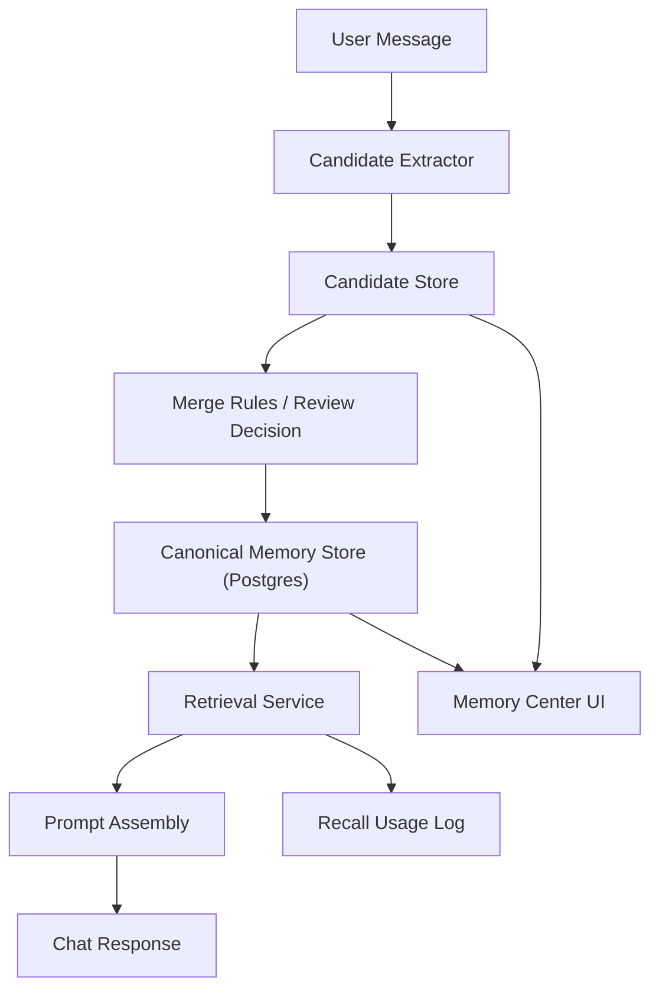

# Memory V2 迁移实现蓝图

状态：Draft；截至 2026-04-04 基本尚未启动主链迁移  
日期：2026-04-04  
目标：放弃 LobeHub 当前分层记忆模型，迁移到更接近 ChatGPT 风格、适合 ToB 场景、允许编辑的自动记忆架构。

---

## 0.0 当前落地进展（截至 2026-04-04）

需要明确：本蓝图对应的 **`Memory V2` 主链迁移当前基本尚未开始**。

- **旧 `/memory` 仍是主入口**：当前个人记忆页面仍然是五层 `identities / contexts / preferences / experiences / activities` 模型。
- **旧抽取链路仍是主链**：`user-memory` 的抽取、存储、检索和聊天注入仍然是当前系统真正在跑的路径。
- **仓库里还没有 V2 核心对象**：当前没有 `memory_v2_entries / candidates / history / recall_logs` 这类表或 service 主线。
- **`MEMORY_V2_ENABLED` 之类的切流开关也尚未出现**。
- **已经发生的唯一相关推进**：旧 `user-memory` 抽取完成后，开始派生 `Space Memory` candidate；这属于团队候选治理前置铺垫，不等于 `Memory V2` 已落地。

所以当前判断应明确为：

> `Space Memory` 已经先走到产品壳层，  
> 但 `Memory V2` 作为 canonical memory kernel 仍停留在蓝图阶段。

---

## 0. 文档定位与统一关系

这份文档是 **Memory V2 的技术主蓝图**，回答的是：

- 记忆引擎应该如何重构
- canonical schema 应该如何定义
- candidate / published / history / recall 应该如何工作
- 未来长记忆 harness 应该如何接入，而不破坏真相边界

与之配套的另外两份文档分别是：

- [space-first-team-memory-plan.zh-CN.md](./space-first-team-memory-plan.zh-CN.md)
  - 负责 `Personal Memory / Space Memory` 的产品、UI、RBAC 与治理方案
- [long-memory-harness-interface-rfc.zh-CN.md](./long-memory-harness-interface-rfc.zh-CN.md)
  - 负责未来自研长记忆 harness 的接口、责任边界与替换约束

统一后的关系应当固定为：

1. **本文件** = 记忆系统内核与 canonical truth
2. **Space-First Team Memory** = 产品层与工作区落地
3. **Harness RFC** = 编排层与未来替换点

一句话定义：

> `Memory V2` 定义“什么是真的”；  
> `Space-First Team Memory` 定义“用户如何使用”；  
> `Harness RFC` 定义“自动化如何接入，但不能拥有真相”。

---

## 0.1 最终统一提案

统一后的企业记忆方案不是单层 memory，也不是把今天的 `user memory` 直接扩成团队 memory。

正确模型是三层：

### A. Product Layer

用户只看到两类长期记忆：

- `Personal Memory`
- `Space Memory`

其中：

- `Personal Memory` 属于 `space` 外
- `Space Memory` 属于某个 `space` 内
- `Source Set` 不是 memory 根，只是来源、标签与过滤维度

### B. Canonical Memory Layer

这一层必须由 LobeHub 自己掌握：

- PostgreSQL 是唯一真相源
- pgvector 只是召回加速层
- `candidate` 与 `published` 必须分离
- 每条团队记忆必须可追溯、可撤销、可审计

### C. Harness Layer

未来的长记忆 harness 只负责：

- extract
- normalize
- dedup
- merge decision
- retrieval packaging

它不负责：

- 定义 canonical schema
- 绕过 review 直接写 `published`
- 替代产品层 scope / RBAC / audit 规则

统一后的边界应当是：

> harness 可以生成 candidate，不能直接拥有 canonical memory。  
> canonical memory 可以被不同 harness 复用，但不被任何单一 harness 绑死。

---

## 1. 决策摘要

### 1.1 主参照库

主参照库选择：**Mem0 OSS**

参考仓库：

- [mem0ai/mem0](https://github.com/mem0ai/mem0)
- [Mem0 OSS Overview](https://docs.mem0.ai/open-source/overview)

本地参考实现路径：

- `mem0/mem0/memory/main.py`
- `mem0/mem0/memory/storage.py`
- `mem0/openmemory/api/app/models.py`
- `mem0/openmemory/api/app/routers/memories.py`
- `mem0/openmemory/ui/store/memoriesSlice.ts`

### 1.2 辅助参照

辅助借鉴：

- [LangMem Background Quickstart](https://langchain-ai.github.io/langmem/background_quickstart/)
- [LangMem Hot Path Quickstart](https://langchain-ai.github.io/langmem/hot_path_quickstart/)
- [Letta Stateful Agents](https://docs.letta.com/guides/core-concepts/stateful-agents)

### 1.3 最终判断

对本项目目标而言，最重要的不是“记忆层分类多细”，而是：

1. 能否自动写入
2. 能否稳定检索
3. 能否允许人工编辑
4. 能否在 ToB 场景下自托管、审计、控权

因此：

- **主参照 = Mem0**
- **写入策略借鉴 = LangMem background memory**
- **状态建模参考 = Letta 的 core memory / pinned memory 思路**

但实现上不建议把 Mem0 当黑盒直接接入 LobeHub。  
更合理的做法是：

- 借鉴 Mem0 的产品形态和关键机制
- 继续使用 LobeHub 自己的 PostgreSQL + pgvector
- 自己掌握 canonical schema、review、audit、scope 和权限
- 预留未来自研 harness 的编排接口，但不把 canonical truth 交给 harness

---

## 2. 基于本地 `mem0` 仓库的关键结论

这一节不是引用营销文案，而是基于本地代码审计得出的能力拆解。

### 2.1 `mem0` 核心 SDK 值得借鉴的点

在 `mem0/mem0/memory/main.py` 中，`Memory` 类提供了一个统一入口：

- `add`
- `search`
- `get`
- `get_all`
- `update`
- `delete`
- `history`

其中最值得借鉴的是 `add()` 背后的逻辑：

1. 从消息中抽取 facts
2. 先用向量搜索找到相似旧记忆
3. 再让 LLM 决策每条记忆应该：
   - `ADD`
   - `UPDATE`
   - `DELETE`
   - `NONE`
4. 对每次变更写 history

这说明 `mem0` 真正的价值不只是“向量检索”，而是：

- **把 memory 写入建模成一个有状态的 merge/update 流程**

这点非常适合 LobeHub V2 参考。

### 2.2 `mem0` 的 scope 设计值得借鉴

`mem0` 在 `_build_filters_and_metadata()` 中把记忆 scope 明确成多个 session 维度：

- `user_id`
- `agent_id`
- `run_id`
- 可选 `actor_id`

对 LobeHub 而言，这启发很直接：

- 记忆不应该只有“用户”一个维度
- 需要支持：
  - 用户级
  - 空间级
  - Agent 级
  - 未来如有必要，可增加会话级短期记忆

### 2.3 `mem0` 的 history 设计值得借鉴

`mem0/mem0/memory/storage.py` 单独维护 history 表，记录：

- `old_memory`
- `new_memory`
- `event`
- `created_at`
- `updated_at`
- `actor_id`
- `role`

这对 ToB 场景非常关键，因为：

- 老板需要“能改”
- 管理员需要“能追”
- 系统需要“能解释为什么改了”

所以 Memory V2 不能只有 CRUD，必须有：

- `entry_history`
- `candidate_decision_history`
- `recall_usage_log`

### 2.4 `OpenMemory` 的产品层值得借鉴

`mem0/openmemory/api/app/models.py` 和 `mem0/openmemory/api/app/routers/memories.py` 显示，OpenMemory 在产品层做了这些事情：

- SQL canonical table 保存 memory 本体
- state 机：
  - `active`
  - `paused`
  - `archived`
  - `deleted`
- app 维度隔离
- status history
- access log
- 列表页支持 filter / sort / archive / pause / update

这说明一个对老板可用的 memory 系统，不能只做：

- search
- add

还必须做：

- 状态控制
- 审计
- 使用日志
- 管理面板

### 2.5 不应该照搬 `mem0` 的部分

`mem0` 很强，但并不应该整套复制：

| `mem0` 能力                           | 建议        |
| ------------------------------------- | ----------- |
| 统一 `Memory` facade                  | 应借鉴      |
| facts -> ADD/UPDATE/DELETE merge 流程 | 应借鉴      |
| history 机制                          | 应借鉴      |
| 多 scope filter                       | 应借鉴      |
| graph store                           | V2 MVP 不做 |
| procedural memory                     | V2 MVP 不做 |
| Python SDK 直连产品核心               | 不采用      |
| vector store 作为唯一真相源           | 不采用      |
| categories 作为主 taxonomy            | 不采用      |

结论：

- **借它的流程设计**
- **不要借它的存储真相边界**

LobeHub 仍应坚持：

- PostgreSQL canonical truth
- pgvector 作为召回加速和相似度搜索

---

## 3. 为什么要放弃现有 LobeHub memory 模式

当前模式的问题不是几个 bug，而是方向不适合现在的产品目标。

### 3.1 当前模式的本质

当前 LobeHub memory 更像：

- 分层结构化知识管理
- topic 批处理提取
- 前端预取缓存注入

对应现状代码：

- 提取主链路：`src/server/services/memory/userMemory/extract.ts`
- topic recall：`src/server/routers/lambda/userMemories.ts`
- 前端缓存注入：`src/services/chat/mecha/memoryManager.ts`
- 前端管理：`src/store/userMemory/*` 与 `src/routes/(main)/memory/*`

它不是真正的：

- 对话驱动自动长期记忆
- 服务端权威 recall
- ChatGPT 风格轻量可编辑 memory

### 3.2 当前模式和目标的错位

当前目标是：

- ToB 场景
- 给老板用
- 类似 ChatGPT
- 自动记忆
- 但允许人工编辑和关闭

这要求系统优先做到：

- 稳定
- 可解释
- 可编辑
- 可审计
- 低惊扰

而现有五层模型：

- `identity`
- `activity`
- `context`
- `experience`
- `preference`

更适合“可视化知识库”，不适合“产品级自动记忆”。

### 3.3 当前链路的核心问题

1. 写入依赖 topic 级抽取，不是 per-turn 自动记忆
2. recall 偏 topic-local，不是 user-level canonical memory
3. Web 管理端按五层拆页，交互重心偏后台系统
4. 聊天发送前的 memory 依赖客户端缓存，不是服务端权威决策

### 3.4 迁移原则

应该保留：

- `/memory` 入口和整体产品位置
- 聊天时注入 memory 的能力
- 用户开启/关闭 memory 的设置项

应该直接替换：

- 旧的五层 schema
- 旧的 topic 批提取主链路
- 旧的客户端缓存主导 recall 方式
- 旧的 agent tool 五层增删接口

---

## 4. Memory V2 的产品定义

### 4.1 产品定位

Memory V2 定义为：

> 一个对话驱动、可编辑、可审计、可控范围的长期记忆系统。

它不是“完整人生知识库”，而是帮助 Agent 在未来对话中表现得更像“记得你”的助手。

### 4.2 V2 只保留四类长期记忆

V2 不再保留五层模型，统一收敛为四类：

1. `profile`
   - 用户身份、角色、公司、长期背景
2. `preference`
   - 语言偏好、输出风格、沟通习惯、禁忌
3. `instruction`
   - 长期有效的行为规则，例如“给我先结论后细节”
4. `business_context`
   - 对老板有价值的长期业务上下文，例如“关注销售回款和招聘效率”

### 4.3 明确不做的事

- 不把所有临时事件都记成长期 memory
- 不把 topic 中短期上下文当成永久记忆
- 不让模型自由创建太多异质 memory 类型
- 不把 vector search 结果直接当成用户可编辑真相

### 4.4 用户感知目标

迁移完成后，用户应感觉到：

1. 聊着聊着系统会自然记住稳定信息
2. 被记住的内容可以直接编辑、关闭、删除
3. 记忆被用到时整体是自然的，不需要频繁手动触发
4. 出错时用户可以追溯和纠正

---

## 5. 目标架构

### 5.1 写入链路

每轮用户消息或每 N 轮消息后：

1. 取最近若干轮对话
2. 抽取 `memory candidates`
3. 做敏感信息和长期性判断
4. 根据置信度与规则：
   - 高置信度：自动 merge 到 canonical memory
   - 中置信度：进入 `Suggested`
   - 低置信度：丢弃

### 5.2 读取链路

发送消息时：

1. 服务端从 canonical memory store 取当前用户可见的 active memories
2. 基于 query / agent / space / tenant 做召回与 rerank
3. 选出少量高价值 memory 形成 `memory pack`
4. 注入 prompt
5. 记录本次 recall usage log

注意：

- **读取必须服务端完成**
- 前端缓存只能做加速，不能做真相源

### 5.3 编辑链路

用户和管理员可以：

- 编辑 memory 内容
- 禁用 memory
- 删除 memory
- Pin memory
- 调整 scope
- 审核候选记忆

---

## 6. 数据模型设计

### 6.1 设计原则

参考 `mem0` 的经验，V2 数据模型必须把下面几层分开：

1. canonical entries
2. candidates
3. history
4. usage log

不要把它们混在一张表里。

### 6.2 Canonical Memory 表

建议新增表：`memory_v2_entries`

| 字段                | 说明                                                    |
| ------------------- | ------------------------------------------------------- |
| `id`                | 主键                                                    |
| `tenant_id`         | 租户                                                    |
| `user_id`           | 用户                                                    |
| `space_id`          | 空间，可空                                              |
| `agent_id`          | Agent，可空                                             |
| `scope`             | `user / space / agent`                                  |
| `kind`              | `profile / preference / instruction / business_context` |
| `title`             | 可选短标题                                              |
| `content`           | 主内容                                                  |
| `normalized_key`    | 去重覆盖键，例如 `language_preference`                  |
| `embedding`         | pgvector 向量                                           |
| `confidence`        | 0~1                                                     |
| `state`             | `active / disabled / archived / deleted`                |
| `is_pinned`         | 是否固定注入                                            |
| `source_type`       | `auto / user / admin / import / legacy_migration`       |
| `source_message_id` | 来源消息                                                |
| `source_topic_id`   | 来源主题                                                |
| `source_run_id`     | 来源运行，可空                                          |
| `created_by`        | `auto / user / admin / system`                          |
| `updated_by`        | `auto / user / admin / system`                          |
| `approved_at`       | 审核通过时间                                            |
| `last_used_at`      | 最近被 recall 时间                                      |
| `expires_at`        | 可选过期时间                                            |
| `metadata`          | 扩展字段                                                |
| `created_at`        | 创建时间                                                |
| `updated_at`        | 更新时间                                                |

建议索引：

- `(tenant_id, user_id, state, kind)`
- `(tenant_id, space_id, state)`
- `(tenant_id, agent_id, state)`
- `normalized_key`
- `embedding` HNSW index

### 6.3 Candidate 表

建议新增表：`memory_v2_candidates`

用途：

- 保存自动提取出的候选记忆
- 支持 review
- 支持规则回放
- 支持 debug 和 prompt 调优

| 字段                 | 说明                                                         |
| -------------------- | ------------------------------------------------------------ |
| `id`                 | 主键                                                         |
| `tenant_id`          | 租户                                                         |
| `user_id`            | 用户                                                         |
| `space_id`           | 空间，可空                                                   |
| `agent_id`           | Agent，可空                                                  |
| `scope`              | `user / space / agent`                                       |
| `kind`               | 候选类别                                                     |
| `content`            | 候选内容                                                     |
| `normalized_key`     | 归一化键                                                     |
| `confidence`         | 0~1                                                          |
| `decision`           | `pending / accepted / rejected / auto_accepted / superseded` |
| `reason`             | 决策理由                                                     |
| `merge_target_id`    | 如果合并进旧 memory，记录目标 entry                          |
| `raw_context`        | 生成候选时使用的上下文                                       |
| `source_message_ids` | 来源消息集合                                                 |
| `extractor_version`  | 抽取器版本                                                   |
| `metadata`           | 扩展字段                                                     |
| `decided_at`         | 决策时间                                                     |
| `decided_by`         | `auto / user / admin / system`                               |
| `created_at`         | 创建时间                                                     |

### 6.4 History 表

建议新增表：`memory_v2_entry_history`

参考 `mem0` 的 history 设计，至少记录：

- `entry_id`
- `event`
- `old_snapshot`
- `new_snapshot`
- `actor_type`
- `actor_id`
- `reason`
- `created_at`

`event` 建议枚举：

- `create`
- `update`
- `disable`
- `enable`
- `delete`
- `pin`
- `unpin`
- `merge_from_candidate`
- `legacy_import`

### 6.5 Recall Usage Log 表

建议新增表：`memory_v2_recall_logs`

用途：

- 记录哪些 memory 在聊天时被拿出来过
- 支持后续排序、治理和运营调优

| 字段         | 说明                |
| ------------ | ------------------- |
| `id`         | 主键                |
| `tenant_id`  | 租户                |
| `user_id`    | 用户                |
| `topic_id`   | 对话主题            |
| `message_id` | 触发召回的消息      |
| `entry_id`   | 被召回的 memory     |
| `rank`       | 排名                |
| `score`      | 最终分数            |
| `reason`     | 召回原因            |
| `injected`   | 是否真正注入 prompt |
| `created_at` | 创建时间            |

这部分是借鉴 `OpenMemory` access log 思路，但更偏 prompt recall 观测。

---

## 7. Retrieval 设计

### 7.1 ChatGPT 风格 recall 的关键

真正像 ChatGPT 的点，不是“搜到了什么”，而是“少量、高命中、低惊扰”。

### 7.2 Recall 流程

建议在服务端实现 `retrieveForChat`：

1. 生成 query
   - 当前用户消息
   - 最近若干轮用户对话摘要
2. 拉取 pinned memories
3. 向量召回 active entries
4. 应用过滤：
   - tenant
   - user
   - scope
   - agent
   - space
   - expires_at
5. rerank
6. 组装 memory pack
7. 记录 recall log

### 7.3 Prompt 注入策略

推荐仅注入三段：

1. `Pinned memory`
2. `Relevant stable memory`
3. `Behavioral instructions`

注入上限建议：

- 3 到 8 条
- 总 token 控制在固定预算内

### 7.4 排序规则

综合分数建议：

`final_score = relevance * 0.45 + confidence * 0.2 + pin_bonus * 0.2 + freshness * 0.1 + usage_bonus * 0.05`

说明：

- `relevance`：向量相似度 + rerank
- `confidence`：抽取器输出
- `pin_bonus`：显式固定优先
- `freshness`：最近更新的长期规则更重要
- `usage_bonus`：高命中、被持续使用的记忆略微上浮

### 7.5 需要避免的旧行为

V2 不应继续依赖以下模式：

- `retrieveMemoryForTopic` 只用 topic 用户消息拼 query
- `memoryManager.ts` 只从客户端缓存读 recall 结果
- 发消息时因客户端未预取而拿不到 memory

---

## 8. 写入与抽取策略

### 8.1 参考 `mem0` 的 merge 思路

`mem0` 的关键不是单纯“抽取事实”，而是：

1. 抽取新 facts
2. 找相似旧 memories
3. 决策 `ADD / UPDATE / DELETE / NONE`

Memory V2 也应该采用同样的两阶段写入：

### 8.2 阶段 A：Candidate Extraction

输入：

- 最近 1 到 6 轮对话
- 当前用户消息
- 可选 Agent 名称 / space 元信息

输出：

- 候选记忆列表
- 每条候选的：
  - `kind`
  - `content`
  - `normalized_key`
  - `confidence`
  - `reason`

### 8.3 阶段 B：Merge Decision

对每个 candidate：

1. 查找 `normalized_key` 相同或相似的旧 entry
2. 决策：
   - 新增
   - 覆盖
   - 忽略
   - 进入 review

建议的 merge 决策：

| 情况                    | 动作                 |
| ----------------------- | -------------------- |
| 高置信度且同 key 无旧值 | 自动新增             |
| 高置信度且同 key 有旧值 | 自动覆盖并写 history |
| 中置信度                | 进入 `Suggested`     |
| 低置信度                | 丢弃                 |
| 敏感信息                | 丢弃或强制 review    |

### 8.4 自动写入规则

自动写入只适用于：

- `profile`
- `preference`
- `instruction`
- 少量高置信度 `business_context`

建议阈值：

- `confidence >= 0.85`
- 非敏感
- 非明显冲突
- `normalized_key` 可稳定归一化

其余进入 `pending review`

### 8.5 敏感信息控制

ToB 场景必须加入 memory safety gate：

- 手机号、身份证、银行卡、住址等敏感信息默认不自动记
- 可配置组织级黑名单模式
- 可配置某些关键词永不落 memory

---

## 9. 前端产品设计

### 9.1 Memory Center

新的 `/memory` 页面不再按五层拆页，而是改为三栏或三标签：

- `Active`
- `Suggested`
- `Disabled`

筛选维度：

- `Kind`
- `Scope`
- `Source`
- `State`

### 9.2 详情面板

每条 memory 至少展示：

- 内容
- 类型
- scope
- 来源
- 置信度
- 最近使用时间
- 历史变更

这部分明显借鉴 `OpenMemory` 对编辑与状态管理的产品化思路。

### 9.3 Chat 内轻反馈

新增两种轻反馈：

- “记住这点”
- “忘掉这点”

可选第三种：

- “为什么提到这个”

主要交互仍然在聊天里完成，后台只负责查看和纠偏。

### 9.4 管理员能力

ToB 需要管理员控制：

- 某类 memory 是否允许自动写入
- memory 保留时长
- 敏感词/敏感模式过滤
- 是否允许 space 共享记忆
- 是否允许 agent 级独立记忆

---

## 10. 服务端接口蓝图

建议新增 router：`memoryV2`

### 10.1 面向 Web 管理端的接口

- `memoryV2.listEntries`
- `memoryV2.getEntry`
- `memoryV2.createEntry`
- `memoryV2.updateEntry`
- `memoryV2.updateEntryState`
- `memoryV2.pinEntry`
- `memoryV2.unpinEntry`
- `memoryV2.getEntryHistory`
- `memoryV2.listCandidates`
- `memoryV2.acceptCandidate`
- `memoryV2.rejectCandidate`

### 10.2 面向聊天主链路的接口

- `memoryV2.retrieveForChat`
- `memoryV2.recordFeedback`

### 10.3 面向异步抽取链路的接口

- `memoryV2.extractCandidatesFromMessages`
- `memoryV2.mergeCandidates`

原则：

- `retrieveForChat` 必须服务端执行
- 不允许 sendMessage 只依赖前端缓存
- 候选抽取和 merge 应可异步化

---

## 11. LobeHub 代码改造映射

### 11.1 可以保留

- `src/routes/(main)/settings/memory/`
- `/memory` 导航入口
- 聊天 prompt 注入入口本身
- 部分已有的 memory enable/disable 用户设置

### 11.2 需要下线或退场的旧主路径

- `src/server/services/memory/userMemory/extract.ts`
- `src/server/routers/lambda/userMemories.ts`
- `src/store/userMemory/*`
- `src/routes/(main)/memory/identities/*`
- `src/routes/(main)/memory/activities/*`
- `src/routes/(main)/memory/contexts/*`
- `src/routes/(main)/memory/experiences/*`
- `src/routes/(main)/memory/preferences/*`

### 11.3 建议新增模块

- `packages/database/src/schemas/memoryV2.ts`
- `packages/database/src/models/memoryV2/`
- `src/server/services/memory/v2/`
- `src/server/routers/lambda/memoryV2.ts`
- `src/store/memoryV2/`
- `src/features/MemoryV2/`
- `src/routes/(main)/memory/(v2)/`

### 11.4 聊天链路替换点

当前前端注入入口：

- `src/services/chat/mecha/memoryManager.ts`

V2 目标：

- 保留这个“注入入口”的概念
- 但实际 recall 数据来自服务端 `memoryV2.retrieveForChat`
- 客户端不再持有 topic memory 作为唯一真相源

### 11.5 Tool 层替换点

当前 `packages/builtin-tool-memory` 仍按五层暴露：

- `toolAddIdentityMemory`
- `toolAddPreferenceMemory`
- `toolAddContextMemory`
- 等等

V2 建议统一成：

- `remember`
- `forget`
- `update_memory`
- `search_memory`

避免继续把旧 taxonomy 固化到 tool contract。

---

## 12. 分阶段迁移路径

### Phase 0：冻结旧模型

目标：

- 不再扩展旧五层 memory
- 只修必要 bug

动作：

- 给旧 memory 打上 `legacy` 标记
- 新增 feature flag：`MEMORY_V2_ENABLED`
- 禁止再新增五层专属功能

### Phase 1：引入 V2 schema 与 model

目标：

- 新表上线
- 不影响旧功能

动作：

- 新增 `memory_v2_entries`
- 新增 `memory_v2_candidates`
- 新增 `memory_v2_entry_history`
- 新增 `memory_v2_recall_logs`
- 建立 pgvector 索引
- 建立 model/repository 层

验收：

- 数据层具备独立 CRUD、history、usage log 能力

### Phase 2：先做“手工可编辑”的 V2

目标：

- 先把 editable memory center 跑通

动作：

- 新增 `/memory` V2 页面
- 支持 CRUD
- 支持 pin / disable / delete
- 支持 history 查看

验收：

- 不做自动抽取，也能手工维护长期记忆

### Phase 3：接入服务端 recall

目标：

- 聊天发送前由服务端统一取记忆

动作：

- 新增 `retrieveForChat`
- prompt assembly 从 V2 取 memory pack
- 记录 recall usage log
- 客户端缓存退化为性能优化，而非真相源

验收：

- 即使前端没有预取，也能稳定使用 memory

### Phase 4：接入 background candidate extraction

目标：

- 新消息产生后自动形成 candidate

动作：

- 新增后台抽取 worker
- 每轮或每 N 轮触发
- 先只写 candidate
- 高置信度场景可自动 merge

验收：

- 聊天后能看到 `Suggested memories`

### Phase 5：接入 merge 规则与 review 流程

目标：

- 像 `mem0` 一样具备“新增/覆盖/忽略”的能力

动作：

- 实现 candidate -> existing entry 的 merge decision
- 支持按 `normalized_key` 覆盖
- 写 history
- review accept/reject 可回溯

验收：

- 同类偏好不会越记越多，而是可被更新

### Phase 6：替换 builtin-tool-memory

目标：

- agent tool 也切到 V2 抽象

动作：

- 新增通用记忆工具
- 保持兼容期 fallback
- 逐步移除五层 tool contract

验收：

- tool 侧不再直接暴露五层语义

### Phase 7：旧数据有选择地迁移

目标：

- 把旧 memory 中真正有价值的长期信息迁入 V2

动作：

- 编写一次性迁移脚本
- 只迁移长期稳定信息
- 输出迁移报告

验收：

- 迁移后噪音低于旧系统

### Phase 8：切流与下线

目标：

- V2 成为默认 memory

动作：

- 新用户默认走 V2
- 旧 `/memory` 五层页面隐藏
- legacy 只读保留一段时间
- 最终移除旧五层提取与 UI

---

## 13. Legacy 数据迁移规则

旧类型建议映射：

| 旧类型       | V2 映射                       | 说明                 |
| ------------ | ----------------------------- | -------------------- |
| `identity`   | `profile`                     | 可迁移               |
| `preference` | `preference` 或 `instruction` | 可迁移               |
| `context`    | `business_context`            | 仅迁长期稳定条目     |
| `experience` | 通常不迁                      | 多为短期或叙事性     |
| `activity`   | 通常不迁                      | 多为任务态或临时过程 |

### 13.1 Persona 的处理

当前旧系统还有 persona 相关链路：

- `src/server/services/memory/userMemory/persona/service.ts`

建议策略：

- 不直接把 persona narrative 原封不动变成 V2 entry
- 可以将其中稳定信息抽成 `profile` candidate
- 由用户或系统 review 后再入库

### 13.2 迁移原则

- 只迁移**长期稳定且未来有价值**的信息
- 不把旧库中所有记录原封不动搬过去
- 迁移脚本应支持 dry-run 和导出报告

---

## 14. 首批实现任务拆解

### 14.1 数据层

1. 新建 Drizzle schema
2. 新建 migration
3. 新建 model/repository
4. 新建基础测试

### 14.2 服务端

1. 新建 `memoryV2` router
2. 新建 `retrieveForChat` service
3. 新建 `extractCandidates` worker
4. 新建 merge service
5. 新建 recall log writer

### 14.3 前端

1. 新建 `src/store/memoryV2/`
2. 新建 `/memory` V2 列表页
3. 新建 `Suggested` review 交互
4. 新建 detail/history 面板

### 14.4 聊天主链路

1. 发消息前改为请求服务端 recall
2. prompt assembly 接入 memory pack
3. 逐步移除 topic cache-only recall

### 14.5 Tool 链路

1. 新建 V2 通用 memory tool
2. agent 默认使用新 tool
3. 旧 tool 保持兼容一段时间

---

## 15. 里程碑建议

### Milestone A：2 周

- V2 schema
- CRUD
- history
- 新 Memory Center
- 手工编辑可用

### Milestone B：4 周

- 服务端 recall
- usage log
- prompt 注入切到 V2

### Milestone C：6 周

- background candidate extraction
- candidate review
- merge rules

### Milestone D：8 周

- 旧数据迁移
- tool 替换
- 逐步切流

---

## 16. 成功标准

迁移完成后，系统应满足：

1. 用户不需要手动跑“记忆提取”
2. 用户可以直接编辑和关闭 memory
3. 服务端发送消息时能稳定取到 memory
4. 同一类长期信息能被更新覆盖，而不是无限堆积
5. memory 数量可控，噪音显著低于旧系统
6. 管理员能做审核、禁用、追踪
7. 旧五层模型不再是主路径

---

## 17. 非目标

V2 MVP 阶段明确不做：

- graph memory
- procedural memory
- 全自动无 review 的高风险记忆写入
- 复杂知识图谱 UI
- 把临时任务流也纳入长期记忆

---

## 18. 最终建议

这个迁移不是“修 LobeHub 当前 memory”，而是：

> 以 Mem0 为主参照，借鉴其 add/update/delete merge 思路、history 与多 scope 设计，重建一套面向 ToB 的 ChatGPT 风格可编辑自动记忆系统。

实施原则：

- 借 `mem0` 的流程，不照搬它的存储边界
- 借 `OpenMemory` 的产品治理能力，不照搬其 taxonomy
- 借 `LangMem` 的 background memory 思路，不把对话主链路变重

最终架构应当是：

- Postgres canonical truth
- pgvector recall
- 服务端权威注入
- 候选记忆 + 审核
- 用户可编辑
- 管理员可控

---

## 19. 参考资料

- [mem0ai/mem0](https://github.com/mem0ai/mem0)
- [Mem0 OSS Overview](https://docs.mem0.ai/open-source/overview)
- [LangMem Background Quickstart](https://langchain-ai.github.io/langmem/background_quickstart/)
- [LangMem Hot Path Quickstart](https://langchain-ai.github.io/langmem/hot_path_quickstart/)
- [Letta Stateful Agents](https://docs.letta.com/guides/core-concepts/stateful-agents)
