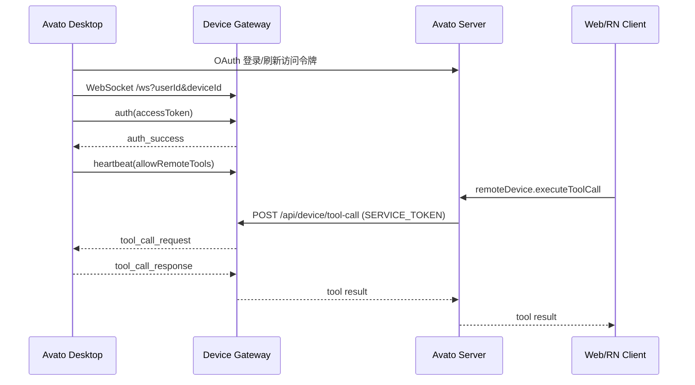

# Remote Device Gateway 开发与部署说明

本文档说明 Web/RN 通过云端中继控制不在同一局域网内的 Avato Desktop 的实现方式。该链路不依赖 Cloud Sandbox，被控电脑由 Desktop 主动反连 Device Gateway，Web/RN 只通过服务端 API 下发工具调用。

## 目标

- Desktop 登录账号后获得访问令牌与稳定 `deviceId`。
- Desktop 主动连接 Device Gateway，保持心跳、重连与状态上报。
- Desktop 默认只作为在线设备暴露，Web/RN 远程执行 Local System、Skills、本机 / 私网 MCP 前，必须由用户在 Desktop 单独开启 Remote Tool Execution。
- Web/RN 通过 Avato 服务端调用 Device Gateway，再由 Gateway 转发到在线 Desktop。
- Skills、Local System 与本机 MCP 复用 Desktop 现有本地执行能力；没有已授权的 Desktop 设备时，不再回退到 Cloud Sandbox。

## 组件分工

| 组件                | 路径                                                                        | 职责                                                                         |
| ------------------- | --------------------------------------------------------------------------- | ---------------------------------------------------------------------------- |
| Device Gateway      | `apps/device-gateway`                                                       | Cloudflare Worker + Durable Object，中继 Desktop WebSocket 与服务端 HTTP RPC |
| Gateway Client      | `packages/device-gateway-client`                                            | Desktop WebSocket 客户端与服务端 HTTP 客户端                                 |
| Desktop Agent       | `apps/desktop/src/main/controllers/DeviceGatewayCtr.ts`                     | 登录后启动反连，处理工具请求、心跳、重连和状态广播                           |
| Electron IPC        | `packages/electron-client-ipc/src/types/deviceGateway.ts`                   | 暴露 Desktop Agent 状态与启停控制                                            |
| Desktop UI          | `src/routes/(main)/settings/system-tools/features/DeviceGatewaySection.tsx` | 在系统工具设置页展示连接状态、`deviceId`、Gateway 地址、远程执行开关和错误   |
| Web tRPC            | `src/server/routers/lambda/remoteDevice.ts`                                 | Web/RN 调用入口，按当前用户转发设备列表、状态、系统信息和工具调用            |
| Server Proxy        | `src/server/services/toolExecution/deviceProxy.ts`                          | 使用服务令牌访问 Device Gateway                                              |
| Skills Web Executor | `src/store/tool/slices/builtin/executors/lobe-skills.ts`                    | Web 侧 Skills 执行时自动选择在线 Desktop 设备                                |

## 调用链路



Durable Object 以 `userId` 分片，同一用户的设备连接和服务端 RPC 会进入同一个对象。服务端不会把 `SERVICE_TOKEN` 下发到浏览器或 RN。

## 环境变量

### Device Gateway

`apps/device-gateway` 需要两个密钥：

| Secret            | 用途                                           |
| ----------------- | ---------------------------------------------- |
| `JWKS_PUBLIC_KEY` | 用于校验 Desktop 登录令牌的 RS256 公钥 JWKS    |
| `SERVICE_TOKEN`   | Avato Server 调用 `/api/device/*` 的服务间令牌 |

生产环境下 Desktop WebSocket 鉴权只接受用户访问令牌。`SERVICE_TOKEN` 默认不能作为设备登录凭证；如需本地 CLI 调试，可临时设置 `ALLOW_SERVICE_TOKEN_DEVICE_AUTH=true`，不要在生产环境开启。

`JWKS_PUBLIC_KEY` 可以从主程序的 `JWKS_KEY` 提取：

```bash
cd apps/device-gateway
JWKS_KEY='{"keys":[...]}' node scripts/extract-public-key.mjs
```

部署到 Cloudflare Workers 时写入 secrets：

```bash
cd apps/device-gateway
wrangler secret put JWKS_PUBLIC_KEY
wrangler secret put SERVICE_TOKEN
bun run deploy
```

本地开发可在 `apps/device-gateway/.dev.vars` 配置：

```dotenv
JWKS_PUBLIC_KEY={"keys":[...]}
SERVICE_TOKEN=dev-service-token
```

然后启动：

```bash
cd apps/device-gateway
pnpm install --ignore-workspace
bun run dev
```

### Avato Web/RN 服务端

Web/RN 走 Avato 服务端 tRPC，服务端需要配置：

```dotenv
DEVICE_GATEWAY_URL=https://device-gateway.example.com
DEVICE_GATEWAY_SERVICE_TOKEN=dev-or-prod-service-token
```

本地联调时可以指向 Wrangler：

```dotenv
DEVICE_GATEWAY_URL=http://localhost:8787
DEVICE_GATEWAY_SERVICE_TOKEN=dev-service-token
```

`DEVICE_GATEWAY_URL` 必须是合法的 `http` / `https` URL，`DEVICE_GATEWAY_SERVICE_TOKEN` 必须与 Gateway 的 `SERVICE_TOKEN` 一致。缺少任一变量、URL 非法或 token 为空时，`deviceProxy.isConfigured` 为 `false`，服务端不会声明可用远程设备能力。

### Avato Desktop

Desktop 默认连接 `https://device-gateway.lobehub.com`。自建或本地联调时，在 Desktop 启动环境中覆盖：

```dotenv
DEVICE_GATEWAY_URL=https://device-gateway.example.com
```

本地 Gateway：

```dotenv
DEVICE_GATEWAY_URL=http://localhost:8787
```

Desktop 登录账号后会从访问令牌读取 `sub` 作为 `userId`，首次启动 Gateway Agent 时生成并持久化 `deviceId`。
Remote Device Gateway 默认自动连接，但 Remote Tool Execution 默认关闭。关闭时设备仍会出现在设备列表中并保持心跳，Web/RN 或服务端 Agent 不能通过该设备执行 Local System、Skills、本机 / 私网 MCP。
手动启动 Gateway Agent 时，Desktop 会等待 Gateway 返回 `auth_success` 后才报告成功；如果认证失败、连接中断或认证超时，会在设置页显示明确错误。
当用户清除远端配置或 token 被判定失效时，Desktop 会立即断开当前 Gateway 连接，但保留自动连接偏好；下次重新登录后会再次启动。

## 协议约定

Desktop 到 Gateway 的 WebSocket 消息：

- `auth`: 连接建立后第一条消息，携带 Desktop access token。
- `heartbeat`: Desktop 每 30 秒发送一次，携带当前 `allowRemoteTools` 状态；Gateway 90 秒未收到心跳会关闭连接。
- `tool_call_response`: Desktop 返回工具执行结果。
- `system_info_response`: Desktop 返回系统路径与运行环境。

Gateway 到 Desktop 的 WebSocket 消息：

- `auth_success` / `auth_failed`: 鉴权结果。
- `auth_expired`: Desktop token 过期，客户端会刷新 token 后重连。
- `heartbeat_ack`: 心跳确认。
- `tool_call_request`: 请求 Desktop 执行工具。
- `system_info_request`: 请求 Desktop 返回系统信息。

服务端 HTTP API：

- `POST /api/device/status`
- `POST /api/device/devices`
- `POST /api/device/system-info`
- `POST /api/device/tool-call`

这些 API 都必须带 `Authorization: Bearer <SERVICE_TOKEN>`。
Desktop WebSocket 鉴权只接受 RS256 签名且 `client_id=lobehub-desktop` 的用户访问令牌，并要求令牌 `sub` 与 Gateway 路由中的 `userId` 一致。
令牌必须带 `exp`，Gateway 会按过期时间通知 Desktop 刷新后重连。
Gateway 会拒绝无效 JSON、过大的 WebSocket 消息、缺失 `userId` 的服务端请求，以及缺失或畸形的 `toolCall`。Desktop WebSocket 必须携带 `userId` 和 `deviceId`，未认证连接不会写入 Durable Object 用户状态。
HTTP JSON body、`userId`、`deviceId`、WebSocket metadata（`hostname` / `platform`）、`toolCall.apiName`、`toolCall.identifier` 会做长度限制；`toolCall.arguments` 必须是字符串且有最大长度限制。Web/RN tRPC 入口会先做同等上限校验，RPC `timeout` 会被限制在 1 秒到 600 秒之间，避免服务端误传超长等待。
Gateway 会限制单个用户 Durable Object 内的总 WebSocket 连接数与未认证连接数，并限制同时挂起的 RPC 数量；设备断线或 WebSocket 异常时，关联的 pending RPC 会立即失败，不再等到超时。
Gateway 只接受目标 WebSocket 返回对应 `requestId` 的 RPC 响应，防止同用户下其他连接误完成请求。设备返回的超大文本结果会被拒绝为 `DEVICE_RESPONSE_TOO_LARGE`，客户端也会限制异常 HTTP 错误体和成功结果体，避免单次工具调用撑爆服务端内存或上下文处理链路。
Desktop 在回传工具结果前也会限制响应体大小，避免本机先构造并发送超大 WebSocket 消息。
Gateway 会优先检查目标设备的 Remote Tool Execution 状态；关闭时 `system_info_request` 和 `tool_call_request` 直接返回 `REMOTE_TOOLS_DISABLED`。Desktop 也会在本地再次检查该开关，即使服务端或 Gateway 出现误路由也不能执行本机工具。
Desktop 返回的 RPC 结果必须是 JSON object；如果设备返回畸形响应，Gateway 会返回 `INVALID_DEVICE_RESPONSE`。
`/api/device/devices` 只返回公开设备视图：`allowRemoteTools`、`connectedAt`、`deviceId`、`hostname`、`platform`，不会暴露 Durable Object 内部认证或心跳字段。旧 Gateway 或旧 Desktop 未返回 `allowRemoteTools` 时，Web/RN 和服务端会按 `false` 处理，避免未经显式授权的设备被自动用于远程执行。

## 当前支持的工具

Desktop Agent 当前处理三类工具：

| identifier          | apiName                         | 说明                                                           |
| ------------------- | ------------------------------- | -------------------------------------------------------------- |
| `lobe-local-system` | `runCommand` 等现有本地系统工具 | 转发到 Desktop 现有 `ShellCommandCtr` / `LocalFileCtr` 处理    |
| `lobe-skills`       | `execScript`                    | 可携带 Skill zip URL/hash，Desktop 准备 Skill 目录后执行命令   |
| `lobe-mcp`          | `callTool`                      | 转发到 Desktop `McpCtr`，执行 stdio MCP 或本机 / 私网 HTTP MCP |

Web 侧 Skills executor 会优先使用本地存储且仍在线、且 `allowRemoteTools=true` 的 active device。若没有有效选择，只有在恰好一台符合条件的设备在线时才会自动选择；多台符合条件的设备在线时不会任选一台，调用方需要先激活目标设备。没有符合条件的设备时返回明确错误，不会回退到 Cloud Sandbox。

Desktop 自身的 Skills executor 仍由 `lobe-skills.desktop.ts` 通过 Electron IPC 在本机执行；Gateway 链路主要服务 Web/RN 或服务端 Agent 远程调用 Desktop。

服务端 Agent 流程可以通过 `lobe-remote-device` 工具列出和激活设备。只允许激活 `online && allowRemoteTools` 的设备；激活后 `activeDeviceId` 会传入 Local System 和 Skills runtime。激活时会尽力查询 Desktop 系统路径并把 `devicePlatform` / `deviceSystemInfo` 写入工具状态，用于下一步注入本机路径变量；系统信息查询失败不会阻止设备激活。
服务端 Local System runtime 会把 Desktop 返回的原始 JSON 结果格式化为与本地 executor 一致的模型可读内容，并保留失败态和 `PluginServerError`，避免远端 shell/file 调用被记录成成功的原始 JSON。

MCP 执行规则：

- `cloud` MCP 仍走 cloud MCP endpoint。
- 公网 HTTP MCP 仍由服务端直接调用。
- `stdio` MCP 与 `localhost` / 私网 HTTP MCP 必须通过已激活且开启 Remote Tool Execution 的 Desktop 设备执行；没有 `activeDeviceId` 时返回 `MCP_DESKTOP_DEVICE_REQUIRED`。
- Desktop Gateway 边界会再次拒绝公网 HTTP MCP URL，避免服务端误路由后让用户设备访问非本机 MCP 服务。

## 不支持与限制

- `lobe-skills/exportFile` 目前不走 Device Gateway，当前返回不可用结果。
- 真机联调需要完整登录令牌、Gateway 部署和服务端 `DEVICE_GATEWAY_SERVICE_TOKEN`。
- Desktop 端实际执行的是用户本机命令，应继续复用现有权限确认、审计和本地工具安全策略。Remote Tool Execution 是 Gateway 远程执行的本机总开关，默认关闭。
- Gateway 只做中继和鉴权，不应暴露 `SERVICE_TOKEN` 给客户端。

## 联调检查清单

1. 启动 Gateway，确认 `GET /health` 返回 `OK`。
2. 启动 Web/RN 服务端，并配置 `DEVICE_GATEWAY_URL` 与 `DEVICE_GATEWAY_SERVICE_TOKEN`。
3. 启动 Desktop，登录同一账号，在系统工具设置页确认 Remote Device Gateway 为 connected。
4. 在 Web/RN 调用 `remoteDevice.list`，应看到 Desktop 的 `deviceId`、主机名、平台和 `allowRemoteTools=false`。
5. 尝试执行 `lobe-local-system/runCommand` 或 `lobe-skills/execScript`，应得到 `REMOTE_TOOLS_DISABLED` 或 “需要开启 Remote Tool Execution” 的明确错误。
6. 在 Desktop 系统工具设置页开启 Remote Tool Execution，再次调用 `remoteDevice.list`，确认 `allowRemoteTools=true`。
7. 执行 `lobe-local-system/runCommand` 或 `lobe-skills/execScript`，确认结果从 Desktop 返回。
8. 断开 Desktop 网络或停止 Agent，确认 Web/RN 侧不再选择离线设备。

## 建议验证命令

```bash
cd apps/device-gateway
bun run type-check
bunx vitest run --silent='passed-only' 'src/index.test.ts' 'src/auth.test.ts' 'src/request.test.ts' 'src/device.test.ts'
```

```bash
cd apps/desktop
bun run type-check
bunx vitest run --silent='passed-only' 'src/main/controllers/__tests__/DeviceGatewayCtr.test.ts' 'src/main/controllers/__tests__/RemoteServerConfigCtr.test.ts'
```

```bash
bunx vitest run --silent='passed-only' \
  'src/server/services/toolExecution/index.test.ts' \
  'src/server/services/toolExecution/serverRuntimes/__tests__/skills.test.ts' \
  'src/server/services/toolExecution/serverRuntimes/__tests__/remoteDevice.test.ts' \
  'src/server/services/toolExecution/serverRuntimes/__tests__/localSystem.test.ts' \
  'src/server/services/toolExecution/__tests__/deviceProxy.test.ts' \
  'src/server/routers/lambda/remoteDevice.test.ts' \
  'src/services/mcp.test.ts' \
  'src/services/__tests__/remoteDevice.test.ts' \
  'src/store/tool/slices/builtin/executors/__tests__/lobe-skills.test.ts'
```

```bash
cd packages/device-gateway-client
bunx tsc --noEmit -p tsconfig.json
bunx vitest run --silent='passed-only'
```
