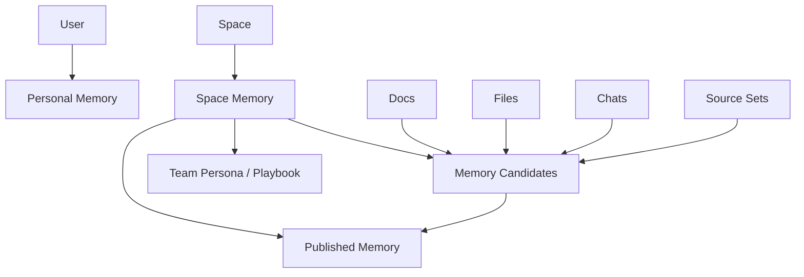

# Space-First Team Memory 产品与架构方案

**状态**：提案；截至 2026-04-05 已有最小产品闭环  
**日期**：2026-04-05  
**目标**：在新的 `space-first` 架构下，把当前偏个人化的 `memory` 能力升级为可自动化、可团队协作、可企业治理的记忆系统，同时不破坏现有个人记忆体验。

---

## 0.0 当前落地进展（截至 2026-04-05）

本方案已经不再停留在纯概念阶段，当前代码里已经出现第一版 `Space Memory` 产品闭环，并开始进入 server-side team agent recall 主链，但距离“团队记忆已全面接管主链”仍有明显差距。

- **`/spaces/:spaceId/memory` 已落地**：团队空间已有独立的 `Space Memory` 路由与页面，个人空间则显式回落到 `/memory`。
- **首版产品结构已存在**：`Inbox / Published / Playbooks / Policies` 四段 UI、详情侧栏、audit 视图、批量 publish / reject 都已接入。
- **candidate intake 已统一**：手工创建、topic 摘要抽取、user-memory 抽取后衍生候选，都已写入同一条 `space_memory_entries` candidate 流。
- **治理动作已存在**：当前已支持 publish、archive/reject、merge into published，并记录简化版 governance history。
- **来源追踪已存在最小闭环**：`origin / producer / traceId / sourceRefs` 已进入 schema、router 与 UI。
- **多入口“加到 Space Memory”已接入**：消息、文件、文档都已经能从产品操作菜单进入 candidate 创建流程。
- **首版团队默认 recall 已接入两条主路径**：当会话命中 team space 且用户开启 memory 时，`published` 的 `general / playbook / policy` 已开始并入 server-side agent 执行链的 `userMemory` 注入载荷；同时 `retrieveMemoryForTopic` 也已聚合 team-space recall，前端 topic memory 预取链不再只包含个人记忆。
- **recall 已有第一版 query-aware ranking**：当前会基于 topic user messages + 当前 prompt 做轻量 lexical 排序，不再只按最新发布时间取 `published`。
- **首版 query-intent aware recall allocation 已落地**：当 query 明显偏 `policy / playbook / general` 其中一类时，published recall 现在会在不增加默认总量的前提下，动态把更多 recall slots 分配给更相关的类别，而不是始终按 `4 / 4 / 4` 平铺；显式 `limitByCategory` 仍保持最高优先级。
- **首版 hybrid rerank 已开始替代纯词频排序**：当前 published recall 的排序已经不再只看单词命中数，还会考虑 query phrase 命中与 query coverage，优先浮出真正完整匹配用户问题的条目，而不是把只蹭到一个高频词的新条目排在前面。
- **首版 recall packaging / compression 已落地，并开始变成 query-aware + sentence-aware + structured**：`Space Memory` recall 不再直接把完整 `summary / content / title` 整段塞进 prompt-facing memory 结构；当前已经按 `general / playbook / policy` 三类做加权长度预算、去重拼接与截断，并增加 category-level 总预算控制，优先保留标题与摘要，再按预算补入正文。最近几轮又把这套压缩包装做成了 query-aware：当 query 明显偏 `policy` 或 `playbook` 时，dominant category 会拿到更高的 detail / action / total budget，而非 dominant category 会被更积极地压缩；同时压缩粒度也开始从“整段截断”收敛为“优先保留完整句子/片段后再截断”，减少 policy/playbook recall 里出现半句噪音。最新一轮还开始补齐结构字段：`playbook` recall 现在会显式带 `action`，`policy` recall 在 search/topic recall 路径里会显式带 `suggestions`，不再只剩单一正文块。
- **首版 recall policy / expiry 已落地到 published entry**：`recallEnabled / expiresAt / lastVerifiedAt` 已进入 schema、router 与 `Space Memory` 详情页，reviewer 可以显式暂停默认 recall、设置过期时间、手动刷新最近验证时间；server-side recall 会自动跳过 disabled / expired 条目。
- **首版 stale / revalidation workflow 已进入 published 治理流**：`staleAt` 已进入 schema、router 与 `Space Memory` 详情页，reviewer 可以显式把某条 published memory 标记为“需重新验证”，也可以在完成复核后立即 revalidate；server-side recall 会自动跳过 stale 条目，避免未复核知识继续默认注入。published 列表现在也会优先浮出 stale 条目，并支持 `Needs Review / 需复核` 过滤，形成最小的复核队列视图；reviewer 还可以在 `All / 全部` 视图批量把已发布记忆标记为需复核，并在 `Needs Review / 需复核` 视图里批量 revalidate 已选条目。
- **reviewed recall 治理视图已从单一复核队列扩到状态化运营**：当前 reviewed sections 已支持 `All / Active / Paused / Expired / Needs Review` 五种 recall filter，并在列表顶部提供 `active / paused / expired / stale` 状态总览与一键直达；reviewer 不再需要靠手动切换翻找 blocked recall 条目。
- **section-level recall summary 已进入顶部导航层**：`Space Memory` summary contract 现在会为 `published / playbooks / policies` 返回 `active / disabled / expired / stale` breakdown，页面顶部也新增了分区级状态条，reviewer 可以直接从 `Policies -> Expired` 这类入口跳到目标 section/filter，而不必先切 section 再试探过滤器。
- **workspace-level recall status 已进入页面顶层**：当前在总览区已经能看到跨 section 聚合后的 `active / paused / expired / stale` 总量，并可一键跳到第一个命中的 section/filter，优先处理真正需要治理的 review 队列。
- **space memory scope rail 已开始暴露治理积压信号**：在 `Memory Scopes / Team Spaces` 左侧导航里，团队空间现在会显示 compact 的 pending governance badge，计数来自跨 `published / playbooks / policies` 的 `paused + expired + stale` 汇总；reviewer 在进入某个 space 前就能先看到哪里开始积压治理工作。
- **通用 space list 入口也开始复用同一组治理信号**：`SpaceList` 里的团队空间现在也会显示 compact 的 pending governance badge，并与 `MemoryScopeSection` 共用同一份 summary 取数逻辑；治理信号不再只存在于 `Space Memory` 页面内部。
- **pending governance badge 已变成可操作深链**：无论是在 `MemoryScopeSection` 还是 `SpaceList`，reviewer 现在都可以直接点击 pending badge 跳到这个 space 里第一个需要处理的治理目标，按 `stale -> expired -> paused` 和 `published -> playbooks -> policies` 顺序决策，避免先进入 space 再手动切 section/filter。
- **review-only governance entry 已开始和 capability 对齐**：当前通过 `spaceMemory.getSummary.canReview` 统一收口 pending governance 入口；没有 review 能力的 team member 不再看到这些 pending badge / deep link，也不会被 `/spaces` redirect 自动送进治理页面。
- **candidate create 入口也开始做 fail-closed capability gating**：当前消息、话题、文件、文档等“Add to Space Memory”入口只会在存在可写 team space 时显示；topic list 这类入口也已经改成依赖真实 `default target`，而不是只看 team space 数量。即便有漏网调用进入 candidate composer，modal 也会在本地校验 `canCreate` 目标并阻止提交，而不是让成员填完表单后才从后端收到 `FORBIDDEN`。
- **create / review capability 已开始共享成统一 contract**：`canCreateSpaceMemory / canReviewSpaceMemory` 不再只散落在某个页面或单个 router 里；当前 client 入口、candidate composer、lambda router，以及 topic / user-memory ingestion service 已开始复用同一份共享 helper，减少前后端 capability 漂移，向正式 RBAC contract 靠近了一步。
- **surface contract 已开始从 summary 扩到 list / detail**：`Space Memory` 现在不再只在 summary 里暴露 `canCreate / canReview` 这类能力布尔值，`summary / list / detail` 都开始显式带出 `surface`（`personal / viewer / reviewer`）。`SpaceMemoryPage`、`SpaceHomePage`、scope rail、space list、docs/files 空态、mobile header 等入口也开始优先消费这层 surface contract，而不是各自从 capability 组合里猜当前应该展示哪一层界面。
- **surface contract 已开始补出显式 UI schema**：除了 `surface` 之外，server-side summary / list / detail 现在也开始返回与当前 surface 对应的 `sections / recallFilters / detailViews` contract，并进一步补出 `canViewInbox / canManageRecall / canAccessAudit` 这类 capability-level schema。`SpaceMemoryPage` 与外围入口不再完全依赖本地 `viewer / reviewer` 推断可见 section、recall filter、audit 视图与治理入口，而是开始消费 router 直接给出的 surface schema。
- **space switcher / scope rail 的治理 microcopy 已开始区分 reviewer 与 viewer**：当前 `MemoryScopeSection`、`SpaceList` 和移动端 `ResourceMobileHeader` 已不再把所有 team member 都暴露成 reviewer 视角；reviewer 仍看到 `pending` 治理入口，而没有 review 能力的成员会回落为更明确的 `Open Memory`，并通过 tooltip 解释这只是已发布团队记忆的查看入口。
- **`SpaceMemoryPage` 本体也开始按 viewer / reviewer 分层**：当前没有 review 能力的成员在 `Space Memory` 页面里只会看到 `Published / Playbooks / Policies` 的内容列表与详情概览；reviewer 才会看到 recall filter、workspace/section recall status、audit/export 和批量治理动作。共享 truth 的浏览面与治理面开始在主页面里分层，而不是只在外围入口做 capability gating。
- **router contract 也开始显式区分 viewer / reviewer**：`spaceMemory.getSummary` 对 viewer 已不再返回 reviewed recall breakdown，`getEntry / listEntries` 也会剥离治理历史、intake、recall policy、review hint 等 reviewer-only 字段，并且不再保留 `stale-first` 这类治理排序；`exportAuditBundle / exportAuditBundles` 现在也明确拒绝没有 review 能力的成员。分层已经不再只是前端显隐，而开始进入服务端返回契约。
- **移动端 space switcher 也开始暴露治理捷径**：在 `ResourceMobileHeader` 里，当前 team space 如果存在治理积压，现在会在标题旁边显示 pending 快捷入口；点击后直接跳到第一个待处理的 `Space Memory` 目标，而点击标题本身仍然保留原来的 workspace switcher 行为。
- **Space 首页也开始显示治理总览卡片**：在 `SpaceHomePage` 里，team space 的 reviewer 现在会在首页顶部看到 `Memory Governance` 总览，聚合 `active / paused / expired / needs review` 四类 recall 状态，并提供直达第一个待处理目标与进入 `Space Memory` 的入口；没有 review 能力的成员则不再看到这张治理卡片，避免误读为“当前治理状态健康”。
- **`/spaces` redirect 已开始优先落到治理目标**：`SpaceRedirectPage` 现在不再只是一味回到 personal space 或第一个空间；当任一 team space 存在 pending governance 时，`/spaces` 会直接落到该空间里第一个待处理的 `Space Memory` deep link，否则才回退到原来的 personal-first 逻辑。
- **`content` 首页的空态与 quick action 也开始暴露治理入口**：`EmptyPlaceholder` 和移动端 `SourceSetListSection` 现在都会在当前 team space 存在治理积压时显示 `Review Pending` 快捷入口，直接 deep link 到第一个待处理的 `Space Memory` 目标；对于没有 review 能力的成员，这些入口会回落成 `Open Space Memory`，不再展示 reviewer-only 文案。
- **docs/table 空态也开始暴露治理入口**：`PageEmpty` 现在会在 team space 的 docs/table 空态中显示 reviewer-aware 副动作；reviewer 看到 `Review Pending`，viewer 则回落为 `Open Space Memory`。搜索空态和 personal space 仍保持纯空态，不会额外露出治理动作。
- **audit export 已进入 reviewer 治理视图**：在 published memory 的 audit 侧栏里，reviewer 现在除了复制审计链接，还可以直接导出当前条目的 `audit JSON`；在 reviewed 列表里，也可以对已选 published memory 批量导出审计包，或导出 `CSV summary index` 作为快速审阅表。单条与批量导出都已经切到 server-side `audit bundle` / `audit bundles` contract，把 `space / section / auditPath / entry snapshot / history / exportedAt` 一并带出，便于离线归档或外部审计留痕。
- **仍未完成的关键点**：当前 recall 还只是第一阶段接入，虽然已具备首版 lexical ranking、query-intent allocation、hybrid rerank、policy gating、expiry、stale/revalidation、packaging compression、audit export，以及 reviewer-only governance entry gating，但仍未覆盖正式 RBAC，以及基于 embedding / policy 的语义精排与更细粒度压缩策略。

审计结论：

> `Space Memory` 已经从提案进入可用壳层，  
> 但目前仍更接近 “候选与治理台 + 首版 recall 主链”，还不是“团队长期真相已全面接入 AI 主链”的完成态。

---

## 0. 文档定位与统一关系

这份文档不是记忆引擎实现细节文档，而是 **Space-First 架构下的团队记忆产品方案**。

它回答的是：

- `Personal Memory` 和 `Space Memory` 应该如何分层
- 在 `space-first` 工作区里，memory 应该如何进入 IA、路由、UI 和 RBAC
- 企业团队该如何理解 candidate / published /治理流

与它配套的另外两份文档分别是：

- [memory-v2-migration-blueprint.zh-CN.md](./memory-v2-migration-blueprint.zh-CN.md)
  - 定义 canonical schema、candidate / published / history / recall 等内核机制
- [long-memory-harness-interface-rfc.zh-CN.md](./long-memory-harness-interface-rfc.zh-CN.md)
  - 定义未来自研长记忆 harness 的接口与边界

统一后的关系必须固定为：

1. `memory-v2` 决定 **系统真相与数据边界**
2. `space-first team memory` 决定 **产品结构与用户体验**
3. `harness RFC` 决定 **自动化编排如何接入，但不能拥有真相**

一句话定义：

> `Personal Memory` 解决“这个用户自己的长期记忆”；  
> `Space Memory` 解决“这个团队在这个空间里的长期共享记忆”；  
> `Harness` 只负责发现、提议、召回，不直接定义 canonical truth。

---

## 一、执行摘要

当前 LobeHub 的 `memory` 本质上还是一套 **user-memory** 系统：

- 数据按 `userId` 存储
- 提取按用户话题和用户消息运行
- 检索按用户上下文注入
- 前台 `/memory` 也是个人视角的管理页

这套设计适合：

- 个人长期偏好
- 个人身份信息
- 个人经验总结
- 个人 persona 演化

但它不适合直接升级成团队记忆，原因很直接：

1. 它没有 `space` 作用域
2. 它没有团队治理和审核流
3. 它没有共享记忆的权限模型
4. 它没有“来源可追、结论可控、过期可管”的企业能力

**最终建议**：

> 不要把今天的 `user memory` 直接包装成团队 memory。  
> 应该保留 `Personal Memory`，并新增一层真正的 `Space Memory`。  
> 个人记忆属于 `space` 外；团队记忆属于某个 `space` 内。  
> 自动化只负责产生候选记忆，团队共享的 canonical memory 默认必须经过治理。

补一条必须明确的系统约束：

> 未来即使引入自研长记忆 harness，`Space Memory` 的 canonical schema、状态机、RBAC 和审计边界也仍然由 LobeHub 掌握。  
> harness 可以写 candidate，不能直接拥有 `published`。

---

## 二、现状审计

### 1. 当前 memory 是明确的个人模型

现有实现几乎全部以 `userId` 为核心：

- 路由：
  - `/Users/arthur/RustroverProjects/lobehub/src/server/routers/lambda/userMemory.ts`
  - `/Users/arthur/RustroverProjects/lobehub/src/server/routers/lambda/userMemories.ts`
- 服务：
  - `/Users/arthur/RustroverProjects/lobehub/src/server/services/memory/searchUserMemoriesCore.ts`
  - `/Users/arthur/RustroverProjects/lobehub/src/server/services/memory/buildMobileChatUserMemoryPrompt.ts`
  - `/Users/arthur/RustroverProjects/lobehub/src/server/services/toolExecution/serverRuntimes/memory.ts`
- 数据：
  - `user_memories`
  - `user_memories_contexts`
  - `user_memories_preferences`
  - `user_memories_identities`
  - `user_memories_experiences`
  - `user_memories_activities`
  - `user_memory_persona_documents`

现有模型中最重要的事实是：

- 检索按用户进行
- CRUD 按用户进行
- persona 文档按用户进行
- 聊天注入的记忆也按用户进行

也就是说，今天的 memory 是：

> **Personal Memory System**

而不是：

> **Workspace Memory System**

### 2. 当前 UI 是“个人记忆管理台”，不是团队知识运营台

当前 `/memory` 的页面结构是：

- Home / Persona
- Preferences
- Identities
- Experiences
- Activities
- Contexts

对应路径集中在：

- `/Users/arthur/RustroverProjects/lobehub/src/routes/(main)/memory`
- `/Users/arthur/RustroverProjects/lobehub/src/store/userMemory`

这套 UI 更像：

- 个人档案页
- 个人行为分析页
- 个人偏好管理页

而不是企业团队真正需要的：

- 共享记忆 inbox
- 记忆审核流
- 过期与冲突处理
- 来源追踪与权限控制
- 团队 persona / playbook / SOP

### 3. 当前自动化链路已经开始接入 `Space Memory`，但仍然偏早期

现有自动化主要还是建立在 `user-memory` 体系上，但已经有两条真实的 `Space Memory` 自动 producer：

- `topic.historySummary -> Space Memory`
  - topic 更新摘要后，服务端会异步构建 candidate draft
  - 再通过内部 trigger / webhook 进入统一 intake
- `user-memory extraction -> Space Memory`
  - team-space topic 的 user-memory 提取成功后
  - 只把 `context / experience` 映射成团队候选记忆
  - 同样通过内部 trigger / webhook 进入统一 intake

也就是说，当前系统已经不是“完全没有这一层”，但企业和团队真正需要的仍然是：

- 从 docs/files/meeting notes/tasks/chat 中抽取
- 产出 candidate memory
- 去重、合并、冲突检测
- 经过 reviewer/curator 审核后进入共享记忆
- 允许 agent 读取，有限度写入

现在的差距是：已经有统一 candidate intake，但还没有成熟的 harness / workflow 生产面。

### 5. 当前还没有正式的 harness 分层

今天的自动提取逻辑和记忆产品逻辑仍然耦合得比较紧：

- 提取逻辑直接绑定在当前 user-memory 管线
- recall 与 prompt 注入也仍然偏实现内聚
- 没有一个明确的 `candidate contract / merge decision contract / recall contract`

这意味着如果未来直接引入新的长记忆 harness，而不先定义接口边界，就会出现两个风险：

1. harness 反向定义产品模型
2. 不同 harness 对同一份团队记忆给出不一致的真相边界

因此团队 memory 方案必须从一开始就预留：

- harness 只产出 candidate
- harness 不直接写 published
- harness 不绕过 RBAC 和审计
- harness 不拥有 UI 主导权

### 4. 和新 `space-first` 架构的错位

新的工作区模型已经明确：

- `Space` 是唯一工作区根
- `Docs` 是知识成果工作面
- `Files` 是原始资产工作面
- `Source Set` 是空间内专题容器

在这个模型下，memory 如果继续只保留个人层，会出现两个问题：

1. `space` 内协作没有共享长期记忆
2. 团队 agent 只能读个人记忆或临时检索，不能读团队 canonical memory

---

## 三、最终产品模型

### 1. 必须拆成两层 memory

#### `Personal Memory`

个人记忆，属于 `space` 外：

- 私人偏好
- 私人身份信息
- 私人长期习惯
- 私人 persona
- 私人经验总结

入口可以继续是：

- `/memory`

这层默认不共享给团队。

#### `Space Memory`

团队记忆，属于 `space` 内：

- 团队术语和定义
- 客户背景与组织知识
- SOP / Playbook / Working Norms
- 项目事实、决策、约束
- 团队 persona / brand voice / writing style
- 需要被团队 agent 稳定复用的长期知识

入口建议为：

- `/spaces/:spaceId/memory`

这层才是“团队化、企业化、自动化”的主战场。

### 2. 不建议再增加第三个“Source Set Memory”

`Source Set` 不应该成为第三层 memory 根。

更合理的做法是：

- `Space Memory` 是唯一团队记忆根
- `sourceSetId` 只是来源、标签或范围维度
- 某条团队记忆可以关联多个 `sourceSet`

这样可以避免：

- 同一条知识在多个资料集里重复维护
- 用户搞不清“空间记忆”和“资料集记忆”哪个是真
- agent 注入时 scope 爆炸

### 3. 最终对象关系

---

## 四、团队记忆应该长成什么样

### 1. 不是“把所有聊天自动记住”

企业团队最怕的不是记忆少，而是：

- 记错
- 记脏
- 记重复
- 记了没人知道谁写的
- agent 把未经确认的信息当真

所以团队 memory 必须遵循一个核心原则：

> 自动化负责发现，治理负责发布。

### 2. 团队 memory 的三类内容

#### A. Facts

客观事实：

- 客户名称
- 产品版本约束
- 对接系统
- 合同限制
- 组织结构
- 项目里程碑

特点：

- 有来源
- 可核验
- 应该进入 canonical memory

#### B. Norms

团队规范：

- 术语写法
- 品牌语气
- 文档模板
- 对外沟通原则
- 决策标准

特点：

- 需要治理
- 适合长期复用
- 是 agent 最有价值的长期记忆之一

#### C. Working Context

阶段性上下文：

- 当前优先级
- 正在推进的关键事项
- 近期注意事项
- 暂时的假设和阻塞

特点：

- 变化快
- 需要过期机制
- 不应和长期 facts 混在一起

### 3. 不建议继续沿用今天的五层页面模型

今天的：

- identities
- activities
- contexts
- experiences
- preferences

适合个人记忆抽取研究，不适合作为团队产品的主 UI。

对团队层更合适的产品分类是：

- `Inbox`
- `Published`
- `Playbooks`
- `Policies`
- `Sources`

如果保留旧五层，也应该退到系统内部 schema，不要作为团队记忆的主导航。

---

## 五、自动化设计

### 1. 自动化目标

团队 memory 的自动化不是“全自动写真相”，而是：

1. 自动发现可能值得沉淀的知识
2. 自动归类和去重
3. 自动推荐写入位置和优先级
4. 自动追踪过期和冲突

### 2. 自动化流水线

建议设计成四段：

#### A. Capture

从这些来源观察变化：

- Chat / Agent 对话
- Docs 更新
- Files 上传与解析

当前已经落地的第一条自动 producer 是：

- `spaceMemory.ingestTopicCandidate`
  - 给定 `topicId`
  - 服务端自行解析 `topic.spaceId`
  - 优先用 `historySummary`，缺失时退回最近消息
  - 最终仍走统一 candidate intake，不直接写 published
  - 当前已挂到 `topic.updateTopic(historySummary)` 的真实摘要持久化链路
  - 当前内部调度已改成走 `spaceMemory async TRPC -> intake`
  - 同一 `topic + summary` 会做去重，避免重复生成候选

当前还新增了第二条自动 producer：

- `user memory extraction -> spaceMemory.ingestCandidates`
  - 只针对 team space topic 生效
  - 当前只映射 `context / experience` 两类 team-safe 结果
  - `context` 默认进入 `general`
  - `experience` 默认进入 `playbook`
  - 不自动映射 `identity / preference / activity`，避免把个人身份和偏好误灌进团队记忆
  - 当前内部调度也已改成走 `spaceMemory async TRPC -> intake`
  - 同一 `topic + category + summary` 会在 candidate / published 内做最小去重

为了让未来自研 harness 能稳定接入，当前还补了统一内部入口：

- `POST /api/webhooks/space-memory-ingest`
  - 只接受 internal service auth
  - 由 harness 提供 `userId / spaceId / drafts / producer / traceId`
  - 服务端统一按 `origin='harness'` 入 candidate intake
  - harness 只负责提取和推荐，不拥有 published 或 canonical schema
- Source Set 内容变化
- 未来 OA 里的任务、审批、会议纪要

#### B. Extract

把来源内容提取成 memory candidate：

- 标题
- 摘要
- 类型
- 置信度
- 来源对象
- 推荐 scope
- 推荐 owner / reviewer

#### C. Govern

自动化在这里停止“替你决定”，改为“推荐你处理”：

- merge into existing
- create new entry
- mark conflict
- mark stale
- suggest expiry

#### D. Publish

只有进入 `published` 的团队记忆，才允许默认被 agent 注入。

### 3. 默认状态机

团队 memory 条目建议至少有这些状态：

- `candidate`
- `reviewing`
- `published`
- `stale`
- `archived`
- `rejected`

不要让 agent 直接把新提取内容写进 `published`。

### 4. 过期与冲突

企业记忆必须支持：

- `expiresAt`
- `supersededBy`
- `conflictWith`
- `lastVerifiedAt`

否则系统会越来越脏。

---

## 六、企业化与治理能力

### 1. 团队记忆必须有 provenance

每条团队记忆必须能回答：

- 来自哪里
- 谁创建的
- 谁审核的
- 最后一次确认是什么时候
- 关联哪些 docs/files/source sets

没有 provenance 的团队 memory，不适合企业使用。

### 2. 团队记忆必须有 owner

建议每条团队记忆都带：

- `ownerId`
- `reviewerId`
- `spaceId`
- `sourceSetIds`

这样才能做：

- 到期提醒
- 冲突处理
- ownership 交接
- 组织内审计

### 3. 团队记忆必须有保留策略

建议从一开始就支持：

- 自动归档
- 手动冻结
- 敏感条目不注入
- 软删除
- 导出审计记录

### 4. 记忆不能等于 prompt 注入

团队记忆要分成两层：

- **storage truth**
- **injection view**

不是所有团队记忆都该注入给 agent。

应当允许：

- only searchable
- prompt eligible
- admin only
- hidden but auditable

---

## 七、RBAC 设计

以后做正式 RBAC 时，memory 是必须纳入的一类资源。

### 1. 资源定义

建议新增：

- `space_memory_entries`
- `space_memory_candidates`
- `space_memory_policies`
- `space_personas`

### 2. 动作定义

至少应支持：

- `memory.read`
- `memory.search`
- `memory.create_candidate`
- `memory.review`
- `memory.publish`
- `memory.update`
- `memory.archive`
- `memory.delete`
- `memory.manage_policy`

### 3. 推荐角色语义

在正式 RBAC 之前，先用现有 `space role` 做映射：

- `owner/admin`
  - 全权限
- `editor`
  - 可创建 candidate
  - 可编辑自己创建的 candidate
  - 默认不可直接 publish
- `viewer`
  - 只读 published memory

未来正式 RBAC 后，再拆成：

- `memory_curator`
- `memory_editor`
- `memory_viewer`
- `agent_memory_writer`

### 4. 默认安全原则

默认策略建议是：

- agent 可以写 `candidate`
- agent 不可以直接写 `published`
- 用户可以提议
- curator 才能发布团队记忆

这比“所有 agent 自动写共享记忆”安全得多。

### 5. 对未来 harness 的产品约束

从产品层看，未来的长记忆 harness 必须遵守四条规则：

1. `Harness` 只负责发现和建议，不负责宣布真相
2. `Space Memory` 的 UI 只展示 candidate / published / history，不展示 harness 内部实现术语
3. 不同 harness 可以替换，但用户看到的记忆对象和状态机不能漂移
4. `Source Set` 仍然只是来源和范围，不被 harness 抬升成第三个 memory 根

---

## 八、UI / UX 方案

### 1. 顶层位置

#### `Personal Memory`

仍保留在全局层：

- 作为个人模块
- 对应今天的 `/memory`

#### `Space Memory`

进入某个 space 后，作为空间内工作面之一：

- `Overview`
- `Docs`
- `Files`
- `Source Sets`
- `Memory`
- `Members`
- `Settings`

### 2. `Space Memory` 的主界面

不建议复用今天五层分栏 UI。

建议主界面改成：

- `Inbox`
- `Published`
- `Playbooks`
- `Policies`

#### Inbox

看候选记忆：

- 来自哪里
- 置信度
- 推荐动作
- reviewer
- 是否冲突
- 当前实现已补最小 reviewer hint：
  - 同一 `space + category + summary` 命中已发布记忆时，会提示“可能与已发布记忆重复”
  - 目的是先降低误发布，不在第一版就强行做复杂 diff
- 当前已支持 reviewer 直接把 candidate merge 进已发布记忆，并自动归档原 candidate
- reviewer 当前已具备两类基础动作：
  - `Publish`
  - `Reject`（进入 archived，不再留在 Inbox）
- 当前 UI 还补了最小批量治理：
  - 多选 candidate 后可批量 `Publish`
  - 多选 candidate 后可批量 `Reject`
  - 如果批量操作只有部分成功，UI 会保留失败项的选择状态，并明确提示还有多少条仍需审核
  - 当前还会汇总逐项失败原因，如：已审核、条目不存在、不在当前工作区
- 对命中重复已发布记忆的 candidate，UI 当前会给出最小 merge 预览：
  - 是否会更新标题
  - 是否会更新摘要
  - 是否会更新内容
  - 是否会追加新的来源
  - reviewer 在点击 `Merge` 前，可以直接对比“已发布版本 / 当前候选”的标题、摘要、内容
  - reviewer 当前还可以显式选择是否采用候选标题、摘要、内容，或只追加来源
  - `Publish` 或 `Merge` 成功后，页面会自动切到对应的已发布分区，并聚焦被更新的已发布条目
  - 对单条 `Publish / Merge`，页面当前会直接打开该已发布条目的详情抽屉，reviewer 不需要再自己点开结果
  - 详情抽屉当前已拆成 `Overview / Audit` 两个视图，`Publish / Merge` 的落地结果会直接进入 `Audit` 视图；列表里的 history strip 也可以直接跳转到对应条目的审计视图
  - `Audit` 视图当前支持复制深链，方便把某条记忆的审计结果直接发给其他 reviewer
  - 被聚焦的已发布条目会显示一条轻量 history strip，明确这次是“刚发布”还是“由哪个候选合并更新”
  - 已发布条目当前还支持展开最近治理历史，查看更早的 publish / merge 记录
  - 条目详情抽屉当前还会显示治理历史明细，包括这次 merge 实际应用了哪些字段（标题 / 摘要 / 内容 / 来源）、字段级的前后值对比，以及是谁执行了这次治理动作
  - 详情抽屉当前由 URL 状态驱动，刷新后不会丢失上下文；provenance 里会直接显示 intake traceId
  - 如果 URL 里的 `detail=<entryId>` 指向的条目不在当前 section，页面会自动拉取该条目详情，并把 section 纠正到真实归属分区，而不是静默关闭抽屉

#### Published

看当前有效的团队长期记忆：

- 可搜索
- 可过滤
- 可看来源
- 可看历史

#### Playbooks

沉淀团队工作规范和 persona：

- 文案风格
- 回复规范
- SOP
- escalation rules

#### Policies

配置自动化策略：

- 哪些来源自动抽取
- 哪些 agent 可写 candidate
- 哪些 source set 优先纳入
- 过期和审核规则

### 3. 和 docs/files/source set 的关系

在 `Docs` / `Files` / `Source Set` 中，不应该直接展示复杂 memory 主 UI。

更合理的嵌入方式是：

- 在 doc/file/source set 详情里显示：
  - `相关团队记忆`
  - `可提取为团队记忆`
  - `查看来源`

也就是说：

- memory 是独立工作面
- docs/files/source set 是来源与消费点

而不是把 memory 又做成每个页面里的一套小系统。

---

## 九、和 OA 扩展的关系

如果以后 LobeHub 要扩到 OA，这套 memory 设计是成立的，因为它天然支持：

- 会议纪要转团队记忆
- 任务推进转工作上下文
- 审批结论转 policy
- 客户档案转组织 facts
- 团队 SOP 转 playbook

也就是说，未来 OA 的很多结构化资产，都可以通过：

- `Space`
- `Docs`
- `Files`
- `Memory`

四者协同来承接。

如果今天就把 memory 继续限制在“用户偏好和 persona”，后面再向 OA 扩会很吃力。

---

## 十、实施建议

### Phase 1：定义与隔离

先做产品边界，不急着改所有 UI：

1. 明确 `Personal Memory` 与 `Space Memory`
2. 现有 `/memory` 明确定义为个人层
3. 新增 `/spaces/:spaceId/memory` 作为团队层入口占位
4. 在 schema 设计里引入 `spaceId`

### Phase 2：Candidate 流

先别做复杂 AI 自动发布，先把团队流程建起来：

1. 从 docs/files/chat 产出 candidate
2. 建 inbox
3. 建 publish / reject / archive
4. 建 provenance 和 history

当前实现约束补充：

- 手动创建与自动化提取不应走两套写入逻辑
- `Space Memory` 应提供统一的 candidate intake 入口，至少支持：
  - 单条手动写入
  - 批量自动化写入
- intake 层必须显式记录：
  - `origin`（`manual / automation / harness`）
  - `producer`
  - `traceId`

这样后续无论是 UI 手动添加、workflow 触发，还是长记忆 harness，都能进入同一条治理链路。

### Phase 3：Agent 使用

在团队 memory 稳定后，再接 agent：

1. 团队 agent 默认可读 `published`
2. 特定 agent 可写 `candidate`
3. 引入 policy 控制注入和写入边界

### Phase 4：治理与 RBAC

最后再做企业治理：

1. role mapping -> formal RBAC
2. expiry / stale / revalidation
3. 审计导出
4. 敏感级别与注入策略

---

## 十一、明确不建议做的事

### 1. 不要把今天的个人 memory 直接改名成团队 memory

这样会把：

- 私人偏好
- 私人身份
- 私人 persona

和团队共享资产混在一起。

### 2. 不要让 agent 直接写共享真相

agent 最多写 `candidate`，不要默认写 `published`。

### 3. 不要把 source set 升格成 memory 根

`source set` 是专题容器，不是记忆系统的顶层 scope。

### 4. 不要继续把五层 schema 直接暴露为团队 UI 主导航

这套分类对内部提取模型有意义，对企业产品主界面不够友好。

---

## 十二、最终结论

在新的 `space-first` 架构下，memory 的正确方向不是：

- 把今天的个人 memory 硬塞进 space
- 或者给现有 `/memory` 多加几个团队 tab

正确方向是：

> **保留 Personal Memory，新增 Space Memory。**  
> **Personal Memory 解决“这个用户的长期个体记忆”。**  
> **Space Memory 解决“这个团队在这个工作区里的长期共享记忆”。**  
> **自动化只负责发现候选，治理决定哪些成为团队真相。**

如果要一句最重要的产品原则：

> **团队记忆必须可自动发现，但不能默认自动成为真相。**
