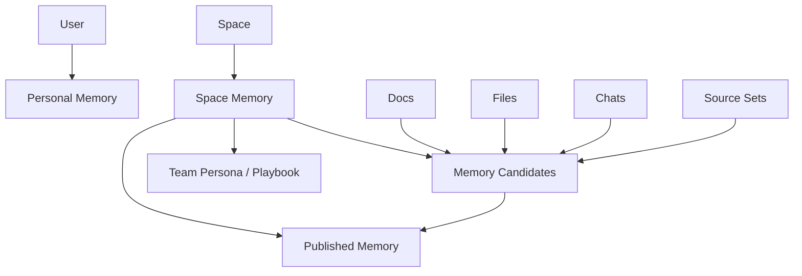

# Space-First Team Memory 产品与架构方案

**状态**：提案  
**日期**：2026-03-31  
**目标**：在新的 `space-first` 架构下，把当前偏个人化的 `memory` 能力升级为可自动化、可团队协作、可企业治理的记忆系统，同时不破坏现有个人记忆体验。

---

## 一、执行摘要

当前 LobeHub 的 `memory` 本质上还是一套 **user-memory** 系统：

- 数据按 `userId` 存储
- 提取按用户话题和用户消息运行
- 检索按用户上下文注入
- 前台 `/memory` 也是个人视角的管理页

这套设计适合：

- 个人长期偏好
- 个人身份信息
- 个人经验总结
- 个人 persona 演化

但它不适合直接升级成团队记忆，原因很直接：

1. 它没有 `space` 作用域
2. 它没有团队治理和审核流
3. 它没有共享记忆的权限模型
4. 它没有“来源可追、结论可控、过期可管”的企业能力

**最终建议**：

> 不要把今天的 `user memory` 直接包装成团队 memory。  
> 应该保留 `Personal Memory`，并新增一层真正的 `Space Memory`。  
> 个人记忆属于 `space` 外；团队记忆属于某个 `space` 内。  
> 自动化只负责产生候选记忆，团队共享的 canonical memory 默认必须经过治理。

---

## 二、现状审计

### 1. 当前 memory 是明确的个人模型

现有实现几乎全部以 `userId` 为核心：

- 路由：
  - `/Users/arthur/RustroverProjects/lobehub/src/server/routers/lambda/userMemory.ts`
  - `/Users/arthur/RustroverProjects/lobehub/src/server/routers/lambda/userMemories.ts`
- 服务：
  - `/Users/arthur/RustroverProjects/lobehub/src/server/services/memory/searchUserMemoriesCore.ts`
  - `/Users/arthur/RustroverProjects/lobehub/src/server/services/memory/buildMobileChatUserMemoryPrompt.ts`
  - `/Users/arthur/RustroverProjects/lobehub/src/server/services/toolExecution/serverRuntimes/memory.ts`
- 数据：
  - `user_memories`
  - `user_memories_contexts`
  - `user_memories_preferences`
  - `user_memories_identities`
  - `user_memories_experiences`
  - `user_memories_activities`
  - `user_memory_persona_documents`

现有模型中最重要的事实是：

- 检索按用户进行
- CRUD 按用户进行
- persona 文档按用户进行
- 聊天注入的记忆也按用户进行

也就是说，今天的 memory 是：

> **Personal Memory System**

而不是：

> **Workspace Memory System**

### 2. 当前 UI 是“个人记忆管理台”，不是团队知识运营台

当前 `/memory` 的页面结构是：

- Home / Persona
- Preferences
- Identities
- Experiences
- Activities
- Contexts

对应路径集中在：

- `/Users/arthur/RustroverProjects/lobehub/src/routes/(main)/memory`
- `/Users/arthur/RustroverProjects/lobehub/src/store/userMemory`

这套 UI 更像：

- 个人档案页
- 个人行为分析页
- 个人偏好管理页

而不是企业团队真正需要的：

- 共享记忆 inbox
- 记忆审核流
- 过期与冲突处理
- 来源追踪与权限控制
- 团队 persona / playbook / SOP

### 3. 当前自动化链路也还是“用户自动提取”

现有自动化主要集中在：

- 用户聊天话题抽取
- 用户 persona 生成
- 用户 memory embedding search

但企业和团队真正需要的是：

- 从 docs/files/meeting notes/tasks/chat 中抽取
- 产出 candidate memory
- 去重、合并、冲突检测
- 经过 reviewer/curator 审核后进入共享记忆
- 允许 agent 读取，有限度写入

当前系统没有这一层。

### 4. 和新 `space-first` 架构的错位

新的工作区模型已经明确：

- `Space` 是唯一工作区根
- `Docs` 是知识成果工作面
- `Files` 是原始资产工作面
- `Source Set` 是空间内专题容器

在这个模型下，memory 如果继续只保留个人层，会出现两个问题：

1. `space` 内协作没有共享长期记忆
2. 团队 agent 只能读个人记忆或临时检索，不能读团队 canonical memory

---

## 三、最终产品模型

### 1. 必须拆成两层 memory

#### `Personal Memory`

个人记忆，属于 `space` 外：

- 私人偏好
- 私人身份信息
- 私人长期习惯
- 私人 persona
- 私人经验总结

入口可以继续是：

- `/memory`

这层默认不共享给团队。

#### `Space Memory`

团队记忆，属于 `space` 内：

- 团队术语和定义
- 客户背景与组织知识
- SOP / Playbook / Working Norms
- 项目事实、决策、约束
- 团队 persona / brand voice / writing style
- 需要被团队 agent 稳定复用的长期知识

入口建议为：

- `/spaces/:spaceId/memory`

这层才是“团队化、企业化、自动化”的主战场。

### 2. 不建议再增加第三个“Source Set Memory”

`Source Set` 不应该成为第三层 memory 根。

更合理的做法是：

- `Space Memory` 是唯一团队记忆根
- `sourceSetId` 只是来源、标签或范围维度
- 某条团队记忆可以关联多个 `sourceSet`

这样可以避免：

- 同一条知识在多个资料集里重复维护
- 用户搞不清“空间记忆”和“资料集记忆”哪个是真
- agent 注入时 scope 爆炸

### 3. 最终对象关系

---

## 四、团队记忆应该长成什么样

### 1. 不是“把所有聊天自动记住”

企业团队最怕的不是记忆少，而是：

- 记错
- 记脏
- 记重复
- 记了没人知道谁写的
- agent 把未经确认的信息当真

所以团队 memory 必须遵循一个核心原则：

> 自动化负责发现，治理负责发布。

### 2. 团队 memory 的三类内容

#### A. Facts

客观事实：

- 客户名称
- 产品版本约束
- 对接系统
- 合同限制
- 组织结构
- 项目里程碑

特点：

- 有来源
- 可核验
- 应该进入 canonical memory

#### B. Norms

团队规范：

- 术语写法
- 品牌语气
- 文档模板
- 对外沟通原则
- 决策标准

特点：

- 需要治理
- 适合长期复用
- 是 agent 最有价值的长期记忆之一

#### C. Working Context

阶段性上下文：

- 当前优先级
- 正在推进的关键事项
- 近期注意事项
- 暂时的假设和阻塞

特点：

- 变化快
- 需要过期机制
- 不应和长期 facts 混在一起

### 3. 不建议继续沿用今天的五层页面模型

今天的：

- identities
- activities
- contexts
- experiences
- preferences

适合个人记忆抽取研究，不适合作为团队产品的主 UI。

对团队层更合适的产品分类是：

- `Inbox`
- `Published`
- `Playbooks`
- `Policies`
- `Sources`

如果保留旧五层，也应该退到系统内部 schema，不要作为团队记忆的主导航。

---

## 五、自动化设计

### 1. 自动化目标

团队 memory 的自动化不是“全自动写真相”，而是：

1. 自动发现可能值得沉淀的知识
2. 自动归类和去重
3. 自动推荐写入位置和优先级
4. 自动追踪过期和冲突

### 2. 自动化流水线

建议设计成四段：

#### A. Capture

从这些来源观察变化：

- Chat / Agent 对话
- Docs 更新
- Files 上传与解析
- Source Set 内容变化
- 未来 OA 里的任务、审批、会议纪要

#### B. Extract

把来源内容提取成 memory candidate：

- 标题
- 摘要
- 类型
- 置信度
- 来源对象
- 推荐 scope
- 推荐 owner / reviewer

#### C. Govern

自动化在这里停止“替你决定”，改为“推荐你处理”：

- merge into existing
- create new entry
- mark conflict
- mark stale
- suggest expiry

#### D. Publish

只有进入 `published` 的团队记忆，才允许默认被 agent 注入。

### 3. 默认状态机

团队 memory 条目建议至少有这些状态：

- `candidate`
- `reviewing`
- `published`
- `stale`
- `archived`
- `rejected`

不要让 agent 直接把新提取内容写进 `published`。

### 4. 过期与冲突

企业记忆必须支持：

- `expiresAt`
- `supersededBy`
- `conflictWith`
- `lastVerifiedAt`

否则系统会越来越脏。

---

## 六、企业化与治理能力

### 1. 团队记忆必须有 provenance

每条团队记忆必须能回答：

- 来自哪里
- 谁创建的
- 谁审核的
- 最后一次确认是什么时候
- 关联哪些 docs/files/source sets

没有 provenance 的团队 memory，不适合企业使用。

### 2. 团队记忆必须有 owner

建议每条团队记忆都带：

- `ownerId`
- `reviewerId`
- `spaceId`
- `sourceSetIds`

这样才能做：

- 到期提醒
- 冲突处理
- ownership 交接
- 组织内审计

### 3. 团队记忆必须有保留策略

建议从一开始就支持：

- 自动归档
- 手动冻结
- 敏感条目不注入
- 软删除
- 导出审计记录

### 4. 记忆不能等于 prompt 注入

团队记忆要分成两层：

- **storage truth**
- **injection view**

不是所有团队记忆都该注入给 agent。

应当允许：

- only searchable
- prompt eligible
- admin only
- hidden but auditable

---

## 七、RBAC 设计

以后做正式 RBAC 时，memory 是必须纳入的一类资源。

### 1. 资源定义

建议新增：

- `space_memory_entries`
- `space_memory_candidates`
- `space_memory_policies`
- `space_personas`

### 2. 动作定义

至少应支持：

- `memory.read`
- `memory.search`
- `memory.create_candidate`
- `memory.review`
- `memory.publish`
- `memory.update`
- `memory.archive`
- `memory.delete`
- `memory.manage_policy`

### 3. 推荐角色语义

在正式 RBAC 之前，先用现有 `space role` 做映射：

- `owner/admin`
  - 全权限
- `editor`
  - 可创建 candidate
  - 可编辑自己创建的 candidate
  - 默认不可直接 publish
- `viewer`
  - 只读 published memory

未来正式 RBAC 后，再拆成：

- `memory_curator`
- `memory_editor`
- `memory_viewer`
- `agent_memory_writer`

### 4. 默认安全原则

默认策略建议是：

- agent 可以写 `candidate`
- agent 不可以直接写 `published`
- 用户可以提议
- curator 才能发布团队记忆

这比“所有 agent 自动写共享记忆”安全得多。

---

## 八、UI / UX 方案

### 1. 顶层位置

#### `Personal Memory`

仍保留在全局层：

- 作为个人模块
- 对应今天的 `/memory`

#### `Space Memory`

进入某个 space 后，作为空间内工作面之一：

- `Overview`
- `Docs`
- `Files`
- `Source Sets`
- `Memory`
- `Members`
- `Settings`

### 2. `Space Memory` 的主界面

不建议复用今天五层分栏 UI。

建议主界面改成：

- `Inbox`
- `Published`
- `Playbooks`
- `Policies`

#### Inbox

看候选记忆：

- 来自哪里
- 置信度
- 推荐动作
- reviewer
- 是否冲突

#### Published

看当前有效的团队长期记忆：

- 可搜索
- 可过滤
- 可看来源
- 可看历史

#### Playbooks

沉淀团队工作规范和 persona：

- 文案风格
- 回复规范
- SOP
- escalation rules

#### Policies

配置自动化策略：

- 哪些来源自动抽取
- 哪些 agent 可写 candidate
- 哪些 source set 优先纳入
- 过期和审核规则

### 3. 和 docs/files/source set 的关系

在 `Docs` / `Files` / `Source Set` 中，不应该直接展示复杂 memory 主 UI。

更合理的嵌入方式是：

- 在 doc/file/source set 详情里显示：
  - `相关团队记忆`
  - `可提取为团队记忆`
  - `查看来源`

也就是说：

- memory 是独立工作面
- docs/files/source set 是来源与消费点

而不是把 memory 又做成每个页面里的一套小系统。

---

## 九、和 OA 扩展的关系

如果以后 LobeHub 要扩到 OA，这套 memory 设计是成立的，因为它天然支持：

- 会议纪要转团队记忆
- 任务推进转工作上下文
- 审批结论转 policy
- 客户档案转组织 facts
- 团队 SOP 转 playbook

也就是说，未来 OA 的很多结构化资产，都可以通过：

- `Space`
- `Docs`
- `Files`
- `Memory`

四者协同来承接。

如果今天就把 memory 继续限制在“用户偏好和 persona”，后面再向 OA 扩会很吃力。

---

## 十、实施建议

### Phase 1：定义与隔离

先做产品边界，不急着改所有 UI：

1. 明确 `Personal Memory` 与 `Space Memory`
2. 现有 `/memory` 明确定义为个人层
3. 新增 `/spaces/:spaceId/memory` 作为团队层入口占位
4. 在 schema 设计里引入 `spaceId`

### Phase 2：Candidate 流

先别做复杂 AI 自动发布，先把团队流程建起来：

1. 从 docs/files/chat 产出 candidate
2. 建 inbox
3. 建 publish / reject / archive
4. 建 provenance 和 history

### Phase 3：Agent 使用

在团队 memory 稳定后，再接 agent：

1. 团队 agent 默认可读 `published`
2. 特定 agent 可写 `candidate`
3. 引入 policy 控制注入和写入边界

### Phase 4：治理与 RBAC

最后再做企业治理：

1. role mapping -> formal RBAC
2. expiry / stale / revalidation
3. 审计导出
4. 敏感级别与注入策略

---

## 十一、明确不建议做的事

### 1. 不要把今天的个人 memory 直接改名成团队 memory

这样会把：

- 私人偏好
- 私人身份
- 私人 persona

和团队共享资产混在一起。

### 2. 不要让 agent 直接写共享真相

agent 最多写 `candidate`，不要默认写 `published`。

### 3. 不要把 source set 升格成 memory 根

`source set` 是专题容器，不是记忆系统的顶层 scope。

### 4. 不要继续把五层 schema 直接暴露为团队 UI 主导航

这套分类对内部提取模型有意义，对企业产品主界面不够友好。

---

## 十二、最终结论

在新的 `space-first` 架构下，memory 的正确方向不是：

- 把今天的个人 memory 硬塞进 space
- 或者给现有 `/memory` 多加几个团队 tab

正确方向是：

> **保留 Personal Memory，新增 Space Memory。**  
> **Personal Memory 解决“这个用户的长期个体记忆”。**  
> **Space Memory 解决“这个团队在这个工作区里的长期共享记忆”。**  
> **自动化只负责发现候选，治理决定哪些成为团队真相。**

如果要一句最重要的产品原则：

> **团队记忆必须可自动发现，但不能默认自动成为真相。**
